https://blog.csdn.net/Shockang/article/details/115609804

# MPP架构和Hadoop组件的关系

## 1 系统架构分类

从系统架构来看,目前的商用服务器大体可以分为三类：

### 1.1 SMP

**Symmetric Multi-Processor 对称多处理器结构**

所谓对称多处理器结构,是指服务器中的多个CPU对称工作,无主次或从属关系。

各CPU共享相同的物理内存,每个CPU访问内存中的任何地址所需时间是相同的,因此SMP也被称为一致存储器访问结构(Uniform Memory Access,UMA)

**对SMP服务器进行扩展的方式**包括增加内存、使用更快的CPU、増加CPU、扩充IO(槽口数与总线数)及添加更多的外部设备(通常是磁盘存储)。

SMP服务器的主要特征是共享,系统中的所有资源(如CPU、内存、I/O等)都是共享的。

也正是由于这种特征,导致了SMP服务器的主要问题,即它的扩展能力非常有限。

对于SMP服务器而言,每个共享的环节都可能造成SMP服务器扩展时的瓶颈,而最受限制的则是内存。

由于每个CPU必须通过相同的内存总线访问相同的内存资源,因此,随着CPU数量的增加,内存访问冲突将迅速增加,最终造成CPU资源的浪费,使CPU性能的有效性大大降低。

实验证明,SMP服务器CPU利用率最好的情况是2~4个CPU。

**特点**
Uniform Memory Access
共享存储：cpu,内存，io

**不足**
扩展能力有限
内存总线限制访问内存的效率

### 1.2 NUMA 

**Non-Uniform Memory Access 非一致存储访问结构**

由于SMP在扩展能力上的限制,人们开始探究如何进行有效的扩展从而构建大型系统的技术,NUMA就是这种努力下的结果之一。

利用NUMA技术,可以把几十个CPU (甚至上百个CPU)组合在一台服务器内。其CPU模块结构如图所示

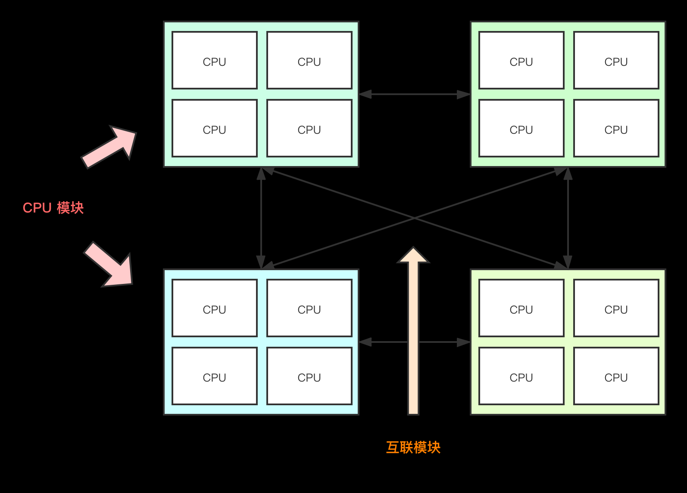

NUMA服务器的基本特征是拥有多个CPU模块,每个CPU模块由多个CPU(如4个)组成并且具有独立的本地内存、I/O槽口等。

由于其节点之间可以通过**互联模块**(如称为 Crossbar Switch)进行连接和信息交互,因此,**每个CPU可以访问整个系统的内存**(这是NUMA系统与MPP系统的重要区别)。

显然,访问本地内存的速度将远远高于访问异地内存(系统内其他节点的内存)的速度, 这也是非一致存储访问NUMA的由来。

由于这个特点,为了更好地发挥系统性能,开发应用程序时需要尽量减少不同CPU模块之间的信息交互。

利用NUMA技术,可以较好地解决原来SMP系统的扩展问题,在一台物理服务器内可以支持上百个CPU。

但是NUMA技术同样有一定的缺陷,**由于访问异地内存的时延远远超过访问本地内存,因此,当CPU数量增加时,系统性能无法线性增加**。

如惠普公司发布 Superdome服务器时,曾公布了它与惠普其他unix服务器的相对性能值,结果发现,64路CPU的Superdome服务器(NUMA结构)的相对性能值是20,而8路N4000(共享的SMP结构)的相对性能值是6.3。从这个结果可以看出,**8倍数量的CPU换来的只是3倍性能的提升**。

**特点**
拥有多个CPU模块，每个模块由多个CPU组成，有独立的本地内存，io槽口

节点之间通过互联模块进行连接和信息交互:同一台物理服务器内部实现，cpu异地访问时必须等待

较好解决SMP系统的扩展问题

**不足**
互联模块访问效率和本地内存访问不在一个效率层级，系统性能无法和cpu数线性增加

### 1.3 MPP 

**Massive-Parallel Processing 海量并行处理架构**
和NUMA不同,MAA提供了另外一种进行系统扩展的方式,它由多台SMP服务器通过一定的节点互联网络进行连接,协同工作,完成相同的任务,从用户角度来看是一个服务器系统。

其基本特征是**由多台SMP服务器(每台SMP服务器称为节点)通过节点互联网络连接而成，每个节点只访问自己的本地资源(内存、存储等)**。

MPP是一种**完全无共享(share Nothing)结构,因而扩展能力最强**,理论上可以无限扩展,目前的技术可以实现512个节点互联.包含数千个CPU。

目前业界对节点互联网络暂无标准, 它们都采用了不同的内部实现机制。但节点互联网络仅供MPP服务器内部使用，对用户而言是透明的。

在MPP系统中.每个SMP节点也可以运行自己的操作系统，数据库等。但和NUMA不同的是，它不存在异地内存访问的问题。换言之,每个节点内的CPU不能访问另一个节点的内存。**节点之间的信息交互是通过节点互联网络实现的.这个过程一般称为数据重分配**(
Data Redistribution )。

但是MPP服务器需要一种复杂的机制来**调度和平衡各个节点的负载和并行处理过程**。

目前,—些基于MPP技术的服务器往往通过系统级软件(如数据库)来屏蔽这种复杂性。

**特点**
SMP组合的方式：每台SMP服务器（节点）通过节点互联网络连接。
节点互联网络：MPP内部使用，对用户透明，在不同SMP服务器外部通过IO实现，每个节点只访问本地内存和存储，节点信息交互和节点本身是并行处理的。

每个节点只访问本地资源（内存，存储），Share Nothing结构。

对等节点：所有数据节点角色一样。可以提升并行计算能力

汇总节点：数据汇总节点的稳定性，可用性影响整体的性能

**不足**
复杂的机制来调度和平衡各个节点的负载和并行处理过程。

短板效应。

如果一个节点总是执行的慢于集群中其他的节点，整个集群的性能就会受限于这个故障节点的执行速度(所谓木桶的短板效应)，无论集群有多少节点，都不会有所提高。
当MPP系统中某个节点的RAID由于磁盘问题导致的性能很慢，或者硬件或者系统问题带来的CPU性能问题等等，都会产生这样的问题。所有的MPP系统都面临这样的问题。

MPP集群规模不能过大。

并发度不能过高，数据查询汇总节点的并发查询数限制在10+数量级，用户数有限制。

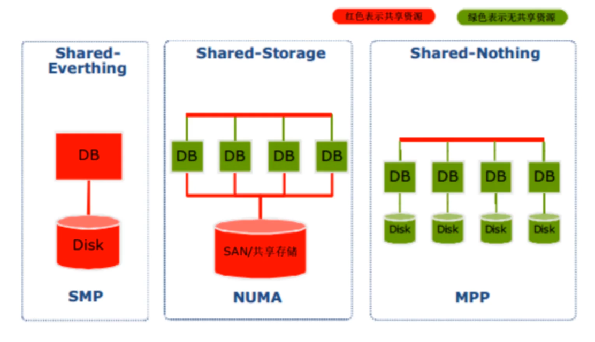

### NUMA与MPP的区别

从架构来看,NUMA与MPP有许多相似之处:

1. 它们都由多个节点组成;

2. 每个节点都有自己的CPU、内存、I/O;

3. 节点之间都可以通过节点互联机制进行信息交互。

   

**区别：**

**节点互联机制不同。**
NUMA的节点互联机制是在**同一台物理服务器内部**实现的,当某个CPU需要进行异地内存访问时,它必须等待,这也是NUMA服务器无法实现CPU增加时性能线性扩展的主要原因。

而MPP的节点互联机制是在不同的SMP**服务器外部通过io实现的**,每个节点只访问本地内存和存储,节点之间的信息交互与节点本身的处理是并行进行的。因此,MPP在增加节点时,其性能基本上可以实现线性扩展。

**内存访问机制不同。**
在NUMA服务器内部,**任何一个CPU都可以访问整个系统的内存**, 但异地内存访问的性能远远低于本地内存访问,因此,在开发应用程序时应该尽量避免异地内存访问。

而在MPP服务器中,**每个节点只访问本地内存**,不存在异地内存访问的问题。

## 2、MPP DB

### 2.1 什么是MPP DB？

MPP DB是一款 **Shared Nothing架构**的**分布式并行**结构化数据库集群，具备高性能、高可用、高扩展特性，可以为超大规模数据管理提供高性价比的通用计算平台，并广泛地用于支撑各类数据仓库系统、BI系统和決策支持系统.

### 2.2 MPP DB特征(优势)

1） 硬件**成本低**：完全使用 x86 架构的 PC Server，不需要昂贵的 Unix 服务器和磁盘阵列；

2）集群架构与部署：完全并行的 MPP + Shared Nothing 的分布式架构，采用 **Non-Master 部署**，节点对等的扁平结构；

3）**海量数据分布压缩存储**：可处理 PB 级别以上的结构化数据，采用 hash分布、random 存储策略进行数据存储；同时采用先进的压缩算法，减少存储数据所需的空间，可以将所用空间减少 1~20 倍，并相应地提高 I/O 性能；

4）数据加载高效性：**基于策略的数据加载模式**，集群整体加载速度可达2TB/h；

5）**高扩展、高可靠**：支持集群节点的扩容和缩容，支持全量、增量的备份/恢复;

6）**高可用、易维护**：数据通过副本提供冗余保护，自动故障探测和管理，自动同步元数据和业务数据。提供图形化工具，以简化管理员对数据库的管理工作；

7）**高并发**：读写不互斥，支持数据的边加载边查询，单个节点并发能力大于 300 用户；

8）行列混合存储：提供**行列混合存储方案**，从而提高了列存数据库特殊查询场景的查询响应耗时；

9）标准化：支持SQL92 标准，支持 C API、ODBC、JDBC、ADO.NET 等接口规范。

### 2.3 缺点

#### 2.3.1 MPP拓展性并不好

MPP DB号称能扩展到1000个节点以上，但在实际应用中不超过100个节点，如在支付宝中用**Greenplum**来做财务数据分析的一个最大集群只有60多台机器。

MPP DB扩展性不好有很多原因，最根本的原因是**架构本身**。

MPP DB是**基于原DB扩展而来的**，DB中天然追求**一致性( Consistency)**，必然会带来**分区容错性较差**。

当集群规模变得太大、业务数据太多时， MPP DB的元数据管理就完全是一个灾难。元数据巨大无比，一旦出错，将很难恢复。

所以 MPP DB要在扩展性上有质的提升，就要对元数据及数据存储有架构上的突破，降低对一致性的要求，否则很难相信一个MPP DB数据库是易于扩展的。

#### 2.3.2 MPP并发支持不高

一个査询系统设计出来就是供用户使用的，所以能支持的并发数越多越好。

MPP DB的核心原理是将一个大的査询通过分解为一个个子查询，分布到底层执行，最后再合并结果，也就是通过多线程并发来暴力扫描以实现高速。

这种暴力扫描的方法对单个查询来说动用了整个系统的能力，所以单个查询比较快，但同时带来用力过猛的问题，整个系统能支持的并发数必然不多。

**从目前的实际经验来看，也就支持50~100的并发能力**。

#### 2.3.3 MPP的设计缺陷：短板效应

所有的MPP解决方案来说都有一个主要的问题——短板效应。

如果一个节点总是执行的慢于集群中其他的节点，整个集群的性能就会受限于这个故障节点的执行速度(所谓木桶的短板效应)，无论集群有多少节点，都不会有所提高。

MPP DB的核心原理是将一个大的査询通过分解为一个个子查询，分布到底层执行，最后再合并结果，也就是通过多线程并发来暴力扫描以实现高速。

这里有一个例子展示了故障节点(Executor 7)是如何降低集群的执行速度的。大多数情况下，除了Executor 7 其他的所有执行器都是空闲状态。这是因为他们都在等待Executor 7执行完成后才能执行同步过程，这也是我们的问题的根本。

比如，当MPP系统中某个节点的RAID由于磁盘问题导致的性能很慢，或者硬件或者系统问题带来的CPU性能问题等等，都会产生这样的问题。**所有的MPP系统都面临这样的问题。**

如果一个集群有1000个磁盘，一年中将会有20个出现故障或者说每两周会有一个故障发生。如果有2000个磁盘，你将每周都会有故障发生，如果有4000个，将每周会有两次错误发生。两年的使用之后，你将把这个数字乘以4，也就是说，一个1000个磁盘的集群每周会有两次故障发生。

事实上，在一个确定的量级，你的MPP系统将总会有一个节点的磁盘队列出现问题，这将导致该节点的性能降低，从而像上面所说的那样限制整个集群的性能。**这也是为什么在这个世界上没有一个MPP集群是超过50个节点服务器的**。

### 2.4 典型的MPP DB

#### 2.4.1 Greenplum

 Greenplum是一种基于ProstgreSQL的分布式数据库，其采用Shared-Nothing架构、主机、操作系统、内存、存储都是自我控制的，不存在共享。

PostgreSQL的基础上 、MPP架构，关系型分布式数据仓库。
兼容Hadoop生态，-》HAWQ,存储层改用HDFS.

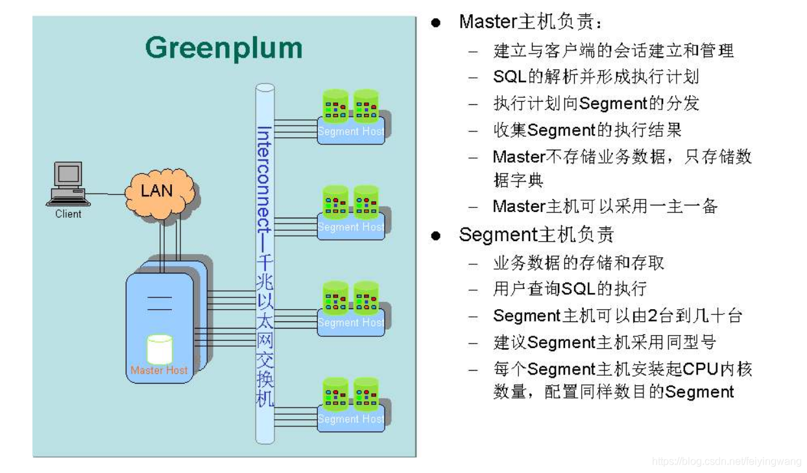

**Interconnect**
1)        是GP数据库的网络层，在每个Segment中起到一个IPC作用；

2)        推荐使用千兆以太网交换机做Interconnect；

3)        支持UDP和TCP两种协议，推荐使用UDP协议，因为其高可靠性、高性能以及可扩展性；而TCP协议最高只能使用1000个Segment实例。

#### 2.4.2 Impala

**1) 介绍说明：**  Impala是Cloudera在受到Google的Dremel启发下开发的实时交互SQL大数据查询工具（实时SQL查询引擎Impala），Impala没有再使用缓慢的Hive+MapReduce批处理，而是通过使用与商用并行关系数据库中类似的分布式查询引擎（由Query Planner、Query Coordinator和Query Exec Engine三部分组成），可以直接从HDFS或HBase中用SELECT、JOIN和统计函数查询数据，从而大大降低了延迟。

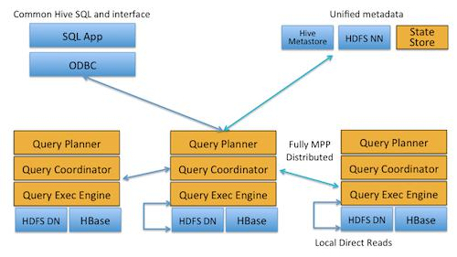

**2）组件:**   Impala主要由Impalad， State Store和CLI组成。

**Impalad**: **与DataNode运行在同一节点上**，由Impalad进程表示，它接收客户端的查询请求（接收查询请求的Impalad为Coordinator，Coordinator通过JNI调用java前端解释SQL查询语句，生成查询计划树，再通过调度器把执行计划分发给具有相应数据的其它Impalad进行执行），读写数据，并行执行查询，并把结果通过网络流式的传送回给Coordinator，由Coordinator返回给客户端。同时Impalad也与State Store保持连接，用于确定哪个Impalad是健康和可以接受新的工作。

在Impalad中启动三个ThriftServer: beeswax_server（连接客户端），hs2_server（借用Hive元数据）， be_server（Impalad内部使用）和一个ImpalaServer服务。

**Impala State Store**: 跟踪集群中的Impalad的健康状态及位置信息，由statestored进程表示，它通过创建多个线程来处理Impalad的注册订阅和与各Impalad保持心跳连接，各Impalad都会缓存一份State Store中的信息，当State Store离线后（Impalad发现State Store处于离线时，会进入recovery模式，反复注册，当State Store重新加入集群后，自动恢复正常，更新缓存数据）因为Impalad有State Store的缓存仍然可以工作，但会因为有些Impalad失效了，而已缓存数据无法更新，导致把执行计划分配给了失效的Impalad，导致查询失败。

**CLI**: 提供给用户查询使用的命令行工具（Impala Shell使用python实现），同时Impala还提供了Hue，JDBC， ODBC使用接口。

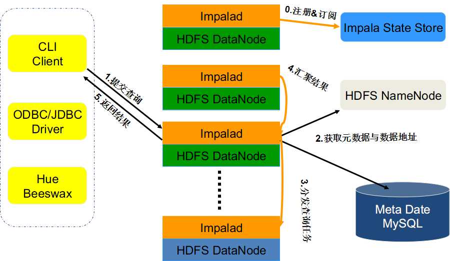

**3）和hive的关系**

Impala与Hive都是构建在Hadoop之上的数据查询工具各有不同的侧重适应面，但从客户端使用来看Impala与Hive有很多的共同之处，如数据表元数据、ODBC/JDBC驱动、SQL语法、灵活的文件格式、存储资源池等。Impala与Hive在Hadoop中的关系如图 2所示。Hive适合于长时间的批处理查询分析，而Impala适合于实时交互式SQL查询，Impala给数据分析人员提供了快速实验、验证想法的大数据分析工具。可以先使用hive进行数据转换处理，之后使用Impala在Hive处理后的结果数据集上进行快速的数据分析。

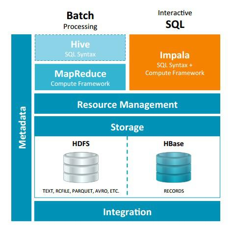

1、没有使用MapReduce进行并行计算，虽然MapReduce是非常好的并行计算框架，但它更多的面向批处理模式，而不是面向交互式的SQL执行。与MapReduce相比：Impala把整个查询分成一执行计划树，而不是一连串的MapReduce任务，在分发执行计划后，Impala使用拉式获取数据的方式获取结果，把结果数据组成按执行树流式传递汇集，减少的了把中间结果写入磁盘的步骤，再从磁盘读取数据的开销。Impala使用服务的方式避免每次执行查询都需要启动的开销，即相比Hive没了MapReduce启动时间。

2、使用LLVM产生运行代码，针对特定查询生成特定代码，同时使用Inline的方式减少函数调用的开销，加快执行效率。

3、充分利用可用的硬件指令（SSE4.2）。

4、更好的IO调度，Impala知道数据块所在的磁盘位置能够更好的利用多磁盘的优势，同时Impala支持直接数据块读取和本地代码计算checksum。

5、通过选择合适的数据存储格式可以得到最好的性能（Impala支持多种存储格式）。

6、最大使用内存，中间结果不写磁盘，及时通过网络以stream的方式传递。

**适用面：**
Hive: 复杂的批处理查询任务，数据转换任务。

Impala：实时数据分析，因为不支持UDF，能处理的问题域有一定的限制，与Hive配合使用,对Hive的结果数据集进行实时分析。

#### 2.4.3 Presto

 presto是facebook开源的查询分析引擎，在国内是京东用的比较溜和成熟。presto数据处理能力到达PB级别，支持查询数据源有hive、kafka、cassandra、redis、mongodb、sql server等，在工作应用当中，我们发现presto的查询性能比hive要高40%以上。

presto的结构式master+slaver模式，具体组成如下：

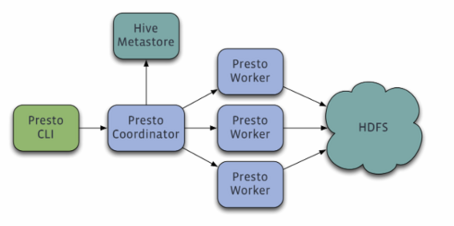

主要组成部分是：

       一个 coordinator+一个discovery server +多个worker。通常discovery server是内嵌在coodinator组件当中。三者的作用分布如下：

1、coodinator：用于解析查询sql，生成执行计划，并分发给worker执行。

2、discovery server：worker上线后，向discovery server注册。coodinator分发任务前，需要向discovery server获取可以正常工作worker列表。通常内嵌于Coordinator节点中

3、worker：具体执行任务的工作节点。负责实际执行查询任务,负责与HDFS交互读取数据。

Worker节点启动后向Discovery Server服务注册，Coordinator从Discovery Server获得可以正常工作的Worker节点。如果配置了Hive Connector，需要配置一个Hive MetaStore服务为Presto提供Hive元信息

**presto优点：**

数据源具有完全解耦，高性能，以及对ansi sql的支持特性，使得presto在etl，实时数据计算、ad-hoc查询和实时数据流分析等多个场景中能够发挥重要的作用。

经过评测：presto的平均性能是hive的10倍

presto适合在单次扫描级别gb tb级别的数据

hive适合海量级别的数据的计算

**hive和presto可以作为互补适用**：

场景： 基于 T+1 数据的实时计算 
在这种业务场景中，用户并**不要求基准数据的实时更新**，但是**要求每次查询数据都能够快速响应**。需要 Presto 和 Hive 配合使用来满足实际的业务需求。每天凌晨通过azkaban 调度 Hive 脚本，根据前一天的数据计算生成中间结果表，生成完毕之后使用 Presto 查询中间结果表，得出用户最终所需要的数据。满足该业务场景的解决方案如下图：

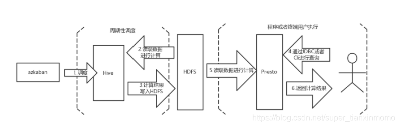

#### 2.4.4  ElasticSearch

Elasticsearch 是一个分布式可扩展的实时搜索和分析引擎,一个建立在全文搜索引擎 Apache Lucene(TM) 基础上的搜索引擎.当然 Elasticsearch 并不仅仅是 Lucene 那么简单，它不仅包括了全文搜索功能，还可以进行以下工作:

- 分布式实时文件存储，并将每一个字段都编入索引，使其可以被搜索。
- 实时分析的分布式搜索引擎。
- 可以扩展到上百台服务器，处理PB级别的结构化或非结构化数据

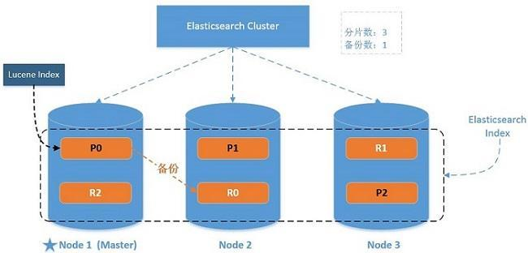

ES在大数据中的场景，推荐以下几篇文章：

**使用ElasticSearch作为大数据平台的实时OLAP框架：** http://lxw1234.com/archives/2015/12/588.htm

**作业帮基于 Apache Doris 的数仓实践：**  https://www.6aiq.com/article/1602420268311

**Doris on ES在快手商业化的最佳实践：**  https://www.modb.pro/db/44961

#### **2.4.5 Vertica**

Vertica 采用**无共享的MPP 架构**，基于工业标准的x86 服务器，拥有高可扩展性。
Vertica 集群中的**所有节点100%对等**，集群中没有主节点或其他共享资源。通过增加节点，就可以线性地扩展集群的计算能力和数据处理容量。
Vertica 是真正的**纯列式数据库**，优化器和执行引擎可以忽略表中与查询无关的列。Vertica 不仅仅按列式存储数据，还主动地根据列数据的特点和查询的要求选用最佳的算法**对数据进行排序和编码压缩**，这就极大地降低磁盘I/O 消耗。同时，Vertica 的执行引擎和优化器也是基于列式数据库设计的，编码压缩过的列数据在Vertica 的执行引擎中进行过滤、关联、分组等操作时**不需要解反编码**，从而大大降低了CPU 和内存消耗。
Vertica 充分利用列式存储的优点，在保持对前端应用透明的前提下，把数据在集群中的所有节点进行均匀分布的同时，还在**多个节点上对同一份数据维护了多个拷贝**，确保任意一个或几个节点出现故障或进入维修状态都不会影响集群的健康状态。这使得Vertica 拥有类似磁盘RAID 一样高可靠性。
无共享的MPP 架构和真正的列式数据库特性，使Vertica 拥有高性能、高扩展性、高压缩率、高健壮性的特点。与传统的解决方案相比，Vertica 可以以30%的成本，实现50 倍-1000 倍的性能提高。

#### 2.4.6 其他

俄罗斯的clickhouse，百度的Polo（改名为Doris），腾讯的tidb（魔改mysql的mpp），华为的高斯（魔改postgre的mpp）

用过的mpp相关的，clickhouse，greenplum，Doris（测试阶段），相对来说，比较稳定的就是greenplum，他在大量数据的处理下，使用者合理的分区，合理的索引，合理的分布键，以及合理的sql下，计算能力还是很不错的，但是**mpp的通病就是木桶效应**，性能取决于集群中分析最慢的那一台机器，因此，**数据分布倾斜**，以及GP分析任务重的数据重分布是尽量要避免的，否则，就无法发挥gp的长处。另外，aoc（append only column ）表对于性能的提升也是巨大的，核心思想还是相较于传统的heap表，aoc利用了列存，数据压缩上效率更好，减少了数据扫描的IO，在巨量（数十亿级）数据下的分析性能提升明显。

**clickhouse** ，俄罗斯人开发的，有点显而易见，就是快，缺点也显而易见，依赖于zk，维护起来也不是很好。另外相较于强大的单表分析的性能，他的join，以及他的并发，着实不好。所以clickhouse一般的应用场景基本都是**形成大宽表**面对业务分析人员，将他的性能优点发挥出来。**避免join，避免高并发查**。另外要时刻关注zk。

**Doris**，由目前原来百度的polo进化而来，有开源版本的Apache Doris，还有商业版本的Doris。大厂均在使用，一般是Doris on ES模式，互补使用。

目前OLAP分布式计算引擎系统发展的方向：

- Batch    MapReduce -> Spark/Tez
- Stream   SparkStreaming -> Flink Streams -> Kafka KSQL
- Batch + MPP  Greenplum/HP Vertica -> Dremel -> Impala/Drill/PrestoDB/HAWQ
- Real-time Storage(Search/KV)  Druid.io/ElesticSearch/CrateDB/Hbase

## 3.MPP和批处理对比

### 3.1 MPPDB、Hadoop与传统数据库技术对比与适用场景

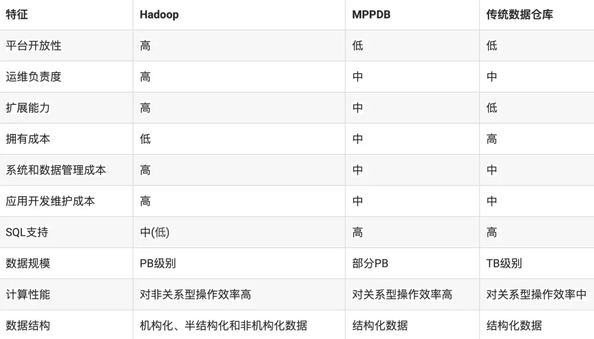

批处理的问题： 

要实现两个大表的join操作，**Spark将会写HDD 3次***(1. 表1根据join key 进行shuffle 2. 表2根据join key 进行shuffle 3. Hash表写入HDD)*， 而**MPP只需要一次写入**(Hash表写入)。

这是因为MPP将mapper和reducer同时运行，而MapReduce将它们分成有依赖关系的tasks(DAG),这些task是异步执行的，因此必须通过写入中间数据共享内存来解决数据的依赖。

将一个现代的MPP系统和Spark在一个相同的硬件集群上进行性能比较的话，Spark通常是慢3-5倍的。50个机器的MPP集群将会提供大约250个节点的Spark相同的处理能力，但Spark可以扩展到250个节点以上，这对于MPP来说是不可能的。*( 需要找到实践论证 )*

### 3.2 将MPP和Batch进行结合

Apache HAWQ拥有业界领先的系统并行架构，能够灵活支持多种数据存储实现接入，并支持快速数据和计算资源水平弹性扩展。当前Apache HAWQ使用Hadoop HDFS作为默认存储插件，并支持与Hadoop YARN的资源管理框架集成，这使得Apache HAWQ自然方便的融入到Hadoop生态系统中。

Apache HAWQ 采用**主从（Master-Segment）的改进MPP架构**。一个典型的Apache HAWQ集群是分布式部署在多个服务器节点上，如多个物理机或多个虚拟机。

在HAWQ Master端，Apache HAWQ提供集中的元数据管理并接受所有客户端连接的请求，当一个客户端的数据计算请求以SQL形式发送到Master后，被优化的分布式执行计划被生成并派发到多个Segment服务器运行，计算由多个执行器进程（QE）实现并行计算。存储由Hadoop HDFS提供服务，绝大多数情况下Segment服务器将使用本地HDFS DataNode服务实现数据存取。集群的计算资源由Master端的资源管理器统一调度，并以资源容器的形式在Segment端体现。

Apache HAWQ能够提供业界领先的性能依赖于：

o 功能完备且高性能的执行引擎；

o 成熟的基于成本的并针对分布式计算优化的执行计划优化；

o 计算与数据分离，针对MPP计算特征，计算资源和IO资源优化的弹性资源分配。

Apache HAWQ天然适应云环境，因为 HAWQ Segment节点是无状态和动态识别利用的，这使得Apache HAWQ支持运行期动态加减节点，并使用户能够方便地按需弹性扩容等；因此Apache HAWQ Segment节点也天然支持容错的功能，在有Segment节点失效情况下不影响集群的正常运行。在Master端主节点数据和服务通过主从互备的方式实现高可用。

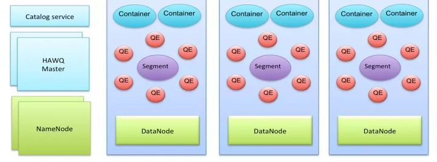

