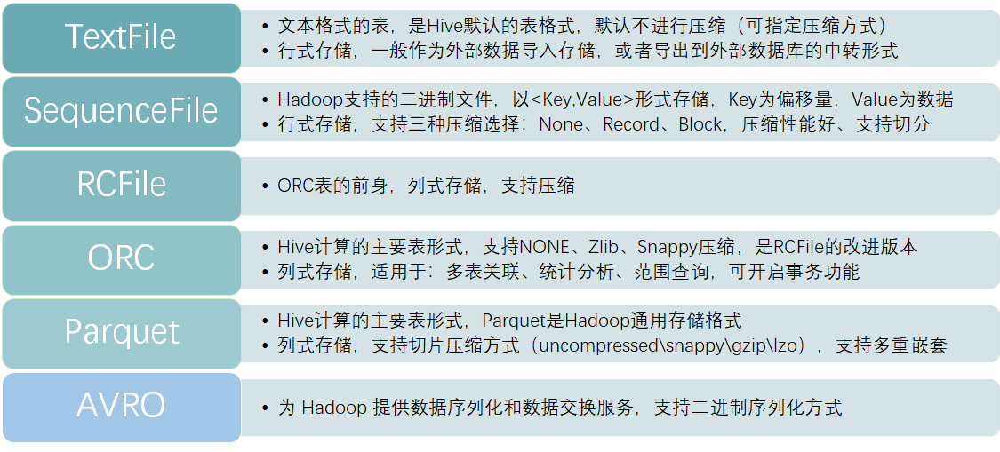
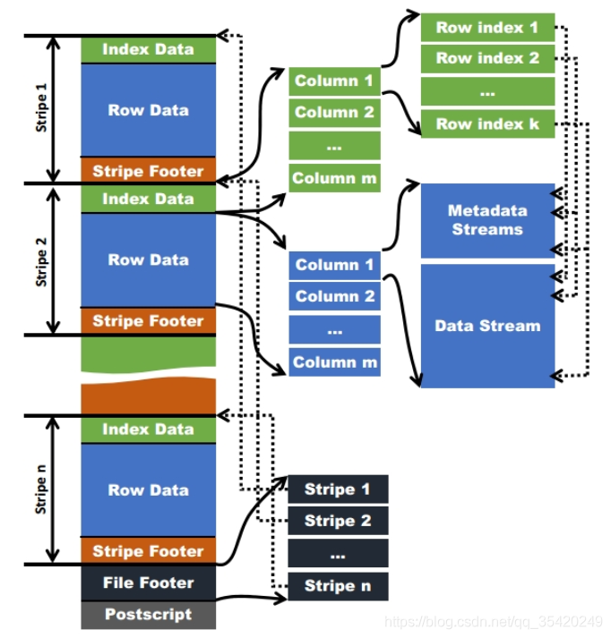
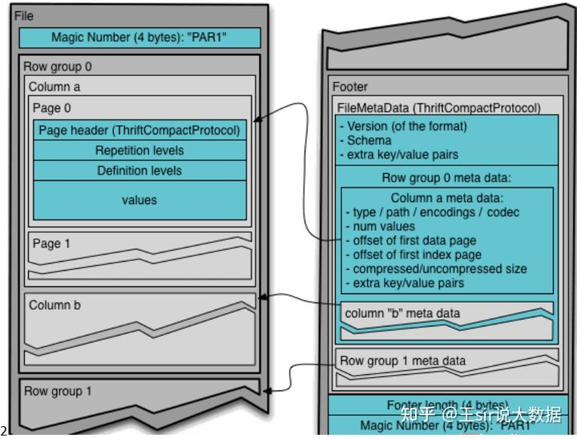

# Hive的常见文件存储格式

在hive中，较常见的文件存储格式有：TextFile、SequenceFile、RcFile、ORC、Parquet、AVRO。默认的文件存储格式是TextFile。

RCFile、ORC、Parquet这三种格式，均为列式存储表。准确来说，应该是行、列存储相结合。



除TextFile外的其他格式的**表不能直接从本地文件导入数据**，数据要先导入到TextFile格式的表中，然后再从表中用insert导入到其他格式的表中。


### TextFile格式

在建表时无需指定，Hive的**默认文件格式**，文件存储方式为正常的文本格式。以TextFile文件格式存储的表，在HDFS上可直接查看到数据。

可结合Gzip、Bzip2使用（系统自动检查，执行查询时自动解压），但是使用这种方式，hive不会对数据进行切分，无法对数据进行并行操作。在TextFile表压缩后再进行解压，即反序列化时，耗费的时间很大，是SequenceFile的十几倍。

**存储方式：**行存储

**优势：**可使用任意的分割符进行分割；在hdfs上可查可标记；加载速度较快；

**劣势：**不会对数据进行压缩处理，存储空间较大、磁盘开销大、数据解析开销大。

**使用场景：**作为外部数据导入存储，或者导出到外部数据库的中转表。可以识别在hdfs上的普通文件格式（如txt、csv），因此该模式常用于仓库数据接入和导出层；


### SequenceFile格式

需在建表是指定stored as sequecefile，文件存储方式为二进制文件，以<key,value>的形式序列话到文件中。以SequenceFile文件格式存储的表，会对数据进行压缩处理，在HDFS上的数据为二进制格式，不可直接查看。

可与record、none、block（块级别压缩）配合使用，默认为record，但record的压缩率低，一般建议使用block压缩，压缩率最高的是Block。

**存储方式：**行存储

**优势：**文件和Hadoop API的MapFile是相互兼容的；存储时候会对数据进行压缩处理，存储空间小；支持文件切割分片；查询速度比TextFile速度快；

**劣势：**无法可视化展示数据；不可以直接使用load命令对数据进行加载；自身的压缩算法占用一定的空间；该种模式是在textfile基础上加了些其他信息，故**该类格式的大小要大于textfile**，现阶段基本上不用。

**使用场景：**如果在生产中，需要数据进行行式存储、原生支持压缩，且要满足一定的性能要求，那么可以使用SequenceFile这种存储方式


### RcFile格式

需在建表是指定stored as rcfile，文件存储方式为二进制文件。以RcFile文件格式存储的表也会对数据进行压缩处理，在HDFS上以二进制格式存储，不可直接查看。

RCFILE是一种行列存储相结合的存储方式，该存储结构遵循的是**“先水平划分，再垂直划分”**的设计里面。首先，将数据按行分块形成行组，这样可以使同一行的数据在一个节点上。然后，把行组内的数据列式存储，将列维度的数据进行压缩，并提供了一种lazy解压技术。

Rcfile在进行数据读取时会顺序处理HDFS块中的每个行组，读取行组的元数据头部和给定查询需要的列，将其加载到内存中并进行解压，直到处理下一个行组。但是，rcfile不会解压所有的加载列，解压采用lazy解压技术，只有满足where条件的列才会被解压，减少了不必要的列解压。

在rcfile中每一个行组的大小是可变的，默认行组大小为4MB。行组变大可以提升数据的压缩效率，减少并发存储量，但是在读取数据时会占用更多的内存，可能影响查询效率和其他的并发查询。用户可根据具体机器和自身需要调整行组大小。

**存储方式：**行列混合的存储格式，将相近的行分块后，每块按列存储。

**优势：**基于列存储，压缩快且效率更高，；占用的磁盘存储空间小，读取记录时涉及的block少，IO小；查询列时，读取所需列只需读取列所在块的头部定义，读取速度快（在读取全量数据时，性能与Sequence没有明显区别）；

**劣势：**无法可视化展示数据；导入数据时耗时较长；不能直接使用load命令对数据进行加载；自身的压缩算法占用一定空间，但比SequenceFile所占空间稍小；

**使用场景：**现在基本很少使用了，它是ORC表的前身，支持的功能和计算性能都低于ORC表。RCFile对于提升任务执行性能提升不大，但是能节省一些存储空间。


### ORC格式

需在建表是指定stored as ORC，文件存储方式为二进制文件。ORC文件格式从hive0.11版本后提供，是RcFile格式的优化版，主要在压缩编码，查询性能方面做了优化。ORC具备一些高级特性，如：update操作，支持ACID，支持struct、array复杂类型。Hive1.x版本后支持事务和update操作，就是基于ORC实现的（目前其他存储格式暂不支持）。

**存储方式：**按行组分割整个表，行组内进行列式存储。
**文件结构：**

*首先做一些名词注释：*

*ORC文件：保存在文件系统上的普通二进制文件，一个ORC文件中包含多个stripe，每个stripe包含多条记录，这些记录按照列进行独立存储。*

*文件级元数据：包括文件的描述信息postscript、文件meta信息（包括整个文件的统计信息）、所有的stripe的信息和schema信息。*

*Stripe：一组行形成一个stripe，每次读取文件是以行组为单位的，一般为hdfs的块大小，保存了每一列的索引和数据。*

*Stripe元数据：保存stripe的位置、每个列在该stripe的统计信息以及所有的stream类型和位置。*

*Row group：索引的最小单位，一个stripe中包含多个row group，默认为10000个值组成。*

*Stream：一个stream表示文件中的一段有效的数据，包括索引和数据。索引stream保存每一个row group的位置和统计信息，数据stream包括多种类型的数据，具体情况由该列类型和编码方式决定。*

*在ORC文件中保存了三个层级的统计信息，分别为文件级别、stripe级别和row group级别，他们可以根据下发的搜索参数判断是否可以跳过某些数据。在这些统计信息中包含成员数和是否有null值，且对不同类型的数据设置了特定统计信息。*

ORC的文件结构如下：
 

 

文件级别：

在ORC文件的末尾记录了文件级别的统计信息，包括整个文件的列统计信息。这些信息主要是用于查询的优化，也可以为一些简单的聚合查询如max、min、sum输出结果。

Stripe级别：

保留行级别的统计信息，用于判断该Stripe中的记录是否符合where中的条件，是否需要被读取。

Row group级别：

进一步避免读取不必要的数据，在逻辑上将一个column的index分割成多个index组（默认为10000，可配置）。以这些index记录为一个组，对数据进行统计。在查询时可根据组级别的统计信息过滤掉不必要的数据。

**优势：**支持NONE、Zlib、Snappy压缩, 具有很高的压缩比，且可切分；由于压缩比高，在查询时输入的数据量小，使用的task减少，所以提升了数据查询速度和处理性能；每个task只输出单个文件，减少了namenode的负载压力；在ORC文件中会对每一个字段建立一个轻量级的索引，如：row group index、bloom filter index等，可以用于where条件过滤；可使用load命令加载，但加载后select * from xx；无法读取数据；查询速度比rcfile快；支持复杂的数据类型；

**劣势：**无法可视化展示数据；读写时需要消耗额外的CPU资源用于压缩和解压缩，但消耗较少；对schema演化支持较差；

可通过命令查看ORC文件系统信息：

```shell
./hive –orcfiledump -j -p hdfs://cdh5/hivedata/warehouse2/lxw1234_orc2/000000_0
```

它是Hive特有的存储类型;所以在其它大数据产品中**兼容性**并不好，有些只有在较高的版本中才会支持。

 **使用场景：** 在分析计算中的性能较好，是生产中常见的表类型。


### Parquet格式

需在建表是指定stored as PARQUET，文件存储方式为二进制文件。Parquet基于dremel的数据模型和算法实现，只是一种存储格式，它与上层平台、语言无关，不需要与任何数据处理框架绑定，**适配多种框架结构**。

它的**计算性能稍弱于ORC表**；但因为Parquet文件是Hadoop通用的存储格式，所以对于其它大数据组件而言，具有非常好的数据兼容度；而且Parquet表可以**支持数据的多重嵌套**（如JSON的属性值可以是一个对象，且支持嵌套），但ORC表在多重嵌套上的性能并不好。

**Parquet支持uncompressed、snappy、gzip、lzo压缩;**

其中lzo压缩方式压缩的文件**支持切片**，意味着在单个文件较大的场景中，处理的并发度会更高；因为一个压缩文件在计算时，会运行一个Map任务进行处理，如果这个压缩文件较大，处理效率就会降低。



**存储方式：**列式存储

**优势：**具有高效压缩和编码，使用时有更少的IO取出所需数据，速度比ORC快；其他方面类似于ORC；

**劣势：**不支持update；不支持ACID；不支持可视化展示数据

**使用场景：**只在Hive中处理时使用，追求更高效的处理性能，且**单个文件不是很大**，或者**需要有事务的支持**，则选用ORC表。

但如果要考虑到与其它大数据产品的**兼容度**，且**单个文件较为庞大**，数据**存在多重嵌套**，则选用Parquet表。


## AVRO

最后AVRO表，它主要为 Hadoop 提供**数据序列化和数据交换**服务，支持二进制序列化方式。

因为AVRO是Hadoop生态圈中，常用的一种用于数据交换、序列化的数据类型，它与Thrift类似。但要与TextFile区分开来，TextFile文本方式是常见的存储类型，基本所有系统都支持；

但一般而言，在数据传输中，不会直接将文本发送出去，而是先要经过序列化，然后再进行**网络传输**，AVRO就是Hadoop中**通用的序列化标准**。

**使用场景：**如果数据通过其他Hadoop组件使用AVRO方式传输而来，或者Hive中的**数据需要便捷的传输**到其他组件中，使用AVRO表是一种不错的选择。


**总结：**

Hive在生产中，一般使用较多的是TextFile、Orc、Parquet。

**TextFile**一般作为**数据导入、导出**时的中转表。

**ORC**和**Parquet**表一般作为**分析运算**的主要表类型，如果需要支持事务，则使用ORC，如果希望与其它组件兼容性更好，则使用Parquet。

在性能上ORC要略好于Parquet。但Parquet支持压缩切分，有时候也是考虑因素。

当然除了这几种内置表，Hive还支持自定义存储格式。可通过实现 InputFormat 和 OutputFormat 来完成。