# 金融支付业务基础通识

### 一、名词概念

**平台账号**： 用户或者商户在平台注册的用户账号，作为其唯一识别编码，一般做登陆时使用，如支付宝账号。

**账户**：支付机构根据客户的真实意愿为其开立的，用于记录预付交易资金余额、客户凭以发起支付指令、反映交易明细信息的电子薄记。

**账基支付**：以账户作为支付工具提供并验证账户信息进行支付的行为。

**卡基支付**：以卡片作为支付工具通过各种媒介提供并验证卡信息进行支付的行为。各种媒介包括Pos、闪付、电话支付、无磁无密等方式

**银行I类账户**：指个人储蓄账户，也就是我们常说的储蓄卡账户。它主要用于个人存取款、转账和日常消费，一类卡的转账交易以及消费是不受限制的。央行规定一个客户只允许在每家银行开设一个一类账户。

**银行II类账户**：不能存取现金的，且单日交易限额1万元，年累计交易限额20万元的账户。

**银行III类账户**：适用于小额快捷移动支付，随用随充的账户。没有实体卡，只有电子账户一种形式。账户余额最高不超过2000元，单日进出帐不超过2000元，年累计进出帐不超过5万元。

**一类支付账户**：一类账户需通过至少一个外部渠道验证身份（只需要绑定一张银行卡即可）。

**二类支付账户**：需通过至少三个外部渠道验证身份（绑定一张银行卡+上传身份证验证，或者绑定两张银行卡）。

**三类支付账户**：需通过至少五个外部渠道验证身份（在二类的基础上再加两项验证）。

支付方式：是指针对支付种类特性表现的一种归类。比如信用卡支付、储蓄卡支付、网银支付、第三方支付等等

支付品牌：是指针对支付方式下面涉及到的具体银行品牌或者第三方支付品牌。比如工商银行、农业银行、微信、支付宝等。

支付通道：指支付品牌后面提供支付受理能力的具体提供方或者三方跳转的通道方，也是收单方，清算方。支付通道包括银行卡支付、第三方支付、聚合支付等多种支付方式。

支付产品：是指把根据通道特性归类包装成一定特性的商户产品，比如信用卡快捷产品、信用卡MOTO产品、鉴权产品之类。

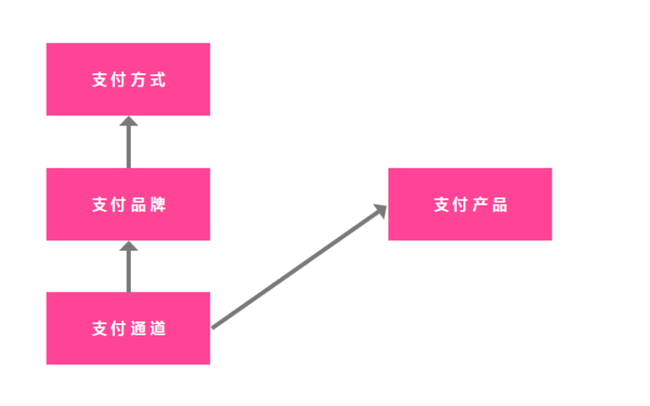                   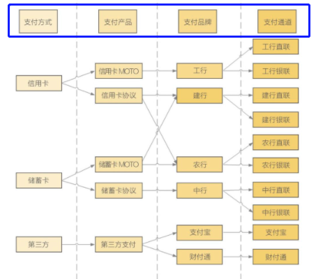

交易类型：

- 支付：购买商品或者服务进行付款；
- 退款：已经购买的订单进行逆向的退回；
- 充值：将银行卡里的钱充到账户余额里；
- 提现：将账户里的余额提到银行卡里；
- 打款：特指利用付款通道给商家结算，将资金付给商家的结算卡；
- 打款退回：原打款的逆向退回，一般因为打款失败；
- 转账：指将银行账户的钱转给另一个银行账户，泛指账户之间余额的转移；
- 调拨：公司将一个银行账户里的钱转到另一个银行账户用于付款业务；
- 资金归集：公司将众多的收款账户里收的钱全部转到一个账户进行统一管理。

**清算**：指履行交易双方约定的条件，完成交易过程中债务的结清和交易信息的核算、对账、对冲和结算的过程。其本质是债权债务的结清与交割成本的**计算**。包含数据搜集、清分、支付指令转发的过程。

**结算**：指在交易后，根据交易各方的约定或者市场规则，在银行或中央结算机构的保证下，进行**资金的划转和交付**，同时完成交易双方的各项权利义务的履行、入账和记账的过程。

​          可以说，清算是结算的前提，没有清算就不能进行结算。先支付，再有清算，再有结算。

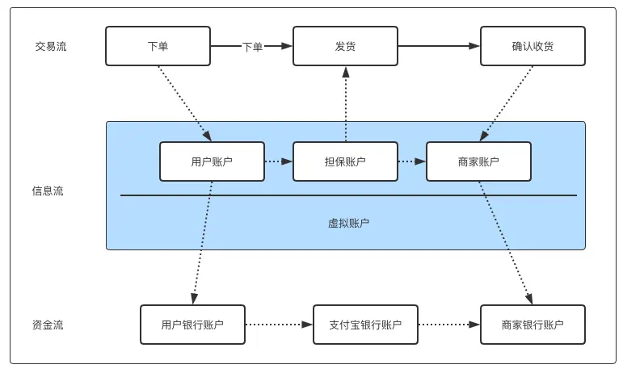

清分：清算过程中，算清楚应该给谁多少钱记账，计算各对象应收应付的过程。

入账：根据制定好的入账规则，将清分结果计入对应对象的账户中的过程。入账规则为，不同业务下产生的不同费用项设定计入账户的规则，入什么账户，什么方向，需不需要冻结等一系列规则和策略。

分账：分账是基于交易订单的收款金额做拆分结算，前面一定要有用户支付订单的环节。将一笔资金按照合同规则拆分成多份给到对应对象，对账务完成拆分的过程。

对账： 按照一定规则完成各方数据核对的过程，一般是帐证实之间的相互核对，确保一致。

结账：结账是指会计期末将各账户余额结清或结转下期，使各账户记录暂告一个段落的过程。包括虚账户的结清和实账户的结清。

### 二、支付体系中的主体

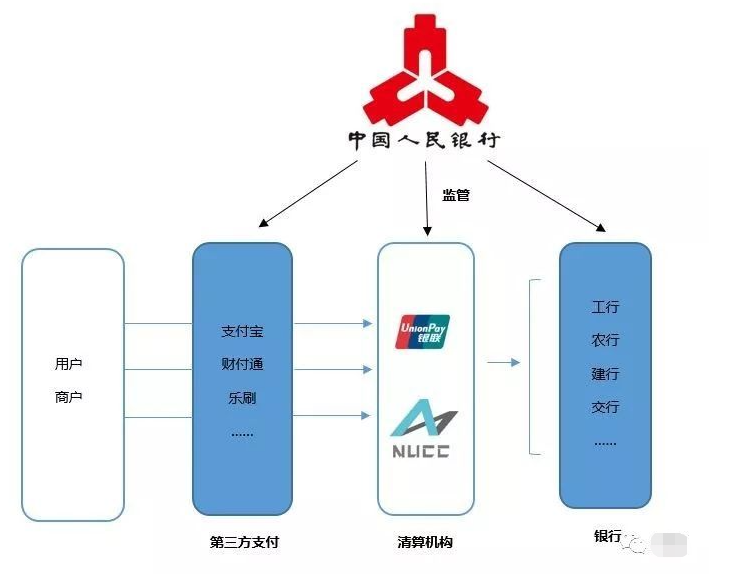

#### 2.1 各主体介绍

##### 2.1.1 银联

负责POS机与ATM的跨行支付、转账、取款业务，清分阶段由中国银联**银行卡跨行支付系统**完成，结算阶段由中国银联银行卡跨行支付系统接入大额实时交易系统完成。银联主要负责**银行间清算**，而网联主要负责非银行支付机构与银行之间的清算。

##### 2.1.2 网联

负责互联网金融如支付宝、微信等**第三方支付平台的支付与转账业务**，清算阶段由中国网联完成，结算阶段由中国网联接入中国人民银行网上支付跨行清算系统完成。

##### 2.1.3 非金融支付机构

是支付服务提供者，包括支付代理商、四方支付机构、三方支付机构等非金融支付机构，他们向商户提供效率更高、体验更好的支付服务解决方案。

第三方支付机构：具备一定实力和信誉保障的独立机构，采用与各大银行签约的方式，通过与银行支付结算系统接口对接而促成交易双方进行交易的网络支付模式。

##### 2.1.4 银行

银行，是依法成立的经营货币信贷业务的金融机构，是商品货币经济发展到一定阶段的产物。银行按类型分为：中央银行，政策性银行，商业银行，投资银行，世界银行，它们的职责各不相同。

##### 2.1.5 央行

中国人民银行是我国的中央银行。是国家中居主导地位的金融中心机构，是国家干预和调控国民经济发展的重要工具。负责制定并执行国家货币信用政策，独具货币发行权，实行金融监管。

##### 2.1.6 用户和商户

用户，是支付交易的消费者和发起者，他们基于生活和社会活动需要，购买商品，购买服务而发起支付动作。

商户，是商品和服务的提供者，并且为个人以及企业用户提供商品交易线下或线上场所以及支付服务。

##### 2.1.7 其他参与主体

以下为联通支付沃学堂分享的行业结构图

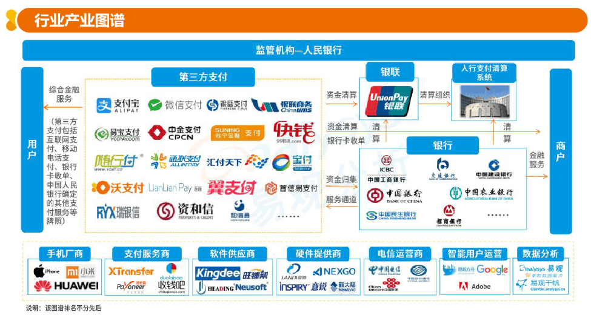

#### 2.2 第三方支付平台运营模式

**断直连**： **“直连”指的是一些第三方支付机构和银行直接连接**，由银行直接为第三方支付机构提供代扣通道的业务。而“断直连”指的就是将这种由银行直接为第三方支付机构提供代扣通道的业务切断，转由合法的清算平台作为中介，衔接银行和第三方支付机构。

断直连原因：直连容易形成安全隐患，监管层无法掌握第三方支付机构的交易数据和资金流向，断直联能够更好地实现资金交易安全。

##### 2.2.1 支付网关模式

纯第三方支付平台就是不涉及任何资金往来，只提供支付工具和服务。纯第三方支付平台的运营商主要通过对支付工具和服务的提供进行收费。

简单说来，就是作为银行和交易方之间的接口存在。具体表现就是，将多个不同银行的银行卡放在一起，然后支付给商家是通过第三方支付平台实现的。

##### 2.2.2 信用中介模式（第三方支付）

经过央行审批并获得牌照的第三方支付服务提供商，它可以通过自己的账户与银行或者客户的账户进行资金的收付和转移。这种模式下，第三方支付平台可以收取用户的交易手续费或者利息等费用。

这种模式的表现，是信用担保和代收代付。当双方可以交易的时候，资金先放在第三方支付平台，然后买家确认商品到货的时候，资金会划到买方账户。

##### 2.2.3 四方模式（聚合支付）

第四方支付是相对于第三方支付而提出的概念，又被称为“**聚合支付**”是指通过聚合第三方支付平台、合作银行、合作电信运营商及其他服务商借口等多种支付工具进行的综合支付服务，集通道聚合、资金聚合、信息聚合等多种功能于一身。

第三方支付介于银行和商户之间，而第四方支付是介于第三方支付和商户之间，**没有支付许可牌照的限制**。

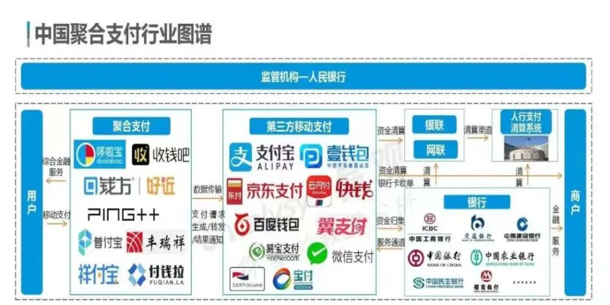

##### 2.2.4 其他模式

#### 2.3 业务类型和支付牌照

支付牌照查询通道：https://www.mpaypass.com.cn/pay/

##### 2.3.1 银行卡收单

##### 2.3.2 网络支付（互联网支付和移动电话支付）

##### 2.3.3 固定电话支付

##### 2.3.4 数字电视支付

##### 2.3.5 预防卡发行

##### 2.3.6 预付卡受理

#### 2.4  其他

### 三、支付平台能力

​    **基础能力**

##### 3.1 收银台

###### 3.1.1 收银台的定义

从字面意思“收银台=收+银+台”，顾名思义就是收取银子的台子。对商家来说是收钱的地方，对用户来说就是付钱的地方。

###### 3.1.2 收银台的功能

- 记录商品信息：消费了什么服务，买了什么商品
- 合计价格信息：应该多少钱，总价，优惠价，折扣，满减，运费等费用计算
- 展示支付方式：如何结算，现款还是赊账；选择哪个支付产品下什么类型的支付通道；
- 核实人员：核对货款的一致；买卖双方信息，商家信息，收货人信息和地址；
- 货款交割：付款结账，宣布完结

###### 3.1.3 收银台的功能模块

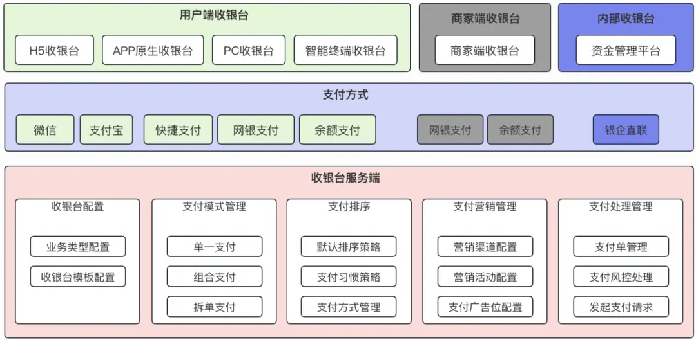

###### 3.1.4 收银台的业务流程

消费者下单需要的**用户收银台**：

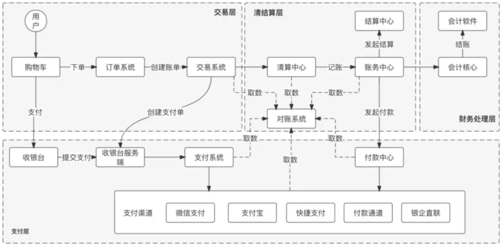

商家支付货款或充值的**商家收银台 ：**

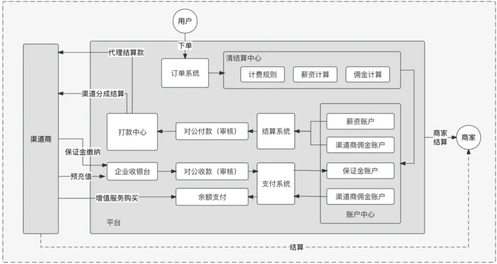

##### 3.2 通道

3.2.1 **什么是支付通道**

类似于运输，支付通道的本质是通过**构建一个个信息交换的环境**，用于支持交易过程中多方之间的信息的传递和验证，以实现交易资金的流动，最终促进交易的完成。

狭义上支付通道是指交易时连接消费者、商家和银行各方钱包账户的网络通路，从广义上来看其实就是只要能完成支付信息传输以及推动交易完成的接口或者其他形式都可以成为通道。通道其实就是支付的基础设施，最终目的是完成支付信息的交互传输，推动支付交易的完成。

3.2.2  **支付方式和支付通道关系**

1）同一个支付方式，除了自身的官方通道，往往也会授权其他机构合作封装出对应通道，所以**一个支付方式是由多个支付通道**可以选择。微信和支付宝都有相关的支付接口API，可以供其他机构对接。

[微信支付产品和场景](https://kf.qq.com/faq/170830jimmaa170830B7F7NJ.html) 

[支付宝支付产品和场景](https://open.alipay.com/api)

2）支付通道关系示意图

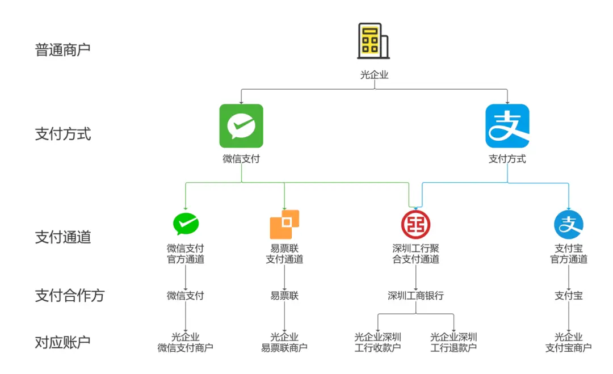

3.2.3 **通道管理**

通道基本信息：支付方式，所属机构，场景类型，卡/账户类型，行业类型，通道限额，通道费率，通道状态等

通道适配场景：选择什么通道，要先了解业务的场景，不同的业务模式需要不同的支付方式。例如，传统的线下零售业务可以选择POS机、微信支付宝的主扫、扫脸等，而线上平台则需要根据不同的平台进行选择。

支付通道路由：路由规则

业务场景流程：不同场景调起支付通道的业务流程是不一样的，这个需要产品人员根据业务场景设计，相对应的支付通道参数也是不一样的。

黑白名单

通道维护时间：通道会有维护时间，即某段时间不能接受交易请求。银行类的交易，维护比较常见。

等等。

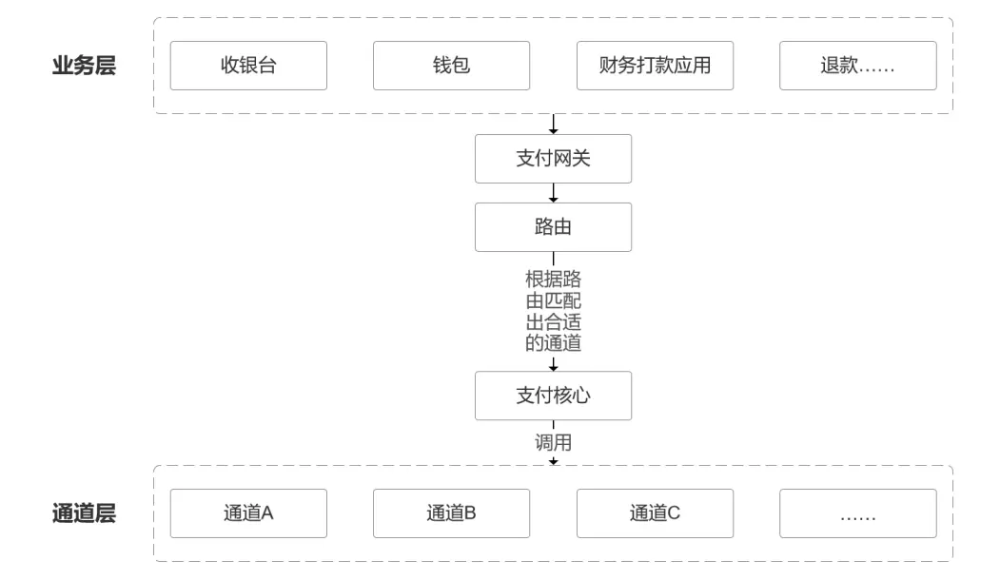

3.2.4 **通道分类**

根据通道的用途：收款通道、出款通道、鉴权认证通道、跨境通道等。

根据通道支持的对象：对公通道、对私通道等。

按渠道提供方分类：第三方渠道、银行渠道、自有渠道等。

其他分类方式...

##### 3.3 风控

四要素认证

黑名单、白名单

风控规则

风控模型

灰产和羊毛党

##### 3.4 商户权益管理

商户后台管理

营销管理

权益类管理（会员、优惠活动、电子券等）

   **个性化能力**

##### 3.5 平台自有商城

##### 3.6 流量内容生态

### 四、支付平台业务能力

##### 4.1 支付类业务

支付在时空上划分成三个阶段，交易，清算，结算；这也是一切支付行为的核心组成框架。

**4.1.2 支付流程**

**通用支付流程图：**

**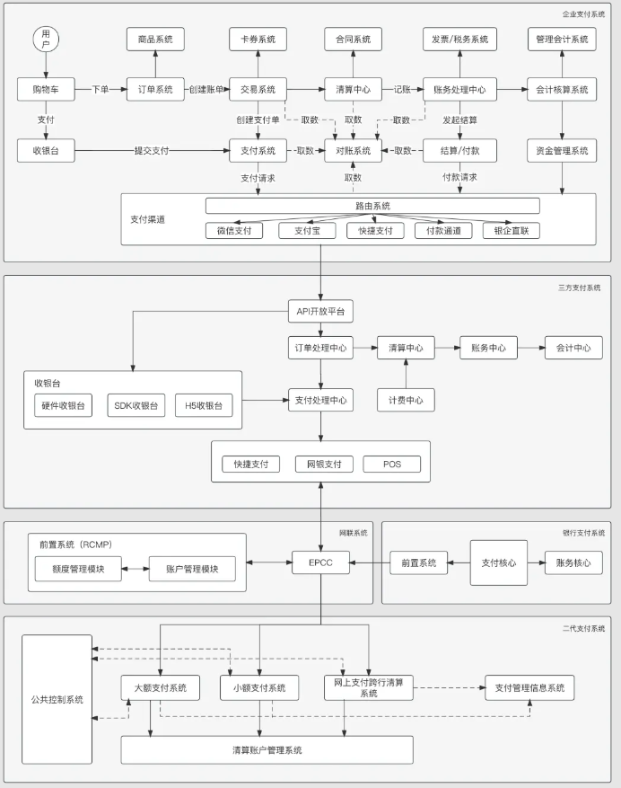**

##### 4.2 信贷类业务

**4.2.1 贷前**

**4.2.2 贷中**

**4.2.3 贷后**

##### 4.3 理财类业务

##### **4.3.1 申购/买**

**4.3.2 赎回/卖**

### 五、支付业务产品

见 [4.源系统资料](https://wiki.unicompayment.com/pages/viewpage.action?pageId=63502977&src=contextnavpagetreemode) 各系统产品介绍

### 六、支付相关常用模型

##### 6.1 风险模型

6.1.1 申请评分卡模型

6.1.2 行为评分卡模型

6.1.3 催收评分卡模型

6.1.4 息费敏感模型

6.1.5 多头借贷模型

6.1.6 多头风险模型

##### 6.2 非风险模型

6.2.1 客户流失模型

6.2.2 借款可能性预测模型

6.2.3 客户职业模型、客户收入模型、有孩模型、破产模型、有房模型、负债模型等

6.2.4 营销响应模型

6.2.5 模型分的有效性预测模型

### 【推荐阅读】

互联网金融支付（第二版）   作者:史浩

支付平台架构：业务、规划、设计与实现   作者:曹兵强

支付方法论    作者:王伟

  