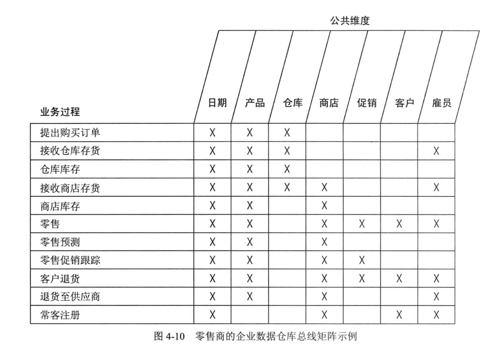
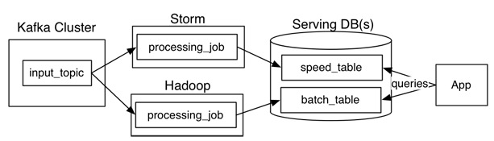
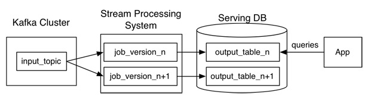
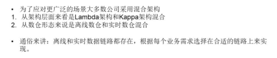
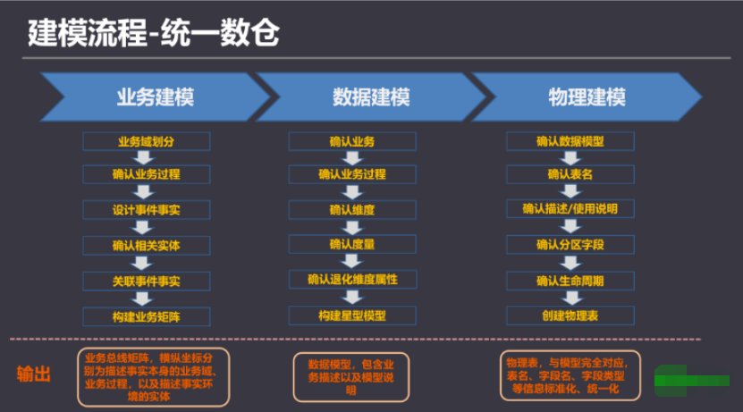
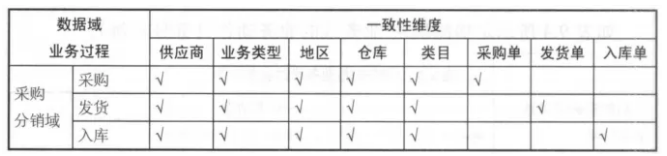
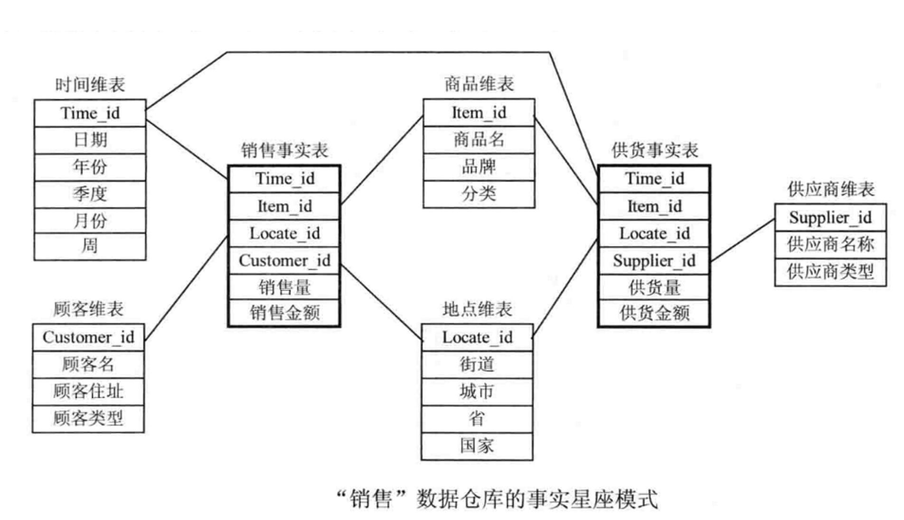
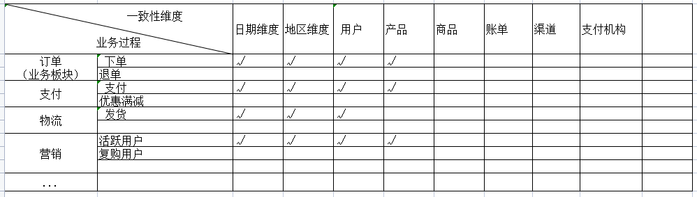
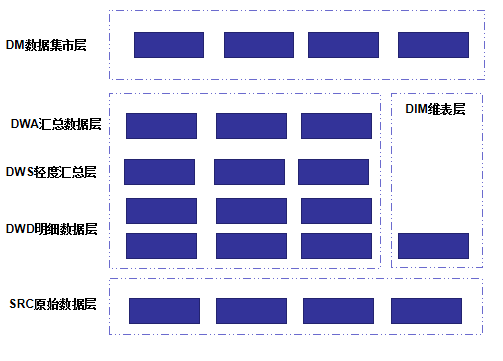
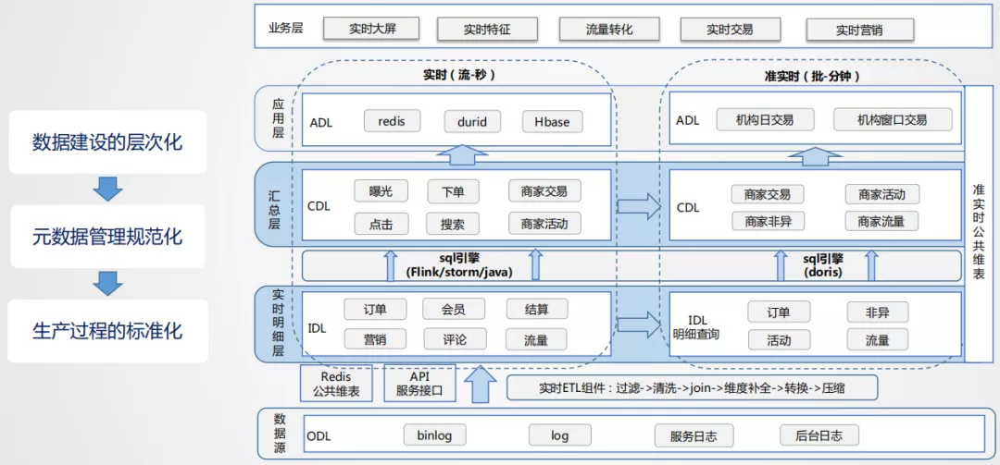

## 1.1 数仓建设指南

------

### 1.1.1 理论和概念

**1） oneData建模理论:**  https://developer.aliyun.com/article/771546

**2）维度建模理论**  《数据仓库工具箱–维度建模的完全指南-第三版》

维度建模是一种将数据结构化的逻辑设计方法，将客观世界划分为度量和上下文。机构的每一个业务过程都可以使用维度模型来描述，维度模型由一系列含有数值型度量的事实表组成，而事实表中的数值型度量则被一系列带有文本形式上下文的维度表所环绕。

数据仓库采用使用维度建模的好处：易理解、查询的高性能、修改的灵活性和可扩充性。

维度建模是一个可不断扩充添加的过程：

（1）在现有的事实表中增加维度。

（2）在事实表中增加事实。

（3）在维度表中增加属性。

在比较了解业务情况下，可先以底层细粒度构建开始，自底向上；反之，以业务需求的粗粒度开始，至顶向下；

**3) 维度建模四步流程：**

   **a） 选择业务过程**：业务过程是由组织完成的一系列微观活动。例如：完成下单、完成支付、发放代金券、上线产品等等。充分理解它们，有助于辨别组织中的不同业务过程，它一般具有这些特性：

- 用行为动词表示：它们通常表示业务过程的活动，比如下单、支付、退款等
- 一般由某个操作系统支持：比如下单由交易系统支持、产品上架由产品中心支持等
- 生成度量：度量一般由操作过程直接生成，比如用户支付金额，由用户支付过程直接产生。分析人员一般工作事件分析度量结果。一句话总结：一系列过程产生一系列事实表

数据仓库人员不仅要详细了解业务过程，还要充分理解用户需求（特别是他们的KPI），因为用户一般很难回答：“你对哪些业务过程感兴趣”，而是使用BI分析来自业务过程的性能度量

我们即需要理解上面的什么是业务过程，也需要理解如下的什么不是业务过程，这样才能取舍。比如不同部门的功能划分就不是业务过程，我们应该将注意力放在业务过程而不是不同的部门，这样才能避免重复的获取数据。

  **b）声明粒度：** 粒度是说明事实表的每一行表示什么。比如：用户下单的内容放倒订单事实表的每一行中。这里的关键是粒度的描述，不能讲维度列出来，而代替粒度声明。这一步特别容易被忽略，粒度声明需要达成共识，否则极有可能到下面三四步之后返工重来

  **c）确定维度：** 如果粒度合适，维度很容易确定，因为维度是用来描述：“谁、何时何地、为何、如何”。比如订单常用的维度是：日期、产品、供应商、订单状态、退款状态等

  **d）确定事实：** 用“业务的度量是什么”来思考事实。属于不同粒度的事实要放在不同的事实表中。有人可能疑惑粒度和事实的区别是啥，粒度说明了事实的每一行代表什么意思，而事实是里面包含哪些列，比如成交金额、退款金额、购买份数等等

**4) 企业数据仓库总线架构**

总线矩阵提供一种分解企业DW/BI规划任务的合理方式，行是业务过程，列是公共维度（一致性维度），图表中的X表示的是哪些列与哪些行有关系，也表示这一个业务过程需要有哪些公共维度。先看一个总线矩阵的示例图（出自kimball的书）：

在多维体系结构（MD） 的数据仓库架构中，主导思想是分步建立数据仓库，由数据集市组合成企业的数据仓库。但是，在建立第一个数据集市前，架构师首先要做的就是设计出在整个企业内具有统一解释的标准化的维度和事实，即一致性维度和一致性事实。而开发团队必须严格的按照这个体系结构来进行数据集市的迭代开发。

一致性维度就好比企业范围内的一组总线，不同数据集市的事实的就好比插在这组总线上的元件。这也是称之为总线架构的原因。

实际设计过程中，我们通常把总线架构列表成矩阵的形式，其中列为一致性维度，行为不同的业务处理过程，即事实，在交叉点上打上标记表示该业务处理过程与该维度相关。这个矩阵也称为总线矩阵（Bus Matrix）。

总线架构和一致性维度、一致性事实共同组成了Kimball的多维体系结构的基础，也建立了一套可以逐步建立数据仓库的方法论。由于总线架构是多维体系结构的核心，所以我们有时就把多维体系结构直接称为总线架构。

------

#### 名称解释

- **业务板块**： 比数据域更高维度的业务划分方法，适用于庞大的业务系统。逻辑空间的定义，是基于业务特征划分的命名空间。

  

- **数据域**：为保障整个体系的生命力，数据域是需要抽象提炼，并且长期维护和更新的，但不轻易变动。面向业务分析，将业务过程或者维度进行抽象的集合。在划分数据域时，既能涵盖当前所有的业务需求，又能在新业务进入时无影响地被包含进已有的数据域中和扩展新的数据域。

  

- **业务过程**： 企业的业务活动事件，如下单、支付、退款都是业务过程。业务过程是一个不可拆分的行为事件

  

- **时间周期**：用来明确数据统计的时间范围或者时间点。如最近30天、自然周、截至当日等。

  

- **修饰类型**：是对修饰词的一种抽象划分。修饰类型从属于某个业务域，如日志域的访问终端类型涵盖 APP 端、PC 端等修饰词。

  

- **修饰词**：统计维度以外指标的业务场景限定抽象，修饰词属于一种修饰类型，如在日志域的访问终端类型下，有修饰词 APP、PC 端等。

  

- **度量**： 在维度建模中，将度量称为事实，将环境描述为维度。度量是业务中产生的一个数值，事实是一条业务中度量的集合。

  

- **原子指标**：是业务定义中不可再拆分的指标，具有明确业务含义的名词，如支付金额。基于某一业务事件行为下的度量

  

- **维度**：是度量的环境，用来反映业务的一类属性，这类属性的集合构成一个维度，也可以称为实体对象。维度是我们描述事实的角度

  

- **维度属性**：隶属于一个维度，如地理维度里面的国家名称、国家ID、省份名称等都属于维度属性。 维度属性是查询约束条件、分组和报表标签生成的基本来源，是数据易用性的关键。

  

- **粒度**：粒度就是业务流程中对度量的单位，比如商品是按件记录度量，还是按批记录度量。在指定粒度时，您需要充分考虑到业务和维度的关系。明细粒度是数据展现业务过程的最小度量值；统计粒度常作为派生指标的修饰词而存在。
  
- **事实表**： 关注的内容，存储为每一个可度量的事件，记录度量的值，比如：一次购买事件，涉及主体包括客户、商品、商家，产生的可度量值 包括商品数量、金额、件数等
  
- **事务事实表**： 以每个事务或事件为单位， 一旦事务被提交，事实表数据被插入，数据就不再进行更改。

  

- **周期快照事实表**：按照一定的时间周期间隔(每天，每月)来捕捉业务活动的执行情况。用来记录有规律的、固定时间间隔的业务累计数据，通常粒度比较高。

  

- **累积快照事实表**：用于描述业务过程（有明确的开端和结尾）中某个不确定时间跨度里的活动。用来记录具有时间跨度的业务处理过程的整个过程的信息，每个生命周期一行。跟周期快照事实表的区别就在于，业务过程的时间周期不确定、不是固定长度。

  

- **维度表**：业务过程的发生或分析的角度，比如：按某某分析就构成一个维度。一般把能够分类的属性单独列出来，成为维度表，在事实表中维护事实与维度的引用关系

  

- **退化维度**：将一些常用的维度属性直接写到事实表中的维度操作称为维度退化。维度属性的一些字段冗余。

  

- **缓慢变化维**：随着时间的流逝维度发生缓慢的变化，比如员工表中的部门维度，员工的所在部门有可能两年后调整一次。

  

- **星型模型**：当所有维表都直接连接到“ 事实表”上时，整个图解就像星星一样，故将该模型称为星型模型

  

- **雪花模型**：当一个或多个维表没有直接连接到事实表上，而是通过其他维表连接到事实表上时，其图解就像多个雪花连接在一起，故称雪花模型

  

- **星座模型**：数据仓库由多个主题构成，包含多个事实表，而维表是公共的，可以共享。有的时候一个维度表可能被多个事实表用到，这个时候就需要采用星座模式。

------

#### 数仓架构

**1）Lambda架构**

Lambda架构主要由这几部分构成：

​        数据源（Kafka），数据处理（Storm，Hadoop），服务数据库（Serving DB）。

​        其中数据源和服务数据库是整个架构数据的入口和出口。

​        数据处理则是分为在**在线处理**和**离线处理**两部分。

当数据通过kafka消息中间件，进入Lambda架构后，会同时进入离线处理（Hadoop）和实时处理（Storm）两个处理模块。离线处理进行批计算，将大量T+1的数据进行汇总。而实时处理则是进行流处理或者是微批处理，计算秒级、分钟级的结果。最后都录入到服务数据库（Serving DB）中进行汇总，暴露给上层服务调用。

Lambda架构的好处是：

​    架构简单，很好的结合了离线批处理和实时流处理的优点，稳定且实时计算成本可控。

​    它对数据订正也很友好。如果后期数据统计口径变更，重新运行离线任务，则可以很快的将历史数据订正为最新的口径。

Lambda也有很多问题。

​      最突出的问题就是需要**同时维护**实时处理和离线处理**两套代码**的同时还要保证**两套处理**结果保持一致。这无疑是非常让人头疼的。

**2）Kappa架构**

Kafka或者其他消息中间件，具备保留多日数据的能力。正常情况下kafka都是吐出实时数据，经过实时处理系统，进入服务数据库（Serving DB）。

当系统需要数据订正时，重放消息，修正实时处理代码，扩展实时处理系统的并发度，快速回溯过去历史数据。这样的架构简单，避免了维护两套系统还需要保持结果一致的问题，也很好解决了数据订正问题。

但它也有它的问题：

1、消息中间件缓存的数据量和回溯数据有性能瓶颈。通常算法需要过去180天的数据，如果都存在消息中间件，无疑有非常大的压力。同时，一次性回溯订正180天级别的数据，对实时计算的资源消耗也非常大。

2、在实时数据处理时，遇到大量不同的实时流进行关联时，非常依赖实时计算系统的能力，很可能因为数据流先后顺序问题，导致数据丢失。

|        | 优点                                                         | 缺点                                                     |
| ------ | ------------------------------------------------------------ | -------------------------------------------------------- |
| Lambda | 1、架构简单2、很好的结合了离线批处理和实时流处理的优点4、稳定且实时计算成本可控5、离线数据易于订正 | 1、实时、离线数据很难保持一致结果2、需要维护两套系统     |
| Kappa  | 1、只需要维护实时处理模块2、可以通过消息重放3、无需离线实时数据合并 | 1、强依赖消息中间件缓存能力2、实时数据处理时存在丢失数据 |

**3）混合架构**

------

### 1.1.2 建模阶段设计

------

####  1.业务建模

采用过程分析法，将整个业务过程涉及的每个环节一一列清楚，包括技术、数据、系统环境等。

每个业务会生成哪些数据？

每一个环节会产生哪些数据，数据的内容是什么？

数据在什么情况下会更新，更新的逻辑是什么？

构建业务实体模型图，梳理业务过程，分析出业务总线矩阵。

------

#### 2.数据建模（维度建模）

一般使用下面的过程维度建模：

- **选择业务流程**：描述需要建模的业务流程。例如，需要了解和分析一个零售店的销售情况，那么与该零售店销售相关的所欲业务流程都是需要关注的。

- **声明粒度**：声明维度模型的粒度，用于确定事实中表示的是什么，例如，一个零售店的顾客在购物小票上的一个购买条目。

- **确认维度**：典型的维度都是名词，如日期、商店、库存等。维度表存储了某一维度的所有相关数据，例如，日期维度应该包含年、季度、月、周、日等数据。每个数据仓库中都应该有一个日期维度。

- **确认事实**：这一步是数字化的度量，构成事实表的记录。它是和系统的业务用户密切相关的，因为用户正是通过对事实表的访问获得数据仓库存储的数据。大部分事实表的度量都是数字类型的，可累加，可计算，如成本、数量、金额等。 

构建星座模型，示例如下：

------

#### 3.物理建模

建模/开发工具： 数据建模工具。

------

### 1.1.3 相关工具

无

------

## 1.2 数仓建设规范

------

### 1.2.1 数据分域

------

#### 1.1.数据域关系图

待补充（市面上有相关模型）

#### **1.2. 企业总线架构矩阵图**

（结合企业已有业务线）

------

#### 2.数据域划分

1. **客户域（Customer）**
   编码缩写： **CUS**
   描述说明：用户、商户等

   

2. **产品域（Product）**
   编码缩写： **PRD**
   描述说明：沃易贷、沃分期、沃理财等

   

3. **资产域（Asset**）
   编码缩写： **ASS**
   描述说明：客户资产信息

   

4. **协议域（Aggrement）**
   编码缩写： **AGG**
   描述说明：客户与机构间的契约关系

   

5. **事件域（Events）**
   编码缩写： **EVT**
   描述说明：客户与机构间的金融与非金融事件

   

6. **渠道域（Channel）**
   编码缩写： **CHL**
   描述说明：各种接触途径等

   

7. **营销域（Marketing）**
   编码缩写： **MRT**
   描述说明：各种促销活动等

   

8. **财务域（Finance）**
   编码缩写： **FIN**
   描述说明：科目、账务、清结算等

   

9. **位置域（Location）**
   编码缩写： **LOC**
   描述说明：商户、活动地址等

   

10. **公共域（Public）**
    编码缩写： **PUB**
    描述说明：各种业务编码数据

    

11. **规则域（Rule）**
    编码缩写： **RUL**
    描述说明：约束条件、业务规则。与协议不同，是单向制定的

    
    

------

#### 3.业务域划分

***业务域名称缩写：***

1. 
   

业务域命名来源参考：

 

------

### 1.2.2 数仓分层

------

#### 1） 架构图

ODS层(在这里叫的src)

##### 技术架构

（示例： ）

------

#### 2）说明

- **数据流向**
  1）稳定业务：ODS → DWD→DWS → DWA

  2）非稳定业务（调用量小的业务）： ODS→  DWD→ DWA     
   减少数据链路，免去DWS轻度聚合层的通用封装。
   使用频率非常低的数据，也可以使用该链路。

  3）数据域未覆盖全：ODS→ DWS→DWA 

  **[注意事项]：**
  a. 尽量避免出现 DWA 宽表中，既使用 DWD， 又使用（该 DWD 所归属主题域）DWS的表
  b. 同一主题域内对于 DWS 生成 DWS 的表，原则上要尽量避免，否则会影响 ETL 的效率
  c. 禁止出现反向依赖，例如 DWS 的表依赖 DWA 的表

**分层说明**

- SRC层
  **数据接入范围：**          数据按需接入，与来源业务系统保持一致
  **数据粒度**：         业务系统粒度
  **建模方法**：       保持与业务系统一致，ER模型
  **数据保留时间**：      60天
  **其他**：

  

- DWD层
  **数据接入范围：**          数据全面覆盖SRC层数据
  **数据粒度**：         明细级，最小数据粒度
  **建模方法**：       维度建模+ER模型，星座模型/雪花模型
  **数据保留时间**：     1-3年
  **其他**：

  

- DIM维表层
  **数据接入范围：**          数据全面覆盖SRC层数据
  **数据粒度**：         明细级，最小数据粒度
  **建模方法**：       维度建模
  **数据保留时间**：    长期保留
  **其他**：

  

- DWA层
  **数据接入范围：**          数据按业务主题接入DWD层
  **数据粒度**：         轻度汇总，公共维度组合数据
  **建模方法**：       维度建模 
  **数据保留时间**：     1-3年
  **其他**：

  

- DM集市层
  **数据接入范围：**          数据按指标体系接入
  **数据粒度**：         高度汇总，指标需求维度组合数据
  **建模方法**：       维度建模 
  **数据保留时间**：    长期保留
  **其他**：

  

- BK备份层
  **数据接入范围：**          数仓各层数据
  **数据粒度**：         无
  **建模方法**：       无
  **数据保留时间**：     长期保留，只保留最近三个版本数据
  **其他**：

  

- 

------

### 1.2.3 分层表命名规范

**1）通用命名格式：**

​       数仓分层名_数据域_业务域_T_表名_[ 同步周期/统计周期 ]

数据域名：  参考数据分域中，对应数据域的编码缩写

业务域名： 参考数据分域中，对应业务域的编码缩写

同步/统计周期：  数字 + 周期描述词 

​      描述词： 年 _Y。 如： 3年，_3Y

​                      季 _Q

​                      月 _M

​                      **周 _W**

​                      **日 _D**

​                      **时 _H**

**2） 通用规范：**

1. 表名统一字母大写，字段名统一小写

2. 实时性要求在分钟级别的表，不带周期后缀

   

   

------

#### 1）分层命名说明

**SRC层**

表命名格式： SRC_业务系统名_T_业务表名_同步周期

举例： 

​      用户信息表 举例： SRC_ISIM_T_USERINFO_1D

 **DIM维表层**

表命名格式： DIM_数据域_业务域_T_维度关键词

举例：

​     全网客户信息表  DIM_CUS_ISIM_T_AL_CUSTOMER 

**DWD明细数据层**

表命名格式：DWD_数据域_业务域_T_事实关键词_同步周期

举例：

​     CBSS语音详单表(日)  DWD_EVT_ISIM_T_CB_VOICE_1D  

 **DWS层**

表命名格式：DWS_数据域_业务域_T_关键词_统计周期

举例：

​     3日用户留存表 DWS_CUS_ISIM_T_AL_SAVE_3D  

 **DWA层**

表命名格式：DWA_数据域_业务域_T_关键词_统计周期

举例：

​     采购SKU粒度汇总表 DWA_EVT_ISIM_T_SKU_SHOP_7D

**DM层**

表命名格式：DM_业务域_集市描述关键词_统计周期

举例：

​     助贷风控特征离线表 DM_DTCCS_T_RISK_CONTROLLER_OFFLINE_1D

**BK备份层**

表命名格式：BK_备份表表名_日期

举例：

​     BK_DWS_[详细表名]_20210329

**其他表名**

- 临时表 TMP_ ： 表名：TMP_分层名_[ to_分层名 ]_T_表标识_[ 时间  ]

  

- 视图表 VIEW_ ： 表名：VIEW_分层名_数据域_业务域_T_关键词_[ 周期 ]

  

- 拉链表 ZT_ ： 表名：ZT_分层名_T_表标识_[ 时间日期 ]

  

- 码表 MA_ ： 表名：MA_数据域_T_码表描述关键词

------

### 1.2.4 业务数据入仓规范

------

#### 1) 数据需求梳理

输出结果： 可行的业务需求文档，明确不存在歧义和模糊边界的需求，对后期数据开发有一定指导意义。

如果本期需求为业务明细数据，需求文档落实到具体业务表的取数逻辑；示例如下：

如果本次需求为统计指标相关，需要按照运营清算部已有的指标体系规范，拆解成 “时间周期 + 维度属性 + 根指标”这种明确的需求。示例如下：

------

#### 2）业务库表梳理

本阶段输出结果：跟业务系统人员沟通梳理，**以实际生产环境的业务库表为标准，** 整理出各个业务表相关文档。具体举例如下：

------

#### 3）业务数据抽取依据的时间字段

本阶段输出结果：

基于2）中业务字段梳理的基础上，结合实际生产环境数据，确定后面接入数据时抽取依据的时间字段，整理成相应的文档。格式举例如下：

| **业务**                    | **表名**                     | **创建时间字段名**              | **创建时间值示例** | **更新时间字段名**              | **更新时间值示例**       |
| --------------------------- | ---------------------------- | ------------------------------- | ------------------ | ------------------------------- | ------------------------ |
|                       |           |                          | 2021-05-12         | 无，一般不会更新                |                          |

时间字段数据质量不规范时，数据处理办法：

| 业务时间字段数据情况                                 | 数据处理办法                             | 备注                                                    |
| :--------------------------------------------------- | :--------------------------------------- | :------------------------------------------------------ |
| 业务表不存在时间字段；或有时间字段列，但无值(null)   | 每日一次，全量抽取                       | 小码表（数据条数范围：）； 大表，推动业务部门添加并维护 |
| 有时间字段列，有更新有空值null                       | 有值的数据按原逻辑抽取，空值数据不抽取； | 空值数据，推动业务部门改造或补数                        |
| 有时间字段列，但时间精度不够（flinkx要求精度在毫秒） | 精度够的抽取                             | 推动业务部门统一时间字段数据标准                        |
| 同一张表有多个时间字段列，同时维护，精度符合要求     | 拆分多个逻辑，按对应时间列抽取           |                                                         |
| 有时间字段，分离成日期、时间等多个列                 | 构建视图抽取                             | 推动业务部门改造                                        |

#### 4）数据脱敏相关梳理

涉及到敏感类数据，梳理过程中需要确认数据明文密文情况、加密算法等问题。

------

### 1.2.5 数据建模规范

无

------

#### 数仓的数据标准

### 1.2.6 开发规范

------

#### 基于hive的规范

**约定：**

- 字符编码统一为utf-8格式

- 分区表必须包含年月日字段

- 对于可能出现null的字段，如果为字符型统一为空字符串，如果是数值则给0

- 所有模型创建，必须有注释，包括表注释、字段注释

- 测试表、临时表、中间表确定不会再使用后，及时清除

- 不允许直接登陆数据库进行数据表的创建、修改和删除工作，必须利用平台提供数据建模工具进行相关操作

  

**分区：**

**1）按时间分区**

- 默认采用月份（YYYYMM）分区作为一级分区，对于日模型表（DD）增加二级分区；

- 年份分区，分期键：YEAR_ID，格式： yyyy

- 月份分区，分期键：MONTH_ID，格式： yyyymm

- 日期分区，分期键：DT，格式： yyyymmdd

- 日分区，分期键：DAY_ID，格式： dd

- 小时份分区，分期键：HOUR_ID，格式： HH

  

**2）按地区分区**

**存储和压缩**

**sql脚本规范**

**调度脚本规范**

------

## 1.3 数据仓库设计

工作步骤：

1）梳理业务系统数据库表： 整理数据字典、明确字段业务含义、数据质量问题、数据抽取依据的时间字段等工作；

2）SRC层模型设计，建立SRC层物理表等工作；

3）数据采集流程方案确定。分为实时采集流程和离线批量采集流程。

​    制定采集方案(如ogg等 )、确定采集规则（初始化、增量）、清洗规则（类型转换、空值处理、数据脱敏、日期格式转换等）、数据链路文档等工作；

​     开发程序、数据入仓到SRC；

4）DWD层维度建模设计；

5）DM主题集市设计：  DM需求分析和梳理、模型设计和物理表建立、统计需求开发、数据录入主题集市等工作。

------

### 1.3.3 数据采集

分为：实时采集和离线采集。

均包含：命名规则、采集规则、清洗规则、数据流向链路等

------

#### 离线采集流程

------

##### 离线数据流向链路

------

#### 实时采集流程

##### 实时数据流向链路

### 1.3.4 DWD维度建模

