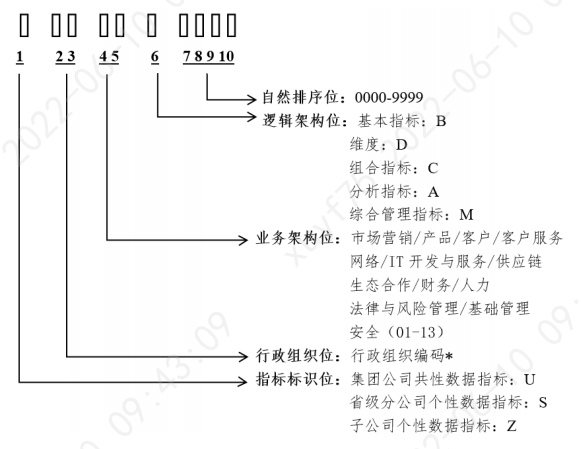
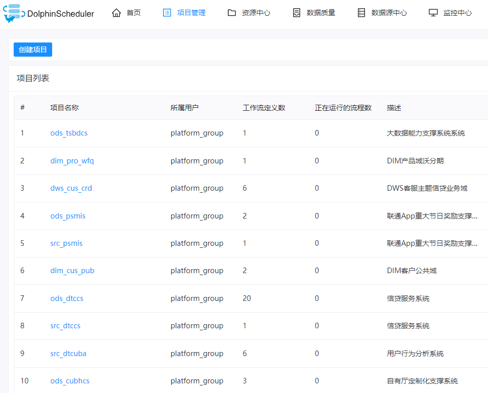
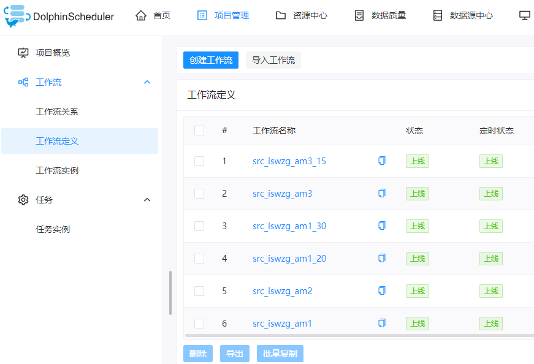
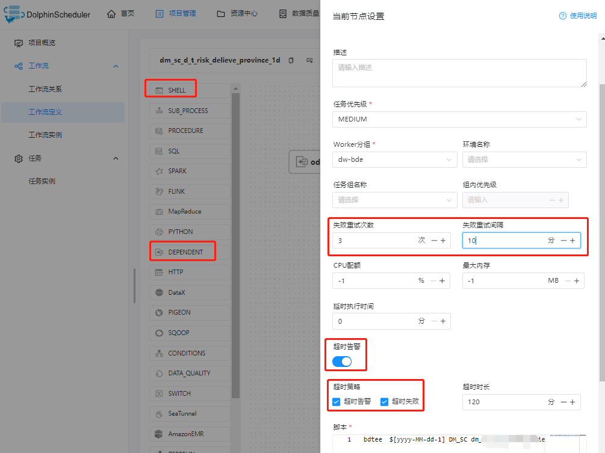
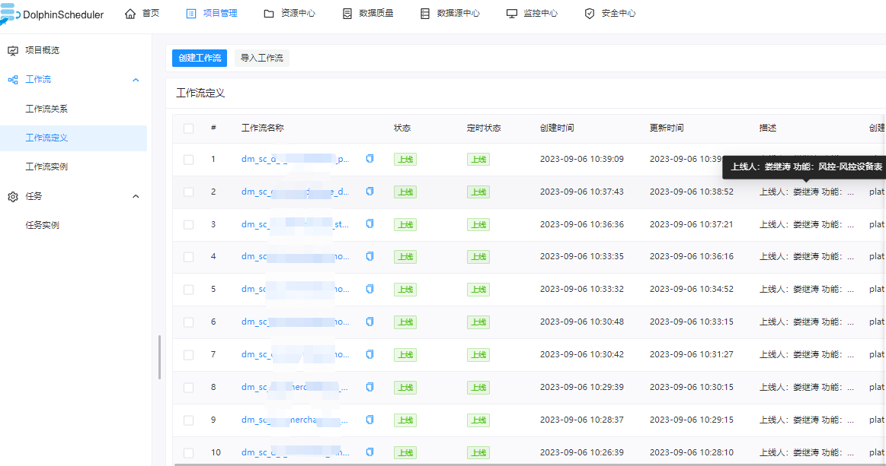
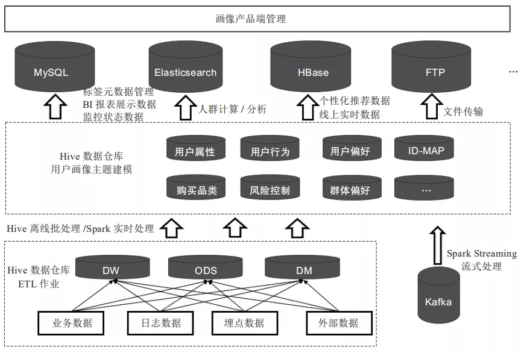
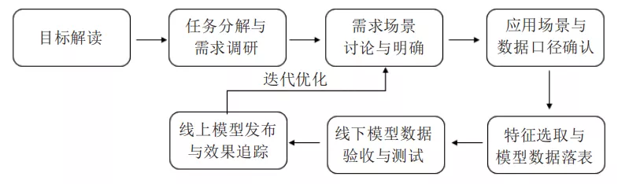
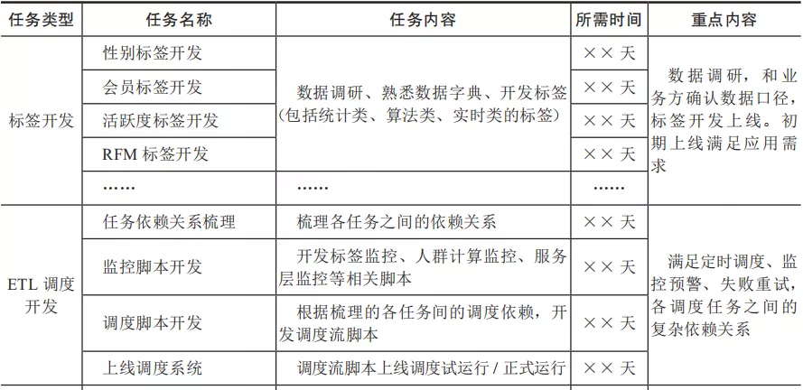

## 1.1 数仓建设指南

------

### 1.1.1 理论和概念

**1） oneData建模理论:**  https://developer.aliyun.com/article/771546


**2）维度建模理论**  《数据仓库工具箱–维度建模的完全指南-第三版》

维度建模是一种将数据结构化的逻辑设计方法，将客观世界划分为度量和上下文。机构的每一个业务过程都可以使用维度模型来描述，维度模型由一系列含有数值型度量的事实表组成，而事实表中的数值型度量则被一系列带有文本形式上下文的维度表所环绕。

数据仓库采用使用维度建模的好处：易理解、查询的高性能、修改的灵活性和可扩充性。

维度建模是一个可不断扩充添加的过程：

（1）在现有的事实表中增加维度。

（2）在事实表中增加事实。

（3）在维度表中增加属性。

在比较了解业务情况下，可先以底层细粒度构建开始，自底向上；反之，以业务需求的粗粒度开始，至顶向下；


**3) 维度建模四步流程：**

   **a） 选择业务过程**：业务过程是由组织完成的一系列微观活动。例如：完成下单、完成支付、发放代金券、上线产品等等。充分理解它们，有助于辨别组织中的不同业务过程，它一般具有这些特性：

- 用行为动词表示：它们通常表示业务过程的活动，比如下单、支付、退款等
- 一般由某个操作系统支持：比如下单由交易系统支持、产品上架由产品中心支持等
- 生成度量：度量一般由操作过程直接生成，比如用户支付金额，由用户支付过程直接产生。分析人员一般工作事件分析度量结果。一句话总结：一系列过程产生一系列事实表

数据仓库人员不仅要详细了解业务过程，还要充分理解用户需求（特别是他们的KPI），因为用户一般很难回答：“你对哪些业务过程感兴趣”，而是使用BI分析来自业务过程的性能度量

我们即需要理解上面的什么是业务过程，也需要理解如下的什么不是业务过程，这样才能取舍。比如不同部门的功能划分就不是业务过程，我们应该将注意力放在业务过程而不是不同的部门，这样才能避免重复的获取数据。

  **b）声明粒度：** 粒度是说明事实表的每一行表示什么。比如：用户下单的内容放倒订单事实表的每一行中。这里的关键是粒度的描述，不能讲维度列出来，而代替粒度声明。这一步特别容易被忽略，粒度声明需要达成共识，否则极有可能到下面三四步之后返工重来

  **c）确定维度：** 如果粒度合适，维度很容易确定，因为维度是用来描述：“谁、何时何地、为何、如何”。比如订单常用的维度是：日期、产品、供应商、订单状态、退款状态等

  **d）确定事实：** 用“业务的度量是什么”来思考事实。属于不同粒度的事实要放在不同的事实表中。有人可能疑惑粒度和事实的区别是啥，粒度说明了事实的每一行代表什么意思，而事实是里面包含哪些列，比如成交金额、退款金额、购买份数等等


**4) 企业数据仓库总线架构**

总线矩阵提供一种分解企业DW/BI规划任务的合理方式，行是业务过程，列是公共维度（一致性维度），图表中的X表示的是哪些列与哪些行有关系，也表示这一个业务过程需要有哪些公共维度。先看一个总线矩阵的示例图（出自kimball的书）：


在多维体系结构（MD） 的数据仓库架构中，主导思想是分步建立数据仓库，由数据集市组合成企业的数据仓库。但是，在建立第一个数据集市前，架构师首先要做的就是设计出在整个企业内具有统一解释的标准化的维度和事实，即一致性维度和一致性事实。而开发团队必须严格的按照这个体系结构来进行数据集市的迭代开发。

一致性维度就好比企业范围内的一组总线，不同数据集市的事实的就好比插在这组总线上的元件。这也是称之为总线架构的原因。

实际设计过程中，我们通常把总线架构列表成矩阵的形式，其中列为一致性维度，行为不同的业务处理过程，即事实，在交叉点上打上标记表示该业务处理过程与该维度相关。这个矩阵也称为总线矩阵（Bus Matrix）。

总线架构和一致性维度、一致性事实共同组成了Kimball的多维体系结构的基础，也建立了一套可以逐步建立数据仓库的方法论。由于总线架构是多维体系结构的核心，所以我们有时就把多维体系结构直接称为总线架构。


Kimball 的模型是自底向上的，自下而上，维度建模；**以最终任务（需求）为导向**，将数据按照目标拆分出不同的表需求，通过 ETL 导入数据集市层

先按照业务主线建立最小粒度的事实表；

再建立维度表，形成数据集市；在数据集市将事实表和维度表根据**分析主题**组合后导入数据仓库中，用于数据分析

通过“一致维度”能够共同看到不同数据集市的信息；

------


#### 1.1.1.1 名称解释

- **业务板块**： 比数据域更高维度的业务划分方法，适用于庞大的业务系统。逻辑空间的定义，是基于业务特征划分的命名空间。

  

- **数据域**：为保障整个体系的生命力，数据域是需要抽象提炼，并且长期维护和更新的，但不轻易变动。面向业务分析，将业务过程或者维度进行抽象的集合。在划分数据域时，既能涵盖当前所有的业务需求，又能在新业务进入时无影响地被包含进已有的数据域中和扩展新的数据域。

  

- **业务过程**： 企业的业务活动事件，如下单、支付、退款都是业务过程。业务过程是一个不可拆分的行为事件

  

- **时间周期**：用来明确数据统计的时间范围或者时间点。如最近30天、自然周、截至当日等。

  

- **修饰类型**：是对修饰词的一种抽象划分。修饰类型从属于某个业务域，如日志域的访问终端类型涵盖 APP 端、PC 端等修饰词。

  

- **修饰词**：统计维度以外指标的业务场景限定抽象，修饰词属于一种修饰类型，如在日志域的访问终端类型下，有修饰词 APP、PC 端等。

  

- **度量**： 在维度建模中，将度量称为事实，将环境描述为维度。度量是业务中产生的一个数值，事实是一条业务中度量的集合。

  

- **原子指标**：是业务定义中不可再拆分的指标，具有明确业务含义的名词，如支付金额。基于某一业务事件行为下的度量

  

- **维度**：是度量的环境，用来反映业务的一类属性，这类属性的集合构成一个维度，也可以称为实体对象。维度是我们描述事实的角度

  

- **维度属性**：隶属于一个维度，如地理维度里面的国家名称、国家ID、省份名称等都属于维度属性。 维度属性是查询约束条件、分组和报表标签生成的基本来源，是数据易用性的关键。

  

- **粒度**：粒度就是业务流程中对度量的单位，比如商品是按件记录度量，还是按批记录度量。在指定粒度时，您需要充分考虑到业务和维度的关系。明细粒度是数据展现业务过程的最小度量值；统计粒度常作为派生指标的修饰词而存在。
  
- **事实表**： 关注的内容，存储为每一个可度量的事件，记录度量的值，比如：一次购买事件，涉及主体包括客户、商品、商家，产生的可度量值 包括商品数量、金额、件数等
  
- **事务事实表**： 以每个事务或事件为单位， 一旦事务被提交，事实表数据被插入，数据就不再进行更改。

  

- **周期快照事实表**：按照一定的时间周期间隔(每天，每月)来捕捉业务活动的执行情况。用来记录有规律的、固定时间间隔的业务累计数据，通常粒度比较高。

  

- **累积快照事实表**：用于描述业务过程（有明确的开端和结尾）中某个不确定时间跨度里的活动。用来记录具有时间跨度的业务处理过程的整个过程的信息，每个生命周期一行。跟周期快照事实表的区别就在于，业务过程的时间周期不确定、不是固定长度。

  

- **维度表**：业务过程的发生或分析的角度，比如：按某某分析就构成一个维度。一般把能够分类的属性单独列出来，成为维度表，在事实表中维护事实与维度的引用关系

  

- **退化维度**：将一些常用的维度属性直接写到事实表中的维度操作称为维度退化。维度属性的一些字段冗余。

  

- **缓慢变化维**：随着时间的流逝维度发生缓慢的变化，比如员工表中的部门维度，员工的所在部门有可能两年后调整一次。

  

- **星型模型**：当所有维表都直接连接到“ 事实表”上时，整个图解就像星星一样，故将该模型称为星型模型

  

- **雪花模型**：当一个或多个维表没有直接连接到事实表上，而是通过其他维表连接到事实表上时，其图解就像多个雪花连接在一起，故称雪花模型

  

- **星座模型**：数据仓库由多个主题构成，包含多个事实表，而维表是公共的，可以共享。有的时候一个维度表可能被多个事实表用到，这个时候就需要采用星座模式。

------

#### 1.1.1.2 数仓构建流程 

##### **1.1.1.2.1. 需求分析** 

需求来源/需求调研方式：内部讨论、客户访谈 和 调查问卷。

**1）角度一： 企业领导层**

领导层对数据仓库的期望是什么 ?

领导层最关心哪几个指标 ?

领导层希望以何种方式来看这些指标 ?

领导层希望对这些指标进行哪些方面的比较 ?

......

（数仓定位； 关心的核心指标；数据展示的形式； 指标用于决策的价值；）


**2) 角度二： 中间管理层**

中间管理层对数据仓库的期望是什么?

中间管理层希望以何种方式来看这些指标?

平时领导层通常询问哪些指标?在这些指标中哪几个和此分析主题有关?

中间管理层对下属的工作人员都考核哪些指标?哪几个指标与此分析主题有关?

......

（数仓可以为哪些业务和部门用； 指标提供服务的形式；关心的核心指标、分类管理、指标体系等； 指标用于运营、部门间调用、交换等的价值；）


**3）角度三： 产品和业务人员**

业务人员对数据仓库的期望是什么?

业务人员希望系统能提供哪些分析功能?

业务人员希望以何种方式来看这些指标?

业务人员希望对这些指标进行哪些方面的比较?

......

（数仓可以为哪些业务模块用；数仓应该提供哪些便利功能； 自己业务所关心的核心指标有哪些； 指标的价值和使用形式；基于数仓现有的数据设计新产品等）


**4）角度四：IT技术人员**

此主题所需要的数据源都取自哪些业务系统?

与本主题有关的现有的业务系统的数据结构怎样?

IT人员对数据仓库的期望是什么?

IT人员在平时的工作中最关心的哪些指标?

......

（技术组件和架构；和业务系统的对接和交互；数据结构、数据模型和开发规范等；关心的核心指标有哪些；数据量和实时性、链路关系等）


##### 1.1.1.2.2. 逻辑分析

###### **1） 处理逻辑分析**

单一主题处理逻辑分析：从业务逻辑入手，分析各指标的组成关系。（拆分单一的业务过程，分析相关指标和维度）

多主题处理逻辑分析：综合考虑分析主题之间的逻辑关系。（根据业务主题，将多个业务线的业务过程联合建立，全面分析涉及指标和维度）


###### 2） 支撑数据分析

单一主题支撑数据分析：单个主题分析所需要的原始支撑数据分析

多主题支撑数据分析：所有主题统一考虑做需要的支撑数据分析


###### 3） 业务元数据建立

使用者的业务术语所表达的数据模型、对象名和属性名; （元数据管理系统，包含统一业务语义、业务术语、指标描述词明确无二义）

访问数据的原则和数据来源; （数据源元数据管理； 数据服务使用规范化）

系统所提供的分析方法及公式、报表信息。


##### 1.1.1.2.3. 数仓建模

**业务建模**

数据建模

逻辑结构（完成实体的定义，各实体间的关系等）

存储粒度（与源系统基本保持一致）

存储周期（立即删除、过一段时间删除或者是备份到其它介质上）

**物理建模开发**

数据的存储结构

索引策略

数据存放位置（硬盘或磁带等）

存储分配

分区设计


##### 1.1.1.2.4 数据源分析

**数据源范围**：

包括数据源逻辑范围和物理范围。 数据来源是业务数据库，还是文件系统，决定数仓采集的网络、权限、安全加解密等情况。


**数据源格式**

包括业务库数据、文件数据、埋点数据等。


**数据更新频率**

数据创建时间、更新时间字段等，决定数据采集入仓时的准确性，是否存在丢数少数情况。


**数据量**

决定数据抽取是全量采集、增量采集；采集周期是每天一次、每周一次、每月一次等情况。


**数据质量**

决定数据抽取时空值、null值、异常值、金额单位、枚举值业务含义、小数精度等数据结构、数据值的情况。


##### 1.1.1.2.5. 数据获取和整合

**1）直接抽取：主要面向 业务数据库 （ogg canal datax等）**

ETL服务器直接连接到应用系统后台数据库中，直接抽取所需数据。

采用这种抽取方式时，必须注意安全控制和抽取时间窗口两个问题。

**2）Web服务和数据收集工具：主要面向 网络流数据 （接口，消息中间件）**

通过WEB服务获取系统需要的数据的抽取方式。

**3）文件收集：主要面向日志文件（ftp filebeat flume等）**

文件交换是指应用系统将需要抽取的业务数据保存为有格式的文本文件，然后ETL服务器通过读此文件内容来
获取业务数据的数据抽取方式。

**4）数据的整合：数据的 ETL：抽取，转换，装载 （在ODS层做ETL相关清洗处理）**
字段映射

代码转换

字段拆分

字段合并

字段运算

字段补充

行列转换

全部覆盖

记录追加

记录更新

......

##### 1.1.1.2.6  应用分析

**1) 分析方法**

OLAP有多种实现方法，根据存储数据的方式不同可以分为ROLAP、MOLAP、HOLAP

**2) 预定义报表**

1、对单报表可以直接从数据库中取出数据进行分析展现。

2、同一主题的多个报表间有较强的关联，有些数据会在多个报表中以不同方式出现。因此，可以对多个报表进行整合。

**3) 即席查询**

1、基于单个表的即席查询

2、基于多个事实表关联的即席查询

**4) 数据挖掘**

根据数据功能的类型和和数据的特点选择相应的算法，在净化和转换过的数据集上进行数据挖掘。

##### 1.1.1.2.7. 数据展现

**文案、 报表 、图表**

主要数据展现格式：文字不如表，表不如图，但是不能直接干掉表的存在

最佳形式：提供自定义指标选择和条件筛查并且能下载报表明细数据的统一规范化可视化web平台。 echarts


------


#### 1.1.1.3 数仓架构

**1）Lambda架构**


Lambda架构主要由这几部分构成：

​        数据源（Kafka），数据处理（Storm，Hadoop），服务数据库（Serving DB）。

​        其中数据源和服务数据库是整个架构数据的入口和出口。

​        数据处理则是分为在**在线处理**和**离线处理**两部分。

当数据通过kafka消息中间件，进入Lambda架构后，会同时进入离线处理（Hadoop）和实时处理（Storm）两个处理模块。离线处理进行批计算，将大量T+1的数据进行汇总。而实时处理则是进行流处理或者是微批处理，计算秒级、分钟级的结果。最后都录入到服务数据库（Serving DB）中进行汇总，暴露给上层服务调用。


Lambda架构的好处是：

​    架构简单，很好的结合了离线批处理和实时流处理的优点，稳定且实时计算成本可控。

​    它对数据订正也很友好。如果后期数据统计口径变更，重新运行离线任务，则可以很快的将历史数据订正为最新的口径。


Lambda也有很多问题。

​      最突出的问题就是需要**同时维护**实时处理和离线处理**两套代码**的同时还要保证**两套处理**结果保持一致。这无疑是非常让人头疼的。


**2）Kappa架构**


Kafka或者其他消息中间件，具备保留多日数据的能力。正常情况下kafka都是吐出实时数据，经过实时处理系统，进入服务数据库（Serving DB）。

当系统需要数据订正时，重放消息，修正实时处理代码，扩展实时处理系统的并发度，快速回溯过去历史数据。这样的架构简单，避免了维护两套系统还需要保持结果一致的问题，也很好解决了数据订正问题。

但它也有它的问题：

1、消息中间件缓存的数据量和回溯数据有性能瓶颈。通常算法需要过去180天的数据，如果都存在消息中间件，无疑有非常大的压力。同时，一次性回溯订正180天级别的数据，对实时计算的资源消耗也非常大。

2、在实时数据处理时，遇到大量不同的实时流进行关联时，非常依赖实时计算系统的能力，很可能因为数据流先后顺序问题，导致数据丢失。

|        | 优点                                                         | 缺点                                                     |
| ------ | ------------------------------------------------------------ | -------------------------------------------------------- |
| Lambda | 1、架构简单2、很好的结合了离线批处理和实时流处理的优点4、稳定且实时计算成本可控5、离线数据易于订正 | 1、实时、离线数据很难保持一致结果2、需要维护两套系统     |
| Kappa  | 1、只需要维护实时处理模块2、可以通过消息重放3、无需离线实时数据合并 | 1、强依赖消息中间件缓存能力2、实时数据处理时存在丢失数据 |


**3）混合架构**


------


### 1.1.2 建模阶段设计


------


####  1.1.2.1.业务建模

采用过程分析法，将整个业务过程涉及的每个环节一一列清楚，包括技术、数据、系统环境等。

每个业务会生成哪些数据？

每一个环节会产生哪些数据，数据的内容是什么？

数据在什么情况下会更新，更新的逻辑是什么？


构建业务实体模型图，梳理业务过程，分析出业务总线矩阵。


------


#### 1.1.2.2.数据建模（维度建模）

一般使用下面的过程维度建模：

- **选择业务流程**：描述需要建模的业务流程。例如，需要了解和分析一个零售店的销售情况，那么与该零售店销售相关的所欲业务流程都是需要关注的。

  业务过程是组织完成的操作型活动。例如注册用户、下订单，开具发票，付款、处理索赔等。

  业务过程通常用**行为动词**表示。因为他们通常表示业务执行的活动。与之相关的维度描述与某个业务过程时间关联的描述环境。

  业务过程通常由**某个操作系统**支撑，例如账单或购买系统。

  业务过程**建立或获取关键性能度量**。有时这些度量事业务过程的直接结果，度量从其他时间获得。分析人员总是想通过过滤器和约束不同组合，来审查和评估这些度量。

  业务过程通常由输入激活，产生输出度量。在许多组织中，包含一系列过程，他们即是某些过程的输出，也是某些过程的输入。即一系列过程产生一些列的事实表。

  业务过程事件建立或获取性能度量，并转换为事实表中的事实。多数事实表关注某一业务过程的结果。过程的选择是非常重要的，因为过程定义了特定的设计目标以及对粒度，维度，事实的定义。每个业务过程对应企业数据仓库总线矩阵的一行。

- **声明粒度**：声明维度模型的粒度，用于确定事实中表示的是什么，例如，一个零售店的顾客在购物小票上的一个购买条目。

  先举个例子：对于用户来说，一个用户有一个身份证号，一个户籍地址，多个手机号，多张银行卡，那么与用户粒度相同的粒度属性有身份证粒度，户籍地址粒度，比用户粒度更细的粒度有手机号粒度，银行卡粒度，存在一对一的关系就是相同粒度。

  为什么要提相同粒度呢，因为维度建模中要求我们，**在同一事实表中，必须具有相同的粒度**，同一事实表中不要混用多种不同的粒度，**不同的粒度数据建立不同的事实表**。并且从给定的业务过程获取数据时，强烈建议从关注原子粒度开始设计，也就是**从最细粒度开始**，因为原子粒度能够承受无法预期的用户查询。但是上卷汇总粒度对查询性能的提升很重要的，所以对于有明确需求的数据，我们建立针对需求的上卷汇总粒度，对需求不明朗的数据我们建立原子粒度。

- **确认维度**：典型的维度都是名词，如日期、商店、库存等。维度表存储了某一维度的所有相关数据，例如，日期维度应该包含年、季度、月、周、日等数据。每个数据仓库中都应该有一个日期维度。

  维度围绕某一业务过程事件所涉及的谁、什么、何处、何时、为什么、如何等背景。维度表包含BI应用所需要的用于过滤及分类事实的描述性属性。**牢牢掌握事实表的粒度，就能够将所有可能存在的维度区分开**。当与给定的事实表关联时，**任何情况都能保证维度表唯一值**。

- **确认事实**：这一步是数字化的度量，构成事实表的记录。它是和系统的业务用户密切相关的，因为用户正是通过对事实表的访问获得数据仓库存储的数据。大部分事实表的度量都是数字类型的，可累加，可计算，如成本、数量、金额等。 

  事实表是用来度量的，基本上都以数量值表示，事实表中的每行对应一个度量，每行中的数据是一个特定级别的细节数据，称为粒度。维度建模的核心原则之一是**同一事实表中的所有度量必须具有相同的粒度**。这样能确保不会出现重复计算度量的问题。有时候往往不能确定该列数据是事实属性还是维度属性。记住**最实用的事实就是数值类型和可加类事实**。所以可以通过分析该列是否是一种包含多个值并作为计算的参与者的度量，这种情况下该列往往是事实。

  明显属于不同粒度的事实必须放在不同的事实表中。典型事实是可加性数值，例如订货数量是以美元计的成本总额等。


构建星座模型，示例如下：


------


#### 1.1.2.3.物理建模

1）建模/开发工具： 

2）数据建模工具。

数据建模最好是能通过平台、工具，将数仓的模型维护积累到数据资产中，逐渐形成完整的公司数据地图。业界一直在推动数据治理工作，如果能在数仓建设初期就考虑到这点，会减少今后的工作量。

------


### 1.1.3 相关工具

无

------


### 1.1.4 维度表设计

#### 1.1.4.1、维度表设计原则：

**原则1：**每个维表必须有而且只有一个最明细层作为该维表的颗粒度。

**原则2：**任何一个维表若被多个事实表使用，尽量沉淀出通用的维度属性，这些属性作为公共维表属性来设计公共维表。

**原则3：**除非出于性能考虑，否则每一个非键属性应只出现在一张维表里。

**原则4**：尽可能生成丰富的维度属性，尽可能多地给出包括一些富有意义的文字性描述

**原则5：**维表应尽量保存业务使用的代码和 ID ，以及描述信息。

**原则6：**维表的主键（代理键）应做为事实表的外键包含在事实表内。

**原则7：**每个维表中要有相应的行记录来处理特殊的情形来避免在事实表中置空值。如记录不存在，以及迟到的维记录。

**原则8：**通常情况下，一个维度模型，不应该携带很多的维度，否则会增加查询的负担，响应性能，个位数最佳

**原则9：**需要记录属性变化的维的主键应该是使用代理键，并使用具有业务含义，业务用户可识别的代码作为自然键。业务系统自带的代理键不能做为维表的主键。

#### 1.1.4.2、维度表设计方法

**1）选择维度或者新建维度：**在企业级数据仓库中，必须保证维度的唯一性

**2）确定主维表：**一般是ODS层表，直接从业务库同步

**3）确定相关维表：**根据对业务的梳理；确定哪些表和主维表存在关联关系，并选择其中的某些表用于生成 维度属性。

**4）确定维度属性：**

阶段一： 从主维表 中选择维度属性或生成新的维度属性；

阶段二： 从相关维表中选择维度属性或生成新的维度属性

#### 1.1.4.3、要求

a、维度表谨记一条原则，包含单一主键列：如果维表主键不是单一，和事实表关联时会出现数据发散，导致最后结果可能出现错误

b、尽可能生成丰富的维度属性：维度表通常比较宽，包含大量的低粒度的文本属性

c、尽可能多地给出包括一些富有意义的文字性描述

d、区分数值型维度属性和事实表的度量值

e、尽量沉淀出通用的维度属性

------


### 1.1.5 事实表设计

#### 1.1.5.1、事实表设计原则

**原则1:** 尽可能包含所有与业务过程相关的事实。事实表设计的目的是为了度量业务过程，事实越多，越有利于多角度多维度度量业务

**原则2:** 只选择与业务过程相关的事实。比如下单事件，不应该存储支付金额

**原则3:** 分解不可加性事实为可加的组件。比如订单的优惠率，应该分解为订单的原价与订单优惠金额两个事实存储在事实表中

**原则4:** 在选择维度和事实之前必须先声明粒度。粒度是维度的组合。先确定粒度，再确定维度。粒度用于确定事实表中一行所表示业务的细节层次，决定了维度模型的扩展性，在选择维度和事实之前必须先声明粒度，且每个维度和事实必须与所定义的粒度保持一致。

**原则5:** 在同一个事实表中不能有多种不同粒度的事实。事实表中的所有事实需要与表定义的粒度保持一致，在同一个事实表中不能有多种不同粒度的事实。

**原则6:** 事实的单位要保持一致，对于同一个事实表中事实的单位应该保持一致。比如订单的金额、订单优化金额、订单运费金额这三个事实，应该采用一致的计量单位，统一为元或者分，方便实用。

**原则7:** 对事实的 null值要处理。对于事实表中事实度量为null 值的处理，因为在数据库中null 值对常用数字型字段的sql过滤条件都不生效，比如大于，小于，等于…，建议用零值填充。

**原则8:** 使用退化维度提高事实表的易用性。这样设计的主要目的是为了减少下游用户使用时关联多个表进行操作。直接通过退化维度实现事实表的操作。通过增加存储的冗余，提高计算的速度。空间置换时间的方式


#### 1.1.5.2、事实表类型

**1） 事务事实表：**也称原子事实表，描述业务过程，跟踪控件或时间上某点的度量事件，保存的是最原子的数据；

**2） 周期快照事实表：**以一个周期为时间间隔，来记录事实，一般周期可以是每天、每周、每月、每年等；

**3）累积快照事实：**用来描述过程开始和结束之间的关键步骤事件，覆盖过程的整个生命周期，通常具有多个日期字段来记录关键时间点；当过程随着生命周期不断变化时，记录也会随着过程的变化而被修改；

------


## 1.2 数仓建设规范

------


### 1.2.1 数据分域

数据域、业务域这些名词，最好由数据治理平台管理，由相关人员建立、审批，各个业务部门、数据部门统一口径使用。

相应的名词管理还有： 业务描述词、业务指标、时间修饰词等一系列规范性的名词，避免跨部门数据使用时的歧义和理解不同，导致数据排查、指标不准等问题。


#### 1.2.1.1.数据域关系图

待补充（市面上有相关模型）

#####  企业总线架构矩阵图

（结合企业已有业务线）


------


#### 1.2.1.2.数据域划分

（行业有相关的业务模型，都是比较成熟的数据域划分案例，比如：金融保险行业的FSDM数据模型、BDWM金融主题模型等）数据域划分，一般由架构师基于本公司或者集团的业务架构规范等制定的，具体细节可以查看相关数据和行业案例，这里只做列举，不做详细说明解释。

1. **客户域（Customer）**
   编码缩写： **CUS**
   描述说明：用户、商户等

   

2. **产品域（Product）**
   编码缩写： **PRD**
   描述说明：沃易贷、沃分期、沃理财等

   

3. **资产域（Asset**）
   编码缩写： **ASS**
   描述说明：客户资产信息

   

4. **协议域（Aggrement）**
   编码缩写： **AGG**
   描述说明：客户与机构间的契约关系

   

5. **事件域（Events）**
   编码缩写： **EVT**
   描述说明：客户与机构间的金融与非金融事件

   

6. **渠道域（Channel）**
   编码缩写： **CHL**
   描述说明：各种接触途径等

   

7. **营销域（Marketing）**
   编码缩写： **MRT**
   描述说明：各种促销活动等

   

8. **财务域（Finance）**
   编码缩写： **FIN**
   描述说明：科目、账务、清结算等

   

9. **位置域（Location）**
   编码缩写： **LOC**
   描述说明：商户、活动地址等

   

10. **公共域（Public）**
    编码缩写： **PUB**
    描述说明：各种业务编码数据

    

11. **规则域（Rule）**
    编码缩写： **RUL**
    描述说明：约束条件、业务规则。与协议不同，是单向制定的

    
    


#### 1.2.1.3.业务域划分

业务域划分依据公司具体业务线，可以作为集市层DM的主题域标识等。

***业务域名称以及缩写：***

1. **信贷（  Credit）**
   编码缩写：**CRD**
   描述说明： 

   

2.  **支付（  Pay）**

   编码缩写：**PAY**
   描述说明： 

3.  **公共（  Public）**

   编码缩写：**PUB**
   描述说明： 

   

4.  **权益域（ Equity）**

   编码缩写：EQT

   描述说明：


 

------

### 1.2.2 数仓分层

------

#### 1.2.2.1 架构图

ODS层(在这里叫的src)


##### 技术架构


#### 1.2.2.2 说明

- **数据流向**
  1）稳定业务：ODS → DWD→DWS → DWA

  2）非稳定业务（调用量小的业务）： ODS→  DWD→ DWA     
  
   减少数据链路，免去DWS轻度聚合层的通用封装。

   使用频率非常低的数据，也可以使用该链路。

  3）数据域未覆盖全：ODS→ DWS→DWA 
  
  **[注意事项]：**
  
  a. 尽量避免出现 DWA 宽表中，既使用 DWD， 又使用（该 DWD 所归属主题域）DWS的表
  
  b. 同一主题域内对于 DWS 生成 DWS 的表，原则上要尽量避免，否则会影响 ETL 的效率
  
  c. 禁止出现反向依赖，例如 DWS 的表依赖 DWA 的表


**分层说明**

- SRC层
  
  **数据接入范围：**          数据按需接入，与来源业务系统保持一致
  
  **数据粒度**：         业务系统粒度
  
**建模方法**：       保持与业务系统一致，ER模型
  
**数据保留时间**：      永久，冷数据可以按分区迁移走
  
  **其他**：
  
  
  
- DWD层
  
  **数据接入范围：**          数据全面覆盖SRC层数据
  
  **数据粒度**：         明细级，最小数据粒度
  
**建模方法**：       维度建模+ER模型，星座模型/雪花模型
  
**数据保留时间**：     一般最近3年的明细。部分表全量永久
  
  **其他**：
  
  
  
- DIM维表层
  
  **数据接入范围：**          数据全面覆盖SRC层数据
  
  **数据粒度**：         明细级，最小数据粒度
  
**建模方法**：       维度建模
  
**数据保留时间**：    长期保留
  
  **其他**：
  
  
  
- DWA层
  
  **数据接入范围：**          数据按业务主题接入DWD层
  
  **数据粒度**：         轻度汇总，公共维度组合数据
  
**建模方法**：       维度建模 
  
**数据保留时间**：     最近3年的数据
  
  **其他**：
  
  
  
- DM集市层
  
  **数据接入范围：**          数据按指标体系接入
  
  **数据粒度**：         高度汇总，指标需求维度组合数据
  
**建模方法**：       维度建模 
  
**数据保留时间**：    全量处理的只保留最近3次加工的历史；增量处理的保留最近1~3年数据；部分全量永久
  
  **其他**：
  
  

------

### 1.2.3 分层建设规范

#### **1）通用命名格式：**

​       数仓分层名\_数据域\_业务域\_T\_表名\_[ 同步周期/统计周期 ]

**【数据域名】：**  参考数据分域中，对应数据域的编码缩写

**【业务域名】：** 参考数据分域中，对应业务域的编码缩写

**【采集/同步/统计周期】：**  数字 + 周期描述词 

​      描述词： **年 \_Y**。 如： 3年，_3Y

​                      **季 _Q**

​                      **月 _M**

​                      **周 _W**

​                      **日 _D**

​                      **时 _H**

**2） 通用规范：**

1. 表名统一字母大写，字段名统一小写

2. 实时性要求在分钟级别的表，不带周期后缀

   

------

#### 1.2.3.1 各层建设规范说明

SRC层、ODS层表命名中的 “业务系统名”统一按照**系统简称**命名，不细化到子系统简称。

如果系统下多个子系统表入仓，且存在同名的，命名格式如下： **数仓分层名\_业务系统名\_[分层名]\_T[1-9]\_原业务表名**，以便区分。

无多子系统表名重复的情况，则按原规范加工，用“T”分割。T1代表同一个系统下，有一张重名的表，以此类推。

------------------------------------------------------------------------------------------------

##### **SRC层**

**表命名格式：** SRC\_业务系统名\_T\_业务表名\_[采集周期]

举例：    用户信息表 举例： SRC_ISIM_T_USERINFO_1D

**1） 采集方式**

mysql 数据，统一通过CDC机制实时采集；

oracle数据，未申请ogg方案之前，通过datax等工具T+1离线同步入仓； 申请ogg通过后，改造为CDC实时同步采集方案；

埋点数据，通过flink程序由埋点kafka，实时采集；

excel、sftp等文件数据， 原则上根据文件版本手工录入，有新数据文件产生即录入。

其他入仓数据，视情况确定具体方案，再做补充。

**2）数据处理**   保持原始数据全貌，不做过多处理。

**3）保留时长**   默认保存60天数据

**【注意事项】**：

​    a） **业务库源表，原则上不建议采集视图表**。 视图存在不确定因素，如果视图逻辑复杂、依赖层级较多，会导致数仓在数据同步时发生错误。 排查问题还需要联合业务部门、DBA多方一起定位。如果视图表数据重要，需分析原有视图逻辑，采集原表数据入仓，在数仓根据原逻辑构建 类似宽表。


------------------------------------------------------------------------------------------------

##### **ODS层**  

ODS是一个面向主题的、集成的、可变的、当前的细节数据集合，用于支持企业对于即时性的、操作性的、集成的全体信息的需求。常常被作为数据仓库的过渡，也是数据仓库项目的可选项之一。

**表命名格式：** ODS\_业务系统名\_S\_T\_业务表名\_[存储规则标志]\_1D

- 1. **存储规则标志说明：【标志名：解释说明】**

     1. **all**： 无分区当前状态全量表;

     2. **all**： 分区当前状态全量表 ;

     3. **all**： 分区分桶当前状态全量表;

     4. **scd(slowly Changing Dimensions)**： 单分区拉链表;

     5. **scd(slowly Changing Dimensions)**： 无分区拉链表;

     6. **ss(snapshot)**： 分区快照表;

     7. **scd(slowly Changing Dimensions)**： 多分区拉链表;

        

        

**1）加工**  

直接通过SRC层数据直接加工获得，加工方式为增量加工，如下图所示：


**存储类型** 
1.当前全量不带分区（数据规模不大1000万以下）

```sql
create EXTERNAL table IF NOT EXISTS ODS.$hive_tb(

)
COMMENT ''
STORED AS PARQUET;
```

2.当前全量带分区（数据规模较大1000万以上，3亿条以下）

```sql
--多分区全量数据存储1用于有变化数据表
create EXTERNAL table IF NOT EXISTS ODS.$hive_tb(

)
COMMENT ''
PARTITIONED BY ($order_month string)
STORED AS PARQUET;

--多分区全量数据存储2用于无变化流水日志表
create EXTERNAL table IF NOT EXISTS ODS.$hive_tb(

)
COMMENT ''
PARTITIONED BY ($dt string)
STORED AS PARQUET ;
```

3.拉链不带分区（数据规模小需保留历史状态变更1万条以下）

```sql
create EXTERNAL table IF NOT EXISTS ODS.$hive_tb(

start_dt string comment '开始日期',
end_dt string comment '结束日期'
)
COMMENT ''
STORED AS PARQUET;
```

4.拉链带分区（数据规模不大需保留历史状态变更1万条以上1000万以下）

```sql
create EXTERNAL table IF NOT EXISTS ODS.$hive_tb(

start_dt string comment '开始日期',

)
COMMENT ''
PARTITIONED BY (end_dt string comment '结束日期')
STORED AS PARQUET;
```

5.快照（数据规模不大数据变化较快经常使用历史状态数据）

```sql
--带分区快照
create EXTERNAL table IF NOT EXISTS ODS.$hive_tb(

)
COMMENT ''
PARTITIONED BY (dt string comment '数据日期')
STORED AS PARQUET;
```

**3亿条以上数据单独分析**


**加工类型**
1.增量还原

```sql
--增量还原1（全量无分区）
insert overwrite table ODS.$hive_tb1
select X
from SRC.$hive_tb2  where dt='$v_date'
union all 
select 
from ODS.$hive_tb1 t1 
left join SRC.$hive_tb2 t2  on t1.X=T2.X and t2.dt='$v_date'
where t2.X is null

--增量还原2（全量快照带分区）
insert overwrite table ODS.$hive_tb1 partition(dt) 
select X
from SRC.$hive_tb2  where dt='$v_date'
union all 
select 
from ODS.$hive_tb1 t1 
left join SRC.$hive_tb2 t2   on t1.X=T2.X and t2.dt='$v_date'
where t1.dt=date_sub('$v_date',1) 
  and t2.X is null
```

2.增量拉链

```sql
--增量拉链（带分区）
insert overwrite table ODS.$hive_tb1 partition(end_dt)
select 
  X,start_dt,if(sn=1,'2999-12-31','$v_date') end_dt
from(
    select 
    	X,row_number() over(partition by X order by start_dt) sn 
    from(
        select 
            X,'$v_date' start_dt,'2999-12-31' end_dt
        from SRC.$hive_tb2
        where dt='$v_date' 
        union all 		 
        select X,start_dt,end_dt
        from ODS.$hive_tb1 t1 
        where end_dt='2999-12-31'
    )t1 
)tt1
		 
--增量拉链（不带分区）
insert overwrite table ODS.$hive_tb1 
select 
	X,start_dt,if(sn=1,'2999-12-31','$v_date') end_dt
from (
    select X,row_number() over(partition by X order by start_dt) sn 
    from (
        select 
        	X,'$v_date' start_dt,'2999-12-31' end_dt
        from SRC.$hive_tb2
        where dt='$v_date' 
        union all 		 
        select X,start_dt,end_dt
        from ODS.$hive_tb1 t1 
        where end_dt='2999-12-31'
     )t1 
)tt1
union all 
select X,start_dt,end_dt
from ODS.$hive_tb1 
where end_dt<='$s_date'
```

3.全量覆盖

```sql
--全量覆盖（全量无分区）
insert overwrite table ODS.$hive_tb1
select X
from SRC.$hive_tb2
where dt='$v_date'
```

4.增量追加

```sql
--增量追加1（全量无分区）
insert overwrite table ODS.$hive_tb1
select X
from SRC.$hive_tb2  where dt='$v_date'
union all 
select X
from ODS.$hive_tb1
where $dt <> '$v_date'

--增量追加2（增量有分区）
insert overwrite table ODS.$hive_tb1 partition(dt) 
select X
from SRC.$hive_tb2   where dt='$v_date'
```

5.全量追加

```sql
--全量追加（全量快照带分区）
insert overwrite table ODS.$hive_tb1 partition(dt) 
select X
from SRC.$hive_tb2   where dt='$v_date'
```


**2）数据处理**

简单的数据处理：统一标准化、 字段命令规范、字段类型转换统一、异常值处理、数据去重、码值退化等。

- **字段命名规范：( ODS不做处理 ，以原业务字段为主)**
  
  *字段命令统一小写，以下划线分隔；*
  
*缩写、表达不清晰的字段，改写为通用统一的字段名；*
  
  *如果接入数据治理工具后，数据标准库中有的，统一按照数据标准命名。*
  
  
  
- ***字段去留筛选：***
   
   没有意义的字段进行删除，删除字段还是要谨慎，要探查分析清楚确实属于废弃字段，避免后期修改ODS层表结构。

   与业务人员沟通，仍然不确定的，ODS建议先入仓。
   
- **字段类型统一：
  
  **金额：** 金额统一格式decimal（20，2），默认值 0.00，单位：分，空值转换为默认值
  
​            整型数量值统一格式bigint, 默认值：0，空值转为换默认值；
  
  ​            费率比率统一格式decimal（_, _），小数位数**参考业务表位数**确定。业务不明确的统一decimal（10,4）。
  
  **时间：** 日期时间类型格式**统一转换为string类型**，不能损失源表时间精度。
  
  ​            能精确到秒的，yyyy-MM-dd HH:mm:ss

  ​            能精确到分的，yyyy-MM-dd HH:mm
  
  ​            能精确到时的，yyyy-MM-dd HH
  
  ​            能精确到天的，yyyy-MM-dd
  
  ​            以此类推；
  
- **数据值转换处理**：
     
     ​    判断（是否类型）类字段转换：代表是否值为0|1,y|n,T|F等等的，统一转为Y/N，字段名建议以 ”is_“ 开头；

  

- **数据值脱敏加密**：
     
     ​    数据需要加密脱敏的，或者密文转换数仓统一加密的，均在SRC层做了处理，ODS层表取SRC层即可。**( 该项，ODS不做处理）**
​       
     
- **异常值处理：**
    
    ​    **空值、null值：** 源表空值（NULL)处理：ods层建表时**重要字段**全部设置为非空，默认值**按照业务含义**要求设计。重要字段，要根据经验去判断 .  **难以确定**默认值设计的情况下，String类型字段可以统一设置默认值""（空字符串）；
    
    ​    **错误值：** int类型字段中，如果有String这种错误值。无法处理的，剔除该行数据；可以处理的，转换为默认值；优先按默认值处理。**( 该项，ODS不做处理）**
    
    ​    **逻辑异常值：** 如用户年龄字段出现300的数值这种，不影响程序处理，但会影响指标计算。 这类数据按默认值处理也会影响指标统计，根据实际情况处理。 **( 该项，ODS不做处理）**
    
- **码值退化：**
  
  ​    分两类：  1.原业务表中的枚举值，无独立码表；  2.有独立码表，关联码表的码值。
  
  ​    需要探查清楚源表所有码值，不允许为空，所有码值必须有对应码名称（中文或英文描述），并将中文含义退化进表字段。
  
  ​    业务表数据库设计一般遵循范式建模，将码值和中文含义拆开建表。需求统计时需要合并到宽表中展示，可以在ODS层将码表退化到原业务表，**增加中文描述列**。

**3）场景和分区处理方式**

ODS_S层表存储在Hive中。不同场景的表，命名对应不同的**存储规则标志**。

**场景1.业务表只有insert，无修改和删除的场景**

不做特殊处理，直接清洗追加。ODS_S可以按天分区，该层表数据条数跟SRC其实是一致的，只是在列上做些ODS的清洗加工。

**场景2.业务表有新增，也存在update操作场景**

根据当前总数据以及每月增量数据数量进行灵活判断

  参考方案：
（1）总数据1000万（含）以下月并且增量100万以下；

​             **单分区表**直接处理成最新全量数据

（2）总数据量大于1000万小于1个亿并且月增规模小于1000万 ；

​            **按照业务时间分区**

（3）总数据量大于1个亿月增量数据规模大于1000万 ；

​           **按照业务时间分区**，按业务流水编号**分桶**。


**4）生命周期管理**

  如一直有使用，则长久保存；如果复用性不高或者不再使用，及时改造下线。

**5）该层建设思路和流程**

1. 数据探查，了解原业务表中，数据分布、数据量、更新变化、业务场景等基本信息；

2. 针对该表的基本信息情况，结合**步骤3）**中的场景，设计适合的分区存储方式、加工方式；

3. 完成文档设计；利用自动化工具生成ODS_S层sql脚本文件；

4. 在SRC层入仓后开发ODS_S层任务，并配置调度上线；

5. 根据需求，为运清同事开通ODS_S层表权限；数仓上层统计使用的需求；

   

--------------------------------------


#####  **DIM维表层**

表命名格式： DIM\_数据域\_业务域\_T\_维度关键词

举例：     全网客户信息表  DIM_CUS_ISIM_T_AL_CUSTOMER 

-------------------------


##### **DWD明细数据层**

表命名格式：DWD\_数据域\_业务域\_T\_事实关键词\_同步周期

举例：     CBSS语音详单表(日)  DWD_EVT_ISIM_T_CB_VOICE_1D  

----------------------------

#####  **DWS层**

表命名格式：DWS\_数据域\_业务域\_T\_关键词\_统计周期

举例：     3日用户留存表 DWS_CUS_ISIM_T_AL_SAVE_3D  


---------------------------------

#####  **DWA层**

表命名格式：DWA\_数据域\_业务域\_T\_关键词\_统计周期

举例：     采购SKU粒度汇总表 DWA_EVT_ISIM_T_SKU_SHOP_7D

---------------------------------------


##### **DM层**

**1) 表命名格式：**  **DM\_主题域_数据分类\_T\_[交换需求标识]\_集市描述关键词\_统计周期**

举例：     助贷风控特征离线表 DM_DTCCS_T_RISK_CONTROLLER_OFFLINE_1D

**【主题域】：**

1.公共数据层（Public）

 编码缩写：PUB   

SCHEME:**DM_PUB**

  描述说明：基础数仓的数据映射到此数据层，可对外开放，以DWD，DWS为主，视情况可以添加SRC层数据；

2.信贷风险集市（ Credit Risk   ）

   编码缩写：CR   

SCHEME:**DM_CR**

   描述说明：与信贷相关的风险决策及运营数据集市；

3.营销分析集市（Marketing Analysis ）

  编码缩写： MA   

SCHEME:**DM_MA**

  描述说明：支撑营销相关场景的数据集市；

4.经分BI集市（ Business Intelligence）

  编码缩写：BI   

SCHEME:**DM_BI**

  描述说明：支撑经营分析、决策的数据集市；

5.安全合规集市（Safety Compliance ）

   编码缩写：SC  

SCHEME:**DM_SC**

   描述说明：支撑安全、风控、合规分析的数据集市；

6. 科学探索集市 （Scientific Exploration）

   编码缩写：SE  

 SCHEME:**DM_SE**

   描述说明：支撑数据建模，科学探索的数据集市；

 **【数据分类】**： D:明细；S:轻度汇总（简单的维度汇总）；A：汇总（多表的复杂逻辑汇总）；

**【交换需求标识（可选）】**：DX：交换任务；  

 举例：经分BI集市金融网关支付轻度汇总表 DM_BI_S_T_UFAF_PAY

**2) 加工方式**

目前均为离线加工，存储组件为Hive，统计周期由具体的任务调度可知，任务调度在dolphinscheduler上。

**3) 加工规范**

1、DM模型表必须包含两个字段： **dw_entry_time-数据加工时间**， **data_dt-数据日期（字段名-中文名）** 。  数据日期字段的目的： 这个业务时间，和我们调度参数应该是一样的，留作记录，方便日后问题排查（根据具体DM报表需求，确定具体日期格式：yyyy-MM-dd、yyyy-MM、 yyyy）。

2、字段英文名统一数据标准

3、字段中文名统一业务术语


-------------------------------------------------------------


##### **BK备份层**

表命名格式：BK\_备份表表名\_日期

举例：     BK_DWS\_[详细表名]\_20210329


##### **其他表名**

- 临时表 TMP_ ： 表名：TMP\_分层名\_[ to_分层名 ]\_T\_表标识\_[ 时间  ]

- 视图表 VIEW_ ： 表名：VIEW\_分层名\_数据域\_业务域\_T\_关键词\_[ 周期 ]

- kafka在hive中的外部表： **跟hive表命名规范保持一致，在此基础上加上KFK_前缀，以作区分**

  表名：KFK_[HIVE表命名]

  


------


### 1.2.4 业务数据入仓规范


#### 1.2.4.1  数据入仓准则

**1）目的**

数据仓库入仓时，数据来源多源性、数据质量复杂多样、数据可用性高低不齐等问题，涉及数据仓库稳定、数据安全生产、数据复用价值等多个方面。为保证建设健全的数据仓库，需设立较为清晰明确的数据入仓准则。该准则主要明确以下几点：

1）什么样的数据可以入仓？哪些不应该入仓？数据能形成数据资产，体现数据价值；

2）数据如何规范、高效、安全地落到数仓，对数据有哪些基本要求；

3）不规范的地方，如何调整；

**2）要求**

**2.1、需得到数据所有者授权；**

【说明】 入仓时，该数据来源表、sftp文件、csv文件等数据生产部门需知悉授权。

涉及DBA和数据安全的敏感数据，还须提交工单到相关部门申请相应权限。

**2.2、数据源需稳定，长期存续，一般不支持一次性需求**；

【说明】数据需周期性，长期稳定地采集入仓，保证数据生成源的稳定；支撑单次需求的数据、复用性价值低的不建议入仓；不接受文件数据，不方便维护，且容易出错。

特例情况处理：

1）手工维护的编码表、csv文件等，在数据需求提出方的数据库里维护该份数据的表，数仓直接抽取该表。

2）集团或其他部门文件数据，存放到sftp目录上。

**2.3、数据源需有创建时间，更新时间含义字段，且维护准确；**

【说明】数据入仓时，每条数据需要有创建时间、更新时间含义的字段，为时间类型或时间格式字符串，记录该条数据什么时候产生、什么时候变化。

创建时间、更新时间两列数值不应该存在空值、null值、无意义值等异常情况。

**2.4、数据源如有删除操作，需进行逻辑删除，不支持物理删除；**

【说明】数据库表不应该有delete操作；

**2.5、如有历史数据迁移分表的，在主表数据入仓时，历史数据表需一起入仓。**


#### 1.2.4.2业务库表梳理

本阶段输出结果：跟业务系统人员沟通梳理，**以实际生产环境的业务库表为标准，** 整理出各个业务表相关文档。

通过**数据治理平台**，统一数据模型管理，管理业务库表的字典结构，样例数据等。需要明确的地方有：字段名、字段类型、字段值情况（空值null值、异常值、时间格式、默认值等等）、涉密敏感字段情况、大文本类型字段等。


#### 1.2.4.3 抽取依据的时间字段

本阶段输出结果：

基于2）中业务字段梳理的基础上，结合实际生产环境数据，确定后面接入数据时抽取依据的时间字段，整理成相应的文档。格式举例如下：

| **业务**                    | **表名**                     | **创建时间字段名**              | **创建时间值示例** | **更新时间字段名**              | **更新时间值示例**       |
| --------------------------- | ---------------------------- | ------------------------------- | ------------------ | ------------------------------- | ------------------------ |
|                       |           |                          | 2021-05-12         | 无，一般不会更新                |                          |

时间字段数据质量不规范时，数据处理办法：

| 业务时间字段数据情况                                 | 数据处理办法                             | 备注                                                    |
| :--------------------------------------------------- | :--------------------------------------- | :------------------------------------------------------ |
| 业务表不存在时间字段；或有时间字段列，但无值(null)   | 每日一次，全量抽取                       | 小码表（数据条数范围：）； 大表，推动业务部门添加并维护 |
| 有时间字段列，有更新有空值null                       | 有值的数据按原逻辑抽取，空值数据不抽取； | 空值数据，推动业务部门改造或补数                        |
| 有时间字段列，但时间精度不够（flinkx要求精度在毫秒） | 精度够的抽取                             | 推动业务部门统一时间字段数据标准                        |
| 同一张表有多个时间字段列，同时维护，精度符合要求     | 拆分多个逻辑，按对应时间列抽取           |                                                         |
| 有时间字段，分离成日期、时间等多个列                 | 构建视图抽取                             | 推动业务部门改造                                        |


#### 1.2.4.4 数据脱敏相关梳理

涉及到敏感类数据，梳理过程中需要确认数据明文密文情况、加密算法等问题。

**SM3** 密码杂凑算法，即消息摘要。可以用MD5作为对比理解。该算法已公开。校验结果为256位。

**SM4** 无线局域网标准的分组数据算法。对称加密，密钥长度和分组长度均为128位。

 需要加密的字段（入仓统一使用国密算法）

除手机号外,其它都GMSM3不可逆

1.手机号（GMSM4，可逆）

2.身份证号（GMSM3，不可逆）

3.银行卡号（GMSM3，不可逆）

业务系统已加密，在建模梳理字段信息时需明确加密的字段和业务系统使用的加密算法，解密后使用国密进行加密后入仓；

业务系统未加密，处理时直接加密即可； 

数仓开发相关的UDF加密函数，并在采集程序的时候使用，即：在数据入仓的第一层SRC即做了加密处理，保证数仓环节不存在数据泄露风险。


------


### 1.2.5 数据建模规范

数据建模一般结合数据治理工具和平台，制定数仓的的**数据标准**。这里记录一些通用的数据标准字段。

| 字段名称             | 中文名称     | 字段类型 | 备注说明                                                     |
| -------------------- | ------------ | -------- | ------------------------------------------------------------ |
| create_time          | 创建时间     | String   | 格式：yyyy-MM-dd HH:mm:ss。原数据只能到天的，格式为'yyyy-MM-dd。不损失原数据精度的前提下，统一处理为字符串类型 |
| update_time          | 修改时间     | String   | 格式：yyyy-MM-dd HH:mm:ss。原数据只能到天的，格式为'yyyy-MM-dd。不损失原数据精度的前提下，统一处理为字符串类型 |
| dw_entry_time        | 入仓时间     | String   | 格式：yyyy-MM-dd HH:mm:ss                                    |
| business_db_operator | 数据操作标识 | String   | 包含值：I新增、U 修改、D删除、VI校验新增、VU校验修改、VD校验删除。 |
| data_dt              | 数据日期     | String   | 一般指任务的调度日期， yyyy-MM-dd                            |
|                      |              |          |                                                              |
|                      |              |          |                                                              |


### 1.2.6 开发规范


#### 1.2.6.1 hive的规范

**约定：**

- 字符编码统一为utf-8格式

- 分区表必须包含年月日字段

- 对于可能出现null的字段，如果为字符型统一为空字符串，如果是数值则给0

- 所有模型创建，必须有注释，包括表注释、字段注释

- 测试表、临时表、中间表确定不会再使用后，及时清除

- 不允许直接登陆数据库进行数据表的创建、修改和删除工作，必须利用平台提供数据建模工具进行相关操作

  

**1）分区：**

**按时间分区**

- 年分区，分区键：yt，格式： YYYY 
- 月分区，分区键：nt，格式： YYYY-MM
- 天分区，分区键：dt，格式： YYYY-MM-DD
- 小时分区，分区键：ht，格式： HH（24小时制）
- 分钟分区，分区键：mt，格式： mm

**其他分区键**

时间分区字段后，可根据实际情况增加业务分区等分区键，如省份、男女、是否某类人群等。


**2）存储和压缩**

hive存储；

建表语句统一使用：

**CREATE TABLE IF NOT EXISTS  xxx(**


**)** comment ' '

partitioned by (data_dt string）

**row format delimited fields terminated by ','**

**stored as parquet;**


**3）sql脚本规范**

sql脚本统一添加注释头，**一次创建，多次变更； 变更逻辑时，新增变更版本记录，不要在之前的基础上修改。** 内容如下：

-- #########################################################################
-- # 需求提出部门：XX部-大白菜（人名）
-- # 需求描述信息：xxxx营销报表/XX风控黑名单等
-- # JIRA/需求编号：
-- # 查询的表：
-- # 
-- # 创建人：
-- # 创建时间：
-- # 运行周期：日/周/月
-- # 数据采集频率：5分钟/日增/全量
-- # 上线日期：2022-07-05
-- # 定时运行批次：am2/pm4/实时
-- #
-- # ------------------------------------------------------------------------
-- # 变更版本记录
-- # 
-- # 维护人：  
-- # 维护时间：
-- # 维护说明：  
-- #
-- #########################################################################

**统一文件存放**

数仓各层建设过程产生的SQL文件、调度/校验/安装等脚本、代码等，统一存放在项目组gitLab的特定目录 ，并在相应的.md说明文档中写明功能、使用方式、注意事项等说明。

**gitlab提交信息：**

commit信息： add/modify  xxx（说明信息）。提交信息不能太过简洁随意，应大致说明本次提交覆盖哪些需求或者系统入仓。


**4） 调度脚本规范**

数仓离线调度，使用组件为：DolpinScheduler。要求如下：

1、“工作流名称”需要和表名保持一致。

2、必须填写描述项，方便定位问题到个人。 格式：“上线人：xxx  功能：xxxxx”


------

### 1.2.7 数据安全规范及细则


### 1.2.8 数据质量核验规范及流程

#### 一、数据核验目的和意义

**1、目的：**

   1）保证数仓数据准确性、完整性、时效性、一致性； 

   2）及时发现数据质量问题，避免数据服务使用数据时的错误； 

   3）梳理数仓数据元数据信息，积累形成数据资产；

**2、意义：**

   加深数仓人员对数仓数据资产的了解，保证数仓数据的质量问题，使数仓能更方便准确地提供服务，支撑业务需求。

#### 二、数据核验内容

1. ### 理解数据   

   清楚管理的表的数据内容，业务含义，可以为表使用人员答疑，包括但不限于表的数据形式，数据是否可用，哪个数据更准确，使用方法等，以及与老数仓中表对应关系，先形成文档后续通过数据管理平台（datablau）进行维护记录。

2. ### 保障数据质量   

   保障数据的准确性，规范性，完整性，保留检核脚本及核对内容，后续定期可以通过数据管理平台（datablau）对数据质量进行检核。

   准确性检核：主要采取与业务系统创建进行记录数核对。

   规范性检核：主要根据清洗规则对时间字段、加解密、枚举转换字段进行核对。

   完整性检核：主要重点字段数据是否完整进行核对。

3. ### 开发规范性   

   检查开发是否符合现有规范，相关文件是否按照规范上传到git等，检查任务没有注释开发人补充上，调度补充上。

4. ### 数据治理   

   根据表的情况，对历史任务进行治理，下线重复的表。

5. ### 数据运维   

   运行维护相关表，存在跑批失败及时响应处理，表数据存在问题及时修复。

6. ### 数据优化   

   加工程序优化，数据优化（更好的使用，数据更准确，完整）。


#### 三、数据核验流程

**核验方式**

目前核验流程为人工核验，记录通过企业微信在线文档和gitlab代码库，保持核验记录和中间sql、核验结果表格。

（1）检验任务记录：  在企微共享文档《入仓管理文件》中的‘新数仓质量检核表‘sheet中。

（2）检核内容及方法：  核对业务库、新数仓ODS层中表的数据是否一致。

##### 1.数据记录数核对：

**核对标准**：与业务系统昨日记录数一致

核对方式，选取**创建时间或者类似创建时间字段**进行核对。

示例：  ord_dt为订单生成时间，与create_time基本一致。

（1）**数仓侧：**

SELECT DATE_FORMAT(ord_dt,'yyyy-MM'),COUNT(1)
FROM ods_cuooas_s_t_apmtordr_scd_1d
WHERE end_dt='2999-12-31'
GROUP BY DATE_FORMAT(ord_dt,'yyyy-MM')

**业务库侧：**

select substr(ord_dt,1,6),count(1)
from uiadm.APMTORDR
where ord_dt<'20220727'
group by substr(ord_dt,1,6)


##### 2.日期字段转换是否正确

**核对标准**：日期字段均转换为yyyy-mm-dd格式

**核对方式**：

（1）保证该转换字段进行代码转换，通过对时间字段使用时间格式转换date_format(检核字段,'yyyy-MM')并与原字段长度进行对比，是否全部存在值的数据均不为空；

示例：select length(ord_dt),date_format(ord_dt,'yyyy-MM'),count(1)
from ods_cuooas_s_t_apmtordr_scd_1d
group by length(ord_dt),date_format(ord_dt,'yyyy-MM');

（2）保证时间字段转换正确，通过src层和ods层时间字段长度进行比对分析；

示例：select length(ord_dt),count(1)
from src.src_cuooas_t_apmtordr
group by length(ord_dt);

（3）src层长度一致但仍有空值，则需要源库进行确认；

示例：select length(ord_dt),count(1)
from uiadm.apmtordr
group by length(ord_dt)

##### 3.金额字段是否转换正确

**核对标准**：金额全部转换为单位分；**（数仓ODS层，必须保证金额单位一致。这里统一用分为单位）**

**核对方式**：查看设计文档业务系统并结合业务进行分析判断；

示例：select sum(tx_amt)
from ods.ods_cuooas_s_t_mgttmjnl_all_1d

##### 4.枚举字段是否转换正确

**核对标准**：枚举字段进行正确转换，根据对应的值转换且原值保留；

**核对方式**：查看设计文档并查询相应枚举值进行分析判断；

示例：select rvs_tx_typ,rvs_tx_typ_name,count(1)
from ODS_CUOOAS_S_T_QRPTJNALPAY_ALL_1D
group by rvs_tx_typ,rvs_tx_typ_name

##### 5.加解密是否转换正确

**核对标准**：手机号进行GMSM4加密（如业务系统加密需解密后加密），身份证号、银行卡号、营业执照编号、实际经营地址、实际注册地址进行GMSM3加密；（如业务系统加密需解密后加密）,需注意不单字段名为这些的需要进行转换而是实际业务代表这些数据的即需要进行转换，如一个字段存多个含义数据包含手机号等，如json等文本中含有手机号等；

**核对方式**：

（1）手机号 进行解密后核对长度，并结合业务数据和src数据进行分析
示例：select length(src.PN_DECRYPT_UDF(MBL_NO)),count(1)
from ODS.ODS_CVECS_S_T_COUPON_CONSUME_FLOW_ALL_1D
group by length(src.PN_DECRYPT_UDF(MBL_NO))

（2）抽样查看是否转换
select account_name,card_no,id_card,phone_no,account_name_enc,card_no_enc,,id_card_enc,phone_no_enc
from ods.ods_ccbccs_s_t_bcmc_bank_card_scd_1d
where end_dt='2999-12-31'
limit 10

（3）如业务系统进行国密改造，查看是否存在0|数据

select *
from ods.ods_ccbccs_s_t_bcmc_bank_card_scd_1d
where end_dt='2999-12-31' and card_no_enc like '0|%'

##### 6.下游依赖血缘影响

如发现质量问题，在修改之前需先查看是否有依赖它的任务；如果修改影响下游任务，需通知下游任务负责人

select name, description, case release_state when '0' then '未上线' when '1' then '已上线' end as release_state, case flag when '0' then '不可用' when '1' then '可用' end as flag, modify_by, create_time, update_time
from ts_bdt.t_ds_process_definition
where id in (select process_definition_id from ts_bdt.t_ds_task_instance
                   where name = 'ODS_CCBCCS_D_T_BCMC_BANK_CARD' and task_type='DEPENDENT' group by process_definition_id)

产出物：

填写入仓管理文件中新数仓质量检核表sheet页内容

保留数据质量检核脚本 命名为：表名_CHECK.sql

（3）修改完善检核过程中，发现的问题。


#### 四、数据核验常见问题


#### 五、数据核验自动化工具

1.数据质量核验今后可以升级，使用：**dolphinscheduler** 、**Griffin** 这种工具做数据质量核验，解放人力。

2.数据质量核验跟数据血缘分析是离不开的，而且也是数据治理中质量管理中的重要一环。数据血缘分析有以下两种方案可以实现：

​    1）通过解析调度系统元数据，我们使用dolphinscheduler做任务调度，任务中的工作名称、节点名称均为数仓中实际的表名，所以通过调度系统元数据可以查到数仓表中的各级依赖，前提是上线的时候配置调度任务时，不能有遗漏失误的情况。

  2) 通过解析上线脚本，分析出每个表的加工脚本使用到了哪些表，构建出依赖图谱。目前我们也做了这套血缘分析平台，所有上线脚本在自主化上线后，会被统一会存放在服务器的某一目录下。血缘平台每天会扫描目录，解析新增与变化脚本。上线脚本的文件名为表名，解析内容中使用到的表，即为它的依赖表。这样逐层能构建清晰准确的血缘图谱。


### 1.2.9 BI报表脚本规范

#### 一、概述

在老数仓报表迁移过程、日常报表需求开发过程中，可能存在部分通用性的问题，在此记录整理并制定相应要求，以便于规范指导数仓组同事今后的报表开发上线，也方便运清组同事了解新数仓开发注意事项和规范。


#### 二、常见问题

##### 1）规范性问题

1.表命名规则   参考：1.2.2 数仓分层 — [5.DM](https://wiki.unicompayment.com/display/SJKJ/5.DM?src=contextnavpagetreemode)  ；

2.DM报表的表中，均需要添加： data_dt(数据加工日期)、 dw_entry_time（数据入仓日期）两个字段。  如果data_dt和分区键意义一致，可以使用data_dt做分区字段；

3.开发的报表sql脚本中，需添加统一注释头部。内容为: wiki上："[1.2.6 开发规范](https://wiki.unicompayment.com/pages/viewpage.action?pageId=63481617&src=contextnavpagetreemode)——脚本注释" 部分，注意需求信息、姓名、调度时间、执行周期等相关信息根据实际情况填写；

4.报表sql脚本中，可以有多段sql逻辑，每一段结尾加分号 **;**  ，避免上dolphin后执行程序识别不到执行报错；

5.报表sql脚本的逻辑，要先在tmp库或者tmp_dm_bi库验证一下，再上线；

6.报表sql脚本通过gitlab维护，数仓和运清同事基于版本库上的代码更新调整，避免出现不一致问题；

7.表字段数据格式。数值使用bigint，金额使用decimal(20,2)，比率使用decimal(10,4)。逻辑处理中要注意对null值、空字符串等值的处理

##### 2）sql脚本问题

1.null 值，需使用nvl(字段名,0)处理 。组合指标计算时，求比率的要注意分母可能为0的情况，使用 if(a=0, 1, a)函数处理；判空条件时，注意空字符串，使用where A is null or A ='' ；

2.在where条件里，包含与不包含使用"(not) in + 子查询" ， 改用exists( )处理。

3.关联值可能会有空值，导致出现笛卡尔积 ，出现数据膨胀。 即A表 join on B表 on A.id = B.id时，如果关联字段id存在null或者重复值，会发生该问题，需先做判空和去重处理。

4.sql逻辑中的时间格式，统一为(yyyy-MM-dd HH:mm:ss)，根据数据实际情况查看是否有问题，并注意时间格式(yyyy-MM-dd HH:mm:ss)的大小写。

5.with as 中的一个张表多次被使用，改为 create temporary table ，可以优化sql执行效率。

6.ODS层表使用时是否规范，拉链表(scd)需要添加where end_dt='2999-12-31'条件，快照表(ss)需要添加 where dt = '$v_date' 条件。

7.检查sql脚本中，是否存在变量 $v_date 改成了实际日期情况 （检查代码写死的地方，避免数据不更新导致数据问题）

8.字段较多的表使用投影查询。 建议将select * 改为 select 字段1,字段2,字段3...

9.脚本的调度时间有无特殊情况的，报表中存在对账情况的业务表，上线前沟通清楚，协调好数据抽取和DM表加工的调度时间。


##### 3）数据问题

1.历史数据问题1，老vertica数据口径与迁移应用本身不一致，即发现老数仓MDL等脚本逻辑存在问题的；解决办法：需与业务再次确认，按达成一致后的逻辑迁移。

2.历史数据问题2，老vertica缺少历史数据加工到某段时间后就不加工了 ；解决办法：需与业务确认是否可以下线；

3.新脚本要重跑历史问题：目前大部分新数仓ODS_S表为全量表，可能会存在使用到历史状态数据无法回溯的情况。重跑历史数据，使用的也是当前状态，可能与老数仓历史的统计指标不一致。解决办法：需与运清组协商具体的历史数据处理逻辑，新脚本存在差异的是否可以接受。 

#### 三、其他

\1. 业务表存在对账情况的，当天数据发生变化，BI报表需要用到最新数据。解决办法：运清组同事整理好相关表的清单，涉及到这些表的报表，上线时与数仓组同事沟通协调好数据抽取和报表开发的调度时间。

\2. BI报表高速缓存库使用规范：


### 1.2.10 临时表创建和使用规范

**场景1：无固定加工或采集周期，数据使用价值超过一次，但不超过60天的表，应该统一在在hive 各tmp库下创建。**

表命名规范：无需固定tmp前缀，根据数据表的层次，使用对应的命名规范（比如：ods_ccecif_sd_t_mer_info）。与数仓层次结构无关的表，表命名清晰有业务含义即可。

数据清除规则：tmp库(包含 tmp前缀的库比如 tmp_ads等)会自动定期清除60天无数据变更的表。

**场景2：数据使用价值只有一次的临时表，采用 create temporary 的方式在原库创建**

表命名规范：为了避免表名已有人使用，导致**重名sql报错**，临时表名结合当前sql逻辑起复杂一些。

数据清除规则：只针对本次会话有效，会话结束后hive后自动清理该临时表

**场景3：ADS库中从集团拿数据过来探查的数据。**

表命名规范：与src层规范类似，系统名称统一用cu-data（比如：ads_cudata_t_xx部门_xx表_采集周期）。

**注：如果采集周期不确定，数据价值周期也不确定，采集周期使用”_test“后缀，这种情况不在tmp库创建。除非明确知道，数据使用价值不超过60天，可按场景一设计。**

数据清除规则：不清除

**场景4：无固定加工和采集周期（一次性手工加工数据），但数据使用价值超过60天的表**

**注：这种场景理论上不应该存在，应尽量通过合理的分层设计避免出现这种情况，如果确实有遵循以下规范：**

表命名规则：遵循当前库下的命名规范，但以“_创建人姓名全拼_[日期]”后缀命名。后续确定该表不使用了，

数据清除规则：由创建人及时清理


##### 1.2.11 指标建设规范

1、指标编码设计



行政组织编码：读取用户中心系统中的行政组织编码，需要查支付公司的行政组织编码。

业务架构位：指标的业务架构一级分类。

| 标识 | 含义                    | 标识 | 含义                    |
| :--- | :---------------------- | :--- | :---------------------- |
| 01   | **客户域（Customer）**  | 07   | **营销域（Marketing）** |
| 02   | **产品域（Product）**   | 08   | **财务域（Finance）**   |
| 03   | **资产域（Asset**）     | 09   | **位置域（Location）**  |
| 04   | **协议域（Aggrement）** | 10   | **公共域（Public）**    |
| 05   | **事件域（Events）**    | 11   | 规则域（Rule）          |
| 06   | **渠道域（Channel）**   |      |                         |

未区分业务架构的指标，用XX代替。


## 1.3 数据仓库建设

工作步骤：

1）梳理业务系统数据库表： 整理数据字典、明确字段业务含义、数据质量问题、数据抽取依据的时间字段等工作；

2）SRC层模型设计，建立SRC层物理表等工作；

3）数据采集流程方案确定。分为实时采集流程和离线批量采集流程。

​    制定采集方案(如ogg等 )、确定采集规则（初始化、增量）、清洗规则（类型转换、空值处理、数据脱敏、日期格式转换等）、数据链路文档等工作；

​     开发程序、数据入仓到SRC；

4）DWD层维度建模设计；

5）DM主题集市设计：  DM需求分析和梳理、模型设计和物理表建立、统计需求开发、数据录入主题集市等工作。


------


### 1.3.1 数据采集

分为：实时采集和离线采集。  均包含：命名规则、采集规则、清洗规则、数据流向链路等

------

#### 1.3.1.1 离线采集流程


**离线数据流向链路**


------


#### 1.3.1.2 实时采集流程


**实时数据流向链路**


### 1.3.2 任务调度

#### 大数据调度系统使用规范

本规范采用dolphinscheduler作为大数据调度系统使用

#### 一.项目

1.SRC,ODS层按照**系统简称**方式建项目

2.DWD,DIM,DWS,DWA 层按照**数据域、业务域简称**建项目

3.DM 层按照**主题域简称**建项目

4.**项目描述建议必须填写**,按照功能描述填写即可.



#### 二.工作流命名规范:

总体按照数仓分层规范来定义各个项目中的工作流

1.src按照系统简称加批次

格式:src_业务系统名_批次

批次目前分为:凌晨am2,am4,am6,am8

0-2 点放到 am2批次

2-4点放到 am4 批次

4-6 点放到 am6 批次

6-8 点放到 am8 批次

8-10 点放到 am10 批次



2.dwd以及以上与数仓命名方式保持一致

数仓命名规范:    **详细参见1.2.3.1 部分**

格式:

DIM_数据域_业务域_T_维度关键词

DWD_数据域_业务域_T_事实关键词_同步周期

DM_主题域_分层名_T_集市描述关键词_统计周期


#### 三.工作流使用规范

##### 3.1说明:

**SRC层同一批次进一个工作流**

DWD,DIM采用**DEPENDENT节点**方式依赖 SRC 层, 不采用SUB_PROCESS防止 SRC多次同步互相影响.

DWS,DWA 可以采用SUB_PROCESS节点方式将  DIM,DWD 作为子节点放入 DWS,DWS作为SUB_PROCESS节点方式放入DWA,也可以采用DEPENDENT。

  DM采用**DEPENDENT节点**方式依赖各个层次.

  统一使用工作流中的 shell 节点,采用**基础平台自行开发的sql脚本执行引擎**.

##### 3.2规范:

**3.2.1**.项目之间,**采用依赖(DEPENDENT)的方式**,而不是SUB_PROCESS,使用**最小依赖方式**. 

  如 dwd 依赖 src 时,只依赖dwd 此工作流所用到的 src 1个或者多个工作流里的一个或多个节点,而不是选在 ALL依赖整个 src 工作流.

**3.2.2**.制作工作流时要选定好 work分组:

1).ext-bde:外部数据交换 work,在 app 区部署

2).dw-bde:数仓数据交换 work,在 db 区部署

**3.2.3**.禁止 APP 区 work 拿 DB 区数据,然后在写入 BD 区

**3.2.4**.**工作流中的节点名称与表名对应**,或者你处理逻辑名对应,方便查看.

失败重试次数统一设置为 3 次,失败重试间隔统一为1 分钟,依赖节点失败重试次数统一设置为 5 次,失败重试间隔为 10 分钟,建议多一级依赖失败次数可以+1



**3.2.5** 工作流中节点在配置时要选择好work 分组.

**3.2.6** 工作流保存时备注描述：上线人：xxx  功能： xxx



#### 四.任务调度

1. 被其它工作流所DEPENDENT的需要自己有调度

如 SRC 需要配置调度,因为 DWD 和 DIM 依赖SRC.

DWA 需要配置调度,因为 DM 依赖DWA

2.采用SUB_PROCESS方式的调度做到最后一层,如 DWD,DIM,DWS,DWA,应把调度做到 DWA.

3.最后一层需要配置调度.

如 DM需要配置调度

 4.涉及依赖的调度任务,调度时间与依赖层的调度时间可以保持一致.

5.

1)调度结束时间统一为默认的 2121 年

2)失败策略为:继续

3)通知策略:失败发

4)优先级:按需,大多数默认即可.

5)Worker分组:选择任务对应的 work 分组

6)通知组:数科技术平台组

7)抄送人: 按需 (失败告警按小组圈选人员，选定小组后。失败信息会通过企业微信通知到对应人员)

6.配置完成调度,点击上线.

#### 五.ETL资源

1.ETL 所需资源(SQL), 采用 S3 的方式存储, 按照项目工作流命名规范格式存到对应的路径下.

注意:

1. 数据流向一般为SRC -> ODS -> DWD/DIM -> DWS [->DWA] ->DM。禁止向上依赖,如dwd 依赖 dws； 禁止ods依赖DM层等情况

#### 六.上线流程 

1.开发提交 sql,或者 py 脚本 到 gitlab

2. 上线用户统一使用一个非管理员账号，但是上线任务需在描述中填写上线人员名称。

3.配置任务调度


### 1.3.3 指标宽表和标签

#### 1.3.3.1  用户画像和标签体系建设

**一、用户画像简介**

**1.1 概述**：

用户画像，即用户信息标签化，通过收集用户的社会属性、消费习惯、偏好特征等各个维度的数据，进而对用户或者产品特征属性进行刻画，并对这些特征进行分析、统计，挖掘潜在价值信息，从而抽象出用户的信息全貌。用户画像可看作企业应用大数据的根基，是定向广告投放与个性化推荐的前置条件，为数据驱动运营奠定了基础。由此看来，如何从海量数据中挖掘出有价值的信息越发重要。

画像是对业务实体多个维度特征的刻画和描述，是多个标签的集合。

**1.2 应用场景**：

用户画像最终的价值还是要落地运行，为业务带来实际价值。这里需要开发标签的数据工程师和需求方相互协作，将标签应用到业务中。否则开发完标签后，数据还是只停留在数据仓库中，没有为业务决策带来积极作用。

画像开发过程中，还需要开发人员组织数据分析、运营、客服等团队的人员进行画像应用上的推广。对于数据分析人员来说，可能会关注用户画像开发了哪些表、哪些字段以及字段的口径定义；对运营、客服等业务人员来说，可能更关注用户标签定义的口径，如何在Web端使用画像产品进行分析、圈定用户进行定向营销，以及应用在业务上数据的准确性和及时性。

只有业务人员在日常工作中真正应用画像数据、画像产品，才能更好地推动画像标签的迭代优化，带来流量提升和营收增长，产出业绩价值。

**二、标签体系**

**2.1 什么是标签**

标签是对业务实体某个维度特征的刻画和描述，是一种面向业务的数据组织形式。例如，我们在大众点评上看到某家店是“必吃店”，这就是一种标签，又或者某部电影在豆瓣上的评分，这也是一种标签。

提供信息：**标签的本质还是数据，数据的价值在于提供信息，进而提升决策的科学性和准确性**。企业的运营主要围绕业务对象和业务活动，所谓的精细化运营，无非是通过信息，来区分对待业务对象和业务活动，而标签可以很好地承载信息，是精细化运营的重要工具。

面向业务：**标签是面向业务的一种数据组织形式**，可以让业务直接用起来，帮助业务从“看数据”变成“用数据”，真正意义上起到数据驱动业务。


**2.2 标签类型**

**① 统计类标签**

这类标签是最为基础也最为常见的标签类型，例如，对于某个用户来说，其性别、年龄、城市、星座、近7日活跃时长、近7日活跃天数、近7日活跃次数等字段可以从用户注册数据、用户访问、消费数据中统计得出。该类标签构成了用户画像的基础。

**② 规则类标签**

该类标签基于用户行为及确定的规则产生。例如，对平台上“消费活跃”用户这一口径的定义为“近30天交易次数≥2”。在实际开发画像的过程中，由于运营人员对业务更为熟悉，而数据人员对数据的结构、分布、特征更为熟悉，因此规则类标签的规则由运营人员和数据人员共同协商确定；

**③ 算法类标签** 

该类标签通过机器学习挖掘产生，用于对用户的某些属性或某些行为进行预测判断。例如，根据一个用户的行为习惯判断该用户是男性还是女性、根据一个用户的消费习惯判断其对某商品的偏好程度。该类标签需要通过算法挖掘产生。

在项目工程实践中，一般统计类和规则类的标签即可以满足应用需求，在开发中占有较大比例。机器学习挖掘类标签多用于预测场景，如判断用户性别、用户购买商品偏好、用户流失意向等。一般地，机器学习标签开发周期较长，开发成本较高，因此其开发所占比例较小。

该项目不涉及此类。


**2.3 标签体系建设**

**2.3.1 自下而上**

自下而上的标签体系建设方式分为产技主导和业务主导，产技主导主要负责标签体系冷启动的问题，业务主导主要负责标签体系的自增长

**产技主导：**

在标签体系从0-1的起步阶段，可能很多业务同学不清楚什么是标签，标签能用来做什么，对他的工作有什么帮助。那么这个时候可以由产技同学主导，选择1-2个核心场景切入，明确这个场景中的角色、流程、需求、痛点，思考在这个场景下如何通过标签去辅助业务，以及如何量化标签的价值、预估标签可以产生的价值。

在和业务同学沟通确认后，推动这个场景落地。业务同学在有了实操体验后自然会对标签有一定的认识，会举一反三联想到其他哪些场景也能用到标签（这一步业务同学一定比产技同学反应快得多），进而逐步切入到其他场景，渐渐地从产技主导过渡到业务主导。

案例：例如，在从0-1搭建供应商标签体系的时候，可以先主动调研供应商相关的核心业务场景，如供应商寻源，然后明确供应商寻源的具体业务规则，进而推导出哪些标签

会有帮助，如“供应商评级”、“采购降本比例”等等标签，最后推动标签落地。

**业务主导：**

业务主导指业务方有某个具体的运营策略，需要由标签来辅助完成，这类标签的建设和落地会容易的很多。

案例：例如，营销的同学要挽回高价值的流失人群，那么就需要有用户价值、用户流失概率等签，有了这些标签我们就能圈出这部分用户，再结合这部分用户的画像，就可以输出一些的营销策略。

**2.3.2 自上而下**

业务运转机制服务于商业目标，业务运转机制中两条主线就是业务流程和业务对象的生命周期，我们可以通过这两条线结合具体的商业目标和运营策略来自上而下构建标签体系。

**按照业务流程拆解：**

首先要明确企业的业务流程，例如零售企业的基本业务流程可以分为：设计研发-生产-营销-仓储-配送-售后，然后基于商业目标推导每个环节的运营策略。

案例：例如，当我们要降低供应链成本的时候，对应到仓储环节就是要降低库存持有成本，然后我们会有一系列的运营策略来管理库存，比如销量的预测、库存的监控、动销情况等等。基于这些具体的策略我们可以推导需要哪些标签，比如在预测商品销量时，我们需要商品的季节标签、历史销量标签等等。

**按照业务对象的生命周期拆解：**

业务对象的生命周期和业务流程穿插在一起，且可以从多个维度去拆解。以用户为例，我们可以按照AARRR、AIPL等生命周期模型拆解。同样的，我们基于商业目标拆解到每个生命周期的具体运营策略，进而推导出需要哪些标签。

案例：例如，对于流失期的用户，具体的运营策略是一系列的召回措施，那么就会用到用户最近一次购买时间、商品兴趣偏好、优惠圈敏感度等等标签。有了这些标签后，我们可以把运营策略做进一步的精细化，例如，有明显品类偏好的用户通过品类的上新/促销活动来召回，对优惠圈敏感度高的用户可以通过优惠券召回。


**三、项目背景**

第一、标签宽表生成时效低，现有的基础标签宽表中沃账户用户基本信息表、沃账户用户行为偏好信息表、沃账户用户交易信息表，有些表需要一到三小时不等；

第二、计算压力大。


**四、设计目标**

第一、  用户画像相关脚本选用开源计算引擎处理；

第二、  跑批时间减少两小时；

第三、  按照标准维度建模的方式拆分中间表放到当前规范的数据层中；


**五、模型设计**

**1、数据架构**

在整个工程化方案中，系统依赖的基础设施包括Spark、Hive、HBase、MySQL、Redis、Elasticsearch。除去基础设施外，系统主体还包括Spark Streaming、ETL、产品端3个重要组成部分。下图所示是用户画像数仓架构图，下面对其进行详细介绍。



下方虚线框中为常见的数据仓库ETL加工流程，也就是将每日的业务数据、日志数据、埋点数据等经过ETL过程，加工到数据仓库对应的ODS_MF层、ODS_SF层、、ODS_AF层、DM_MA层中。中间的虚线框即为用户画像建模的主要环节，用户画像不是产生数据的源头，而是对基于数据仓库ODS_MF层、ODS_SF层、、ODS_AF层中与用户相关数据的二次建模加工。在ETL过程中将用户标签计算结果写入Hive，由于不同数据库有不同的应用场景，后续需要进一步将数据同步到MySQL、HBase、Elasticsearch等数据库中。

- Hive：存储用户标签计算结果、用户人群计算结果、用户特征库计算结果。
- MySQL：存储标签元数据，监控相关数据，导出到业务系统的数据。
- HBase：存储线上接口实时调用类数据。
- Elasticsearch：支持海量数据的实时查询分析，用于存储用户人群计算、用户群透视分析所需的用户标签数据（由于用户人群计算、用户群透视分析的条件转化成的SQL语句多条件嵌套较为复杂，使用Impala执行也需花费大量时间）。


开发工具:目前采用hive on MR的计算引擎，hivesql同时也支持 Hive on spark引擎，如果MR不能满足时效，可切换到Hive on spark引擎。

ETL调度工具：Dolphin


**2、历史脚本逻辑梳理**

基于老数仓 的用户画像脚本，梳理加工逻辑，分析表间的关联关系；查看ODS设计文档，分析来源表的存储方式及主外键等基本信息。


3、**设计模型**

解决ETL花费时间较长的问题：  1、将标签分区存储，分别执行作业  2、将标签脚本性能调优·  3、基于一些标签共同的数据来源开发中间表

| 分层设计                       | 分层规则                         | 存储方式     | 分区方式（yyyyMMdd） | 粒度           |
| :----------------------------- | :------------------------------- | :----------- | :------------------- | :------------- |
| ODS_MF                         | 表拆分：去除冗余字段             | 增量         | 业务发生时间         | 与源表保持一致 |
| 表合并：业务关系紧密打宽处理   | 增量                             | 业务发生时间 | 按照最细粒度         |                |
| 去重：增量表去重后保留最终状态 | 全量                             | 业务发生时间 | 与源表保持一致       |                |
| ODS_SF                         | 相同业务系统且业务关系紧密       | 增量         | 业务发生时间         | 沃账户、日     |
| 每日增量与前一日全量合并取最新 | 全量                             | 业务发生时间 | 沃账户、日           |                |
| ODS_AF                         | 公用重度汇总指标较少，目前未加工 | 增量         | 业务发生时间         | 按需处理       |
| DM_MA                          | 主要基于ODS_MF和ODS_SF层表加工   | 全量         | 业务发生时间         | 与需求一致     |


六、**脚本开发**

6.1 **开发上线流程**



1、标签开发：根据业务需求和应用场景梳理标签指标体系，调研业务上定义的数据口径，确认数据来源，开发相应的标签。标签开发在整个画像项目周期中占有较大比重。

2、ETL调度开发：梳理需要调度的各任务之间的依赖关系，开发调度脚本及调度监控告警脚本，上线调度系统。

3、上线文档准备


6.2 **开发任务拆解**




6.3 **画像表结构设计**


用户画像表结构设计没有固定格式，可以采用宽表或窄表，根据业务需求灵活选用，目前用户画像2.1采用宽表设计，相同业务标签归集到同张宽表。
用户习惯信息宽表设计（见表1-1），主要记录用户习惯信息。

| 字段名称          | 字段定义                        | hive字段类型  |
| :---------------- | :------------------------------ | :------------ |
| USER_NO           | 用户编号                        | string        |
| MOST_LOGIN_TIME   | 近3个月登录沃账户次数最多时间段 | string        |
| MOST_LOGIN_CHANL  | 近3个月登录沃账户次数最多渠道   | string        |
| EARLYM_TRADE_NUM  | 近3个月月初交易次数             | decimal(12,0) |
| EARLYM_TRADE_AMT  | 近3个月月初交易金额             | decimal(18,2) |
| MIDDLEM_TRADE_NUM | 近3个月月中交易次数             | decimal(12,0) |
| MIDDLEM_TRADE_AMT | 近3个月月中交易金额             | decimal(18,2) |
| LATEM_TRADE_NUM   | 近3个月月末交易次数             | decimal(12,0) |
| LATEM_TRADE_AMT   | 近3个月月末交易金额             | decimal(18,2) |
| WORK_TRADE_NUM    | 近3个月工作日交易次数           | decimal(12,0) |
| WORK_TRADE_AMT    | 近3个月工作日交易金额           | decimal(18,2) |
| UNWORK_TRADE_NUM  | 近3个月非工作日交易次数         | decimal(12,0) |
| UNWORK_TRADE_AMT  | 近3个月非工作日交易金额         | decimal(18,2) |
| STAT_DATE         | 统计日期                        | string        |
| EXEC_DATE         | 执行日期                        | string        |

​                                                （表1-1）

用户基本信息宽表设计（见表1-2），记录用户的基本属性信息

| 字段名称               | 字段定义               | hive字段类型  |
| :--------------------- | :--------------------- | :------------ |
| 字段名称               | 字段定义               | hive字段类型  |
| USER_NO                | 用户编号               | string        |
| CUST_NO                | 客户编号               | string        |
| PHONE_NO               | 手机号                 | string        |
| PROV_NAME              | 省分                   | string        |
| CITY_NAME              | 地市                   | string        |
| PUBLIC_CITY            | 是否属于公缴城市       | string        |
| VENDOR_TYPE            | 运营商                 | string        |
| REGISTER_CHANL         | 注册渠道               | string        |
| ACTIVATE_TIME          | 预开户用户激活时间     | string        |
| REAL_TIME              | 实名认证时间           | string        |
| REAL_LEVEL             | 实名等级               | string        |
| USER_STATUS            | 用户状态               | string        |
| REGISTER_DATE          | 注册日期               | string        |
| REG_MONTHS             | 注册时长（月）         | decimal(18,2) |
| BALANCE                | 沃账户余额             | decimal(18,2) |
| FINANCE_AMT            | 理财总资产             | decimal(18,2) |
| AGENT_FLAG             | 是否代理商             | string        |
| COUPON_FLAG            | 是否开通电子券业务     | string        |
| WOBAIF_FLAG            | 是否开通沃百富业务     | string        |
| ZHHT_FLAG              | 是否开通账户户通业务   | string        |
| CPC_FLAG               | 是否党员               | string        |
| UNICOMPAY_FLAG         | 是否联通支付内部员工   | string        |
| BDS_FLAG               | 是否联通集团员工       | string        |
| EMP_SERV_FLAG          | 是否有员工服务交易     | string        |
| WBX_FLAG               | 是否开通沃保险         | string        |
| IDF_NO                 | 身份证号               | string        |
| USER_SEX               | 性别                   | string        |
| USER_AGE               | 年龄                   | string        |
| STAT_DATE              | 统计日期               | string        |
| EXEC_DATE              | 执行日期               | string        |
| WZG_LIGHT_CONTACT_FLAG | 是否沃掌柜轻触点       | string        |
| WZG_MIS_FLAG           | 是否自有厅营业员       | string        |
| WZG_AGENT_FLAG         | 是否沃掌柜代理商营业员 | string        |
| WZG_FLAG               | 是否沃掌柜注册         | string        |
| WYD_FLAG               | 是否提交沃易贷订单     | string        |
| WO_USER_VALUE          | 用户等级               | string        |
| MAIL                   | 邮箱                   | string        |

​                                             （见表1-2）

**七、数据验证**

 1、查看脚本运行时长     

 2、验证工具：Impala结合Hive工具     

 3、比对目标表与老数仓目标表的数据差异并校正

 4、质量保障标签管理方法论，包括以下四点：

- 每个标签定义第一责任人，用于快速响应业务需求，同时处理标签异常问题；
- 流程优化，标签的流程较为漫长，需要了解业务、算法、开发的全流程，利用端到端的模式，通过快速响应增加标签规范化的评审工作；
- 测试监控方面，测试在标签上线前对标签规范和质量输出测试报告，预测则是针对规范、枚举值等范围，建立监控预警机制；
- 管理平台化，则是标签生产、加工、处理、应用全流程体系化、标签化、工具产品化，不断迭代升级。


### 1.3.4 数据服务


## 1.4 互联网金融业务通识

### 1.4.1 基础知识

基础知识速记: https://loujitao.github.io/%E4%BA%92%E8%81%94%E7%BD%91%E9%87%91%E8%9E%8D%E6%94%AF%E4%BB%98%E4%B8%9A%E5%8A%A1%E9%80%9A%E8%AF%86/


