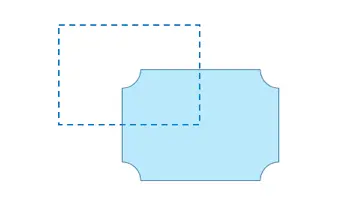

## 一、数据决策的十三种思维方式

从系统架构来看,目前的商用服务器大体可以分为三类：

### 1.1 信度与效度思维

信度与效度的概念最早来源于调查分析，但现在我觉得可以引申到数据分析工作的各方面。

**所谓信度，是指一个数据或指标自身的可靠程度，包括准确性和稳定性**取数逻辑是否正确？有没有计算错误？这属于准确性；每次计算的算法是否稳定？口径是否一致？以相同的方法计算不同的对象时，准确性是否有波动？这是稳定性。做到了以上两个方面，就是一个好的数据或指标了？其实还不够，还有一个更重要的因素，就是效度！

**所谓效度，是指一个数据或指标的生成，需贴合它所要衡量的事物，即指标的变化能够代表该事物的变化。**

只有在信度和效度上都达标，才是一个有价值的数据指标。举个例子：要衡量我身体的肥胖情况，我选择了穿衣的号码作为指标，一方面，相同的衣服尺码对应的实际衣服大小是不同的，会有美版韩版等因素，使得准确性很差；同时，一会儿穿这个牌子的衣服，一会儿穿那个牌子的衣服，使得该衡量方式形成的结果很不稳定；所以，衣服尺码这个指标的信度不够。另一方面，衡量身体肥胖情况用衣服的尺码大小？你一定觉得荒唐，尺码大小并不能反映肥胖情况，是吧？因此效度也不足。体脂率，才是信度和效度都比较达标的肥胖衡量指标。

在我们的现实工作中，许多人会想当然地拿了指标就用，这是非常值得警惕的。你要切骨头却拿了把手术刀，是不是很可悲？信度和效度的本质，其实就是**数据质量**的问题，这是一切分析的基石，再怎么重视都不过分！！

### 1.2 平衡思维

简单来说，在数据分析的过程中，我们需要经常去寻找事情间的平衡关系，且平衡关系往往是关乎企业运转的大问题，如市场的供需关系，薪资与效率关系，工作时长与错误率的关系等等。

**平衡思维的关键点，在于寻找能展示出平衡状态的指标！**也就是如图中红框，我们要去寻找这个准确的量化指标，来观察天平的倾斜程度。

怎么找这个指标呢？以我的经验，一般先找双向型的问题，即高也不是低也不是的问题，然后量化为指标，最后计算成某个比率，长期跟踪后，观察它的信度和效度。

### 1.3 分类思维

客户分群、产品归类、市场分级、绩效评价...许多事情都需要有分类的思维。主管拍脑袋也可以分类，通过机器学习算法也可以分类，那么许多人就模糊了，到底分类思维怎么应用呢？

**关键点在于，分类后的事物，需要在核心关键指标上能拉开距离！**也就是说分类后的结果，必须是显著的。如图，横轴和纵轴往往是你运营当中关注的核心指标（当然不限于二维），而分类后的对象，你能看到他们的分布不是随机的，而是有显著的集群的倾向。

举个例子，假设该图反映了某个消费者分群的结果，横轴代表购买频率，纵轴代表客单价，那么绿色的这群人，就是明显的“人傻钱多”的“剁手金牌客户”。

### 1.4 矩阵思维

矩阵思维是分类思维的发展，它不再局限于用量化指标来进行分类。

许多时候，我们没有数据做为支持，只能通过经验做主管的推断时，是可以把某些重要因素组合成矩阵，大致定义出好坏的方向，然后进行分析。

大家可以百度经典的管理分析方法“波士顿矩阵”模型。

### 1.5 管道/漏斗思维

这种思维方式已经比较普及了，注册转化、购买流程、销售管道、浏览路径等，太多的分析场景中，能找到这种思维的影子。

但我要说，看上去越是普世越是容易理解的模型，它的应用越得谨慎和小心。在漏斗思维当中，我们尤其要注意**漏斗的长度**。

漏斗从哪里开始到哪里结束？以我的经验，**漏斗的环节不该超过5个，且漏斗中各环节的百分比数值，量级不要超过100倍（漏斗第一环节100%开始，到最后一个环节的转化率数值不要低于1%）。**若超过了我说的这两个数值标准，建议分为多个漏斗进行观察。当然，这两个是经验数值，仅仅给各位做个参考～

理由是什么呢？超过5个环节，往往会出现多个重点环节，那么在一个漏斗模型中分析多个重要问题容易产生混乱。数值量级差距过大，数值间波动相互关系很难被察觉，容易遗漏信息。比如，漏斗前面环节从60%变到50%，让你感觉是天大的事情，而漏斗最后环节0.1%的变动不能引起你的注意，可往往是漏斗最后这0.1％的变动非常致命。

### 1.6 相关性思维

我们观察指标，不仅要看单个指标的变化，还需要观察指标间的相互关系！有正相关关系（图中红色实线）和负相关关系（蓝色虚线）。最好能时常计算指标间的相关系数，定期观察变化。

相关思维的应用太广了，我这里就说一点，往往是被大家忽略的。现在的很多企业管理层，面对的问题并不是没有数据，而是数据太多，却太少有用的数据。相关思维的其中一个应用，**就是能够帮助我们找到最重要的数据，排除掉过多杂乱数据的干扰！**

如何执行呢？你可以计算能收集到的多个指标间的相互关系，挑出与其他指标相关系数都相对较高的数据指标，分析它的产生逻辑，对应的问题，并评估信度和效度，若都满足标准，这个指标就能定位为核心指标！

建议大家养成一个习惯，经常计算指标间的相关系数，仔细思考相关系数背后的逻辑，有的是显而易见的常识，比如订单数和购买人数，有的或许就能给你带来惊喜！另外，“没有相关关系”，这往往也会成为惊喜的来源哦。

### 1.7 远近度思维

现在与许多处在管理层的朋友交流后，发现他们往往手握众多数据和报表，注意力却是非常的跳跃和分散。

这当然不是好现象，但如何避免呢？一是上文说的通过相关思维，找到最核心的问题和指标；二就是这部分要说的，建立远进度的思维方式。

确定好核心问题后，分析其他业务问题与该核心问题的远近程度，由近及远，把自己的精力有计划地分配上去。

比如，近期你地核心任务就是提高客服人员的服务质量，那么客服人员的话术、客户评价通道、客服系统的相应速度等就是靠的最近的子问题，需要重点关注，而客户的问询习惯、客户的购买周期等就是相对远的问题，暂时先放一放。

### 1.8 逻辑树思维

一般说明逻辑树的分叉时，都会提到**“分解”和“汇总”**的概念。我这里把它变一变，使其更贴近数据分析，称为**“下钻”和“上卷”**。当然，这两个词不是我发明的，早已有之。

所谓**下钻**，就是在分析指标的变化时，按一定的维度不断的分解。比如，按地区维度，从大区到省份，从省份到城市，从省市到区。所谓上卷就是反过来。随着维度的下钻和上卷，数据会不断细分和汇总，在这个过程中，我们往往能找到问题的根源。

下钻和上卷并不是局限于一个维度的，往往是多维组合的节点，进行分叉。逻辑树引申到算法领域就是决策树。有个关键便是何时做出决策（判断）。当进行分叉时，我们往往会选择差别最大的一个维度进行拆分，若差别不够大，则这个枝桠就不在细分。能够产生显著差别的节点会被保留，并继续细分，直到分不出差别为止。经过这个过程，我们就能找出影响指标变化的因素。

举个简单的例子：我们发现全国客户数量下降了，我们从地区和客户年龄层级两个维度先进行观察，发现各个年龄段的客户都下降，而地区间有的下降有的升高，那我们就按地区来拆分第一个逻辑树节点，拆分到大区后，发现各省间的差别是显著的，那就继续拆分到城市，最终发现是浙江省杭州市大量客户且涵盖各个年龄段，被竞争对手的一波推广活动转化走了。就此通过三个层级的逻辑树找到了原因。

### 1.9 时间序列思维

很多问题，我们找不到横向对比的方法和对象，那么，和历史上的状况比，就将变得非常重要。

其实很多时候，我更愿意用时间维度的对比来分析问题，毕竟发展地看问题，也是“红色方法论”中的重要一环。这种方式容易排除掉一些外在的干扰，尤其适合创新型的分析对象，比如一个新行业的公司，或者一款全新的产品。

时间序列的思维有三个关键点：

**一是距今越近的时间点，越要重视**（图中的深浅度，越近期发生的事，越有可能再次发生）；

二是要做**同比**（图中的尖头指示，指标往往存在某些周期性，需要在周期中的同一阶段进行对比，才有意义）；

三是**异常值出现时，需要重视**（比如出现了历史最低值或历史最高值，建议在时间序列作图时，添加平均值线和平均值加减一倍或两倍标准差线，便于观察异常值）。

时间序列思维有一个子概念不得不提一下，就是**“生命周期”的概念**。用户、产品、人事等无不有生命周期存在。本人最近也正在将关注的重心移向这块，直觉上，生命周期衡量清楚，就能很方便地确定一些“阀值”问题，使产品和运营的节奏更明确。

### 1.10 队列分析思维

随着数据运算能力的提高，队列分析的方式逐渐展露头脚。英文名称为cohort analysis，说实话我不知道怎么表述这个概念，我的理解就是**按一定的规则，在时间颗粒度上将观察对象切片，组成一个观察样本，然后观察这个样本的某些指标随着时间的演进而产生的变化**。目前使用得最多的场景就是留存分析。

举个经常用的例子：假设5.17我们举办了一次促销活动，那么将这一天来的新用户作为一个观察样本，观察他们在5.18、5.19...之后每天的活跃情况。

队列分析中，指标其实就是时间序列，不同的是衡量样本。队列分析中的衡量样本是在时间颗粒上变化的，而时间序列的样本则相对固定。

### 1.11 循环／闭环思维

循环／闭环的概念可以引申到很多场景中，比如业务流程的闭环、用户生命周期闭环、产品功能使用闭环、市场推广策略闭环等等。许多时候你会觉得这是一个不落地的概念，因为提的人很多，干出事情来的例子很少。

但我觉得这种思考方式是非常必要的。业务流程的闭环是管理者比较容易定义出来的，列出公司所有业务环节，梳理出业务流程，然后定义各个环节之间相互影响的指标，跟踪这些指标的变化，能从全局上把握公司的运行状况。

比如，一家软件公司的典型业务流：推广行为（市场部）➡流量进入主站（市场＋产研）➡注册流程（产研）➡试用体验（产研＋销售）➡进入采购流程（销售部）➡交易并部署（售后＋产研）➡使用、续约、推荐（售后＋市场）➡推广行为，一个闭环下来，各个衔接环节的指标，就值得关注了：广告点击率➡注册流程进入率➡注册转化率➡试用率➡销售管道各环节转化率➡付款率➡推荐率／续约率...这里会涉及漏斗思维，如前文所述，**千万不要用一个漏斗来衡量一个循环**。

有了循环思维，你能比较快的建立有逻辑关系的指标体系。

### 1.12 测试／对比思维

**AB test** 大家肯定不陌生了。那么怎么细化一下这个概念？

一是在条件允许的情况下，决策前尽量做对比测试；

二是测试时，一定要注意参照组的选择，建议任何实验中，都要留有不进行任何变化的一组样本，作为最基本的参照。

现在数据获取越来越方便，在保证数据质量的前提下，希望大家多做实验，多去发现规律。

**对比主要分为以下几种：**

**横向对比：**同一层级不同对象比较，如江苏不同市茅台销售情况。

**纵向对比：**同一对象不同层级比较，如江苏南京2021年各月份茅台销售情况。

**目标对比：**常见于目标管理，如完成率等。

**时间对比：**如同比、环比、月销售情况等，很多地方都会用到时间对比。

### 1.13 指数化思维

指数化思维，是指将衡量一个问题的多个因素分别量化后，组合成一个综合指数（降维），来持续追踪的方式。把这个放在最后讨论，目的就是强调它的重要性。前文已经说过，许多管理者面临的问题是“数据太多，可用的太少”，这就需要“降维”了，即要把多个指标压缩为单个指标。

指数化的好处非常明显。

- **一是减少了指标，使得管理者精力更为集中；**
- **二是指数化的指标往往都提高了数据的信度和效度**；
- 三是指数能长期使用且便于理解。

指数的设计是门大学问，这里简单提三个关键点：

1. 一是要遵循**独立和穷尽**的原则；
2. 二是要注意各指标的单位，尽量做**标准化**来消除单位的影响；
3. 三是权重和需要等于1。

独立穷尽原则，即你所定位的问题，在搜集衡量该问题的多个指标时，各个指标间尽量相互独立，同时能衡量该问题的指标尽量穷尽（收集全）。

举个例子：当初设计某公司销售部门的指标体系时，目的是衡量销售部的绩效，确定了核心指标是销售额后，我们将绩效拆分为订单数、客单价、线索转化率、成单周期、续约率5个相互独立的指标，且这5个指标涵盖了销售绩效的各个方面（穷尽）。

我们设计的销售绩效综合指数＝0.4＊订单数＋0.2＊客单价＋0.2＊线索转化率＋0.1＊成单周期＋0.1＊续约率，各指标都采用max-min方法进行标准化。

通过这个例子，相信各位就能理解指数化思维了。

## 二、数据运营的八种思维模型

工作上，拥有数据化思维，对于工作效率能有极大提升，适用于产品、运营及营销。

### 2.1 漏斗思维模型

漏斗分析模型是一套流程式数据分析模型。反映用户行为状态，以及从起点到终点各阶段指标。对于用户行为分析、流量监控、目标动作转化都很好用。

漏斗思维前后关联性极强，从首到尾是弱化和递减。

常用漏斗模型3种: **AIDMA模型**应用于品牌营销占领用户心智；**AISAS模型**帮助消费决策和分析购买路径，**AARRR模型**分析用户行为轨迹提高关键指标。

漏斗模型除了在互联网产品，及电商用户分析上得以应用外，在其他处也能巧妙应用。如销售漏斗：它是按照“线索-意向-客户”层层筛选，逐渐递减。

### 2.2 结构化拆解数据模型

拆解，源自结构化思维金字塔原理，两个要点：相互独立、无穷无尽。面对数据的时候，可以分析相关的模块并拆解，研究不变的单一模块。

举个栗子：GMV=流量*转化率*客单价*复购率。常应用于电商销量的拆解，继续拆流量=流量渠道1+流量渠道2+流量渠道3。

影响流量渠道1的来源有投放时间选择、首页视觉优化、文案优化、活动形式、产品体验流畅度等，继续拆解时间选择是上午好？还是晚上好？继续拆解直到最小颗粒度；此处拆解原则，可结合**5WHY溯源原理**和**A/B测试模型**。

**结构化拆解**，需要记住4个要点，很大程度上这4点和其他思维有共同之处。

核心论点：寻找金字塔的塔点。

结构拆解：自上而下将核心论点层层拆解成分论点，上下之间呈因果，依赖关系。

MECE：相互独立，完全穷尽（免交叉重复）。

验证：核心论点/分论点都是可量化、可验证的，要用数据说话。类A/B测试。

### 2.3 事实数据≠主观判断模型

也许你听过“事实”和“观点”理论。事实。就是可视化数据，没有对错，不带情感；而观点是主观的感受和判断，观点表达了个人的价值观和兴趣偏好。

### 2.4 量化指标+标准思维模型

凡事好不好都是相对，只有建立标准，可用数据衡量的标准后，才能予以评判。标准就像一杆尺子，有刻度、能度量。

同样拿NBA利拉德安利来举例，38.5%的3分球命中率高吗？

如果定义标准3分球命中率低于40%就算低，那么他的命中率就不高；如果定义标准是超过38%是高，那么利拉德命中率就算高。是高还是低？取决于手里尺子的刻度值。

有了刻度，在生活和工作上怎样能加强我们量化指标的意识呢？

继续以篮球举例。我每次训练时候会对流程量化会高效很多，不至于无目标感。

比如：训练时长1小时，做20分钟对抗训练，做10分钟突破训练，做10分钟三分球训练，做10分钟罚球训练，做10分钟热身训练。

把随意的一场打球，量化到各个指标用数据体现，然后刻意练习；同样，对于3分球训练我会10个一组，默认记录数据标准，心里的刻度是35%命中率，有了量化指标，更好的引导我们精进。

### 2.5 5WHY溯源模型

5WHY溯源分析，来自丰田企业管理，对于深度思考，看清事物的本质，找到数据背后隐藏的真像很有帮助。

5WHY分析法，又称“5问法”，也就是对一个问题点连续以5个“为什么”来自问，以追究其根本原因。这里回顾一个经典案例，看清事物本质。

举例来说，如果一个机器损坏了：

1、为什么？（因为零件磨损）

2、为什么零件会磨损？（因为润滑不足）

3、为什么润滑不足？（因为润滑系统故障）

4、为什么润滑系统故障？（因为定期维护未能及时进行）

5、为什么定期维护未能及时进行？（因为没有建立有效的维护计划）

通过这个过程，我们可以找到根本原因是没有建立有效的维护计划，而不仅仅是机器的故障表象。

### 2.6 A/B测试思维模型

A/B测试在产品及技术上经常应用，指在产品迭代发布之前，制定两个（A/B）或多个（A/B/n）版本；在同一时间维度，分别让特征相同（相似）的访客群组（目标人群）随机的访问这些版本，并收集每个群组用户的数据，最后通过分析数据，评估出最好版本去承载全部流量。

多组开花，找到数据最好的一组，予以选用。

A/B测试的理念和假设验证思维模型类似，实操过程中，通常AB测试都是围绕着某一个目标进行，比如：提升新用户下单率。围绕该目标，我们可以设置相应的运营动作。

PlanA设置优惠券A并全渠道触发，PlanB设置优惠券B全渠道触发，一个周期后分析A/B两种运营动作下，目标数据（新用户下单率）的变化；此处样本数量要足够大，测试周期要足够长才有说服力，否则很大程度上是小概率事件。

### 2.7 RFM分析思维模型

RFM是3个指标的缩写，最近一次消费时间间隔（**Recency**），消费频率（**Frequency**），消费金额（**Monetary**），通过这3个指标对用户分类。

RFM通过3个维度数据对用户进行评估分类，从而实现精细化运营，根据不同用户的属性做不同营销策略。

此处，也是淘宝千人千面、字节智能算法的前身，量身定制。

RFM分析方法把用户分为8类，这样可对不同价值用户使用不同的营销决策。

冯仑讲过：正常情况下，人一生交往的关系是三个数：10%、30%和60%。

这句话是什么意思呢？

其实正好对应我们刚讲的三种人脉关系，RFM模型里的前三种重要价值、重要发展、重要保持用户，对于3类用户我们需要采取不同应对策略。

对于不同用户类型，有对应不同运营策略。高价值享受VIP待遇，需挽留采用促活方案定时触达。

1）重要价值关系：对你生活和工作非常有价值。他几乎是你最亲密的亲戚、朋友、客户。面对这些人，你应该经常联系，彼此帮助，时不时约出来聊聊天。

2）重要发展关系：联系比较多、一起做过点事，但聊天是有一句没一句的，这种要重点发展关系。比如把你的困惑或者小秘密和他分享，产生情感连接。

3）重要保持的关系：所谓熟人，也就是打起电话来记得住这个人，而且也大概了解他的背景，可能很长时间都没有见的那种“朋友”。要主动联系，利用节假日登门拜访、共同的朋友持续保持沟通。

### 2.8 北极星数据指标思维模型

**北极星指标，也叫做唯一重要的指标**，之所以叫做北极星指标是指这个指标一经制定，像北极星一样，高高的闪耀在天空中，指引着团队向同一个方向前进。

北极星指标，**随产品生命周期在动态变化**，但是有两个大前提不会变。第一，对规模的追求（用户规模或收入规模）；第二，对用户长期价值的考量。

我看来看常见产品的北极星指标，并做拆解：

- Airbnb北极星指标是交易总额，分解目标：用户总数+订房次数。
- 知乎北极星指标是问答总数，分解目标：用户总数+单用户问答贡献数。
- 简书北极星指标是文章总数，分解目标：用户总数+单用户文章贡献数。
- 滴滴北极星指标是月活跃用户，分解目标：月活跃司机+月活跃乘客。

**北极星指标是风向标，能避免我们陷入数据陷阱**。

与之对应，是虚荣性指标，盘点下常见产品虚荣型数据指标。

**电商类：GMV和订单量。**

要知道脱离利润的GMV并没有用，如果毛利不够甚至亏本，带来的结果是买的越多亏得越多；订单量也一样，如果只是低客单的薅羊毛订单，只会起反作用。

电商，更多要关注转化率、客单价、复购率等北极星指标。

**内容类：曝光量和点击PV。**

拿现在的抖音来说，一些粉丝量上百万的抖音号没有商业价值就是这原因，某单条视频点赞量过百万依然不能变现，也很好的说明这个问题。

抖音，更多要关注停留时长、完播率、评论人次及标签用户量等北极星指标。

## 三、数据常用分析模型

### 1.RFM分析

### 2.帕累托分析

### 3.波士顿矩阵

### 4.漏斗转化分析

### 5.购物篮分析

### 6.复购率分析

### 7.留存分析

### 8.热图分析

### 9.AARRR海盗模型

### 10: 用户流入流出分析

### 11.用户画像

### 12.需求分析方法

### 13.库存周转分析

### 14.杜邦分析

### 15.盈亏平衡分析

### 16.同期群分析

### 17.比率分析

### 18.零基预算法

### 19.净现值法

### 20. SWOT分析

### 21.PEST分析

### 22.BSC平衡记分卡

### 23.波力五特模型

### 24.PDCA

### 25.GE矩阵

### 26.STP分析

### 27.4Ps营销组合

### 28.安索夫矩阵

### 29.推销方格理论

### 30.哈夫模型

### 31.KPl

### 32.360绩效考核

### 33.六西格玛

### 34.SPIN销售法

### 35.盖普洛Q12测评法