# 如何成为大数据架构师？

大数据架构师是一个综合学科，除了平台编码，架构设计，更需要了解行业领域、以及具备产品和运维的思维能力。

架构师的这个坑主要工作任务不再是做具体代码编写，而是负责更高层次的开发构架工作。因为一个架构师工作能力的强弱以及专业素养的高低可能决定了整个软件项目的成败，所以作为架构师，他必须对开发技术非常了解，并且需要有良好的组织管理能力以及责任心。

## 一、技术要求

### 1.1、平台建设

1.行业平台(走马观花)

**大平台**

​	谷歌云

​	亚马逊云

​	阿里云

​	腾讯云

​	网易云

​	华为云

**小平台**

​	国云

​	国双

​	青云

​	勤思

**专业工具平台**

​	易观

​	海致BDP

​	永洪

**APP分析平台**

​	mix panel

​	growing IO

​	神策

​	诸葛 IO

### **1.2、技术选型(维护成本)**

CDH

HDP+HDF

MAPR

Transwarp

cloudera hortonworks 新平台 CDP

**如何做技术选型？**

```
在讲技术选行之前，还是要插播一个问题：先理解架构设计的目的是什么？
架构就是为了应对软件系统复杂度而提出的解决方案，说白了，架构设计的目的就是为了解决系统复杂度带来的问题；所以在做技术选型的时候需要结合业务场景和业务需求，在尽量降低整体架构复杂度的同时选择最适合的技术。
 
接下来结合我们以前做过的一个大数据平台项目，简单探讨一下选型过程吧：
1、环境：根据运维的情况，或者结合公司具体历史原因，进行综合衡量，是用redhat或centos，甚至有些服务可以部署在Windows上；不过所有的服务器还是尽量选择同一个版本，以便运维；

2、数据存储：结合数据源的情况，以及数据具体的应用场景，结构化数据和非结构化数据需要尽量区分来存储。在选择关系型数据库的时候要结合项目的成本与产出，对数据存储的要求等选择不同的数据库，如果数据量大而且对数据安全要求高可以考虑oracle；如果对查询性能要求高可以考虑IQ；如果数据量不是很大，而且考虑到投入成本，可以直接用myql。

在大数据平台中对于非关系型数据库的选择，需要结合一下三点：
1、根据数据源的类型和采集方式。比如非结构化的数据不可能拿一个关系数据库去存储。采集方式如果是流失处理，通过消息队列传递是比较合适的，例如放到Kafka、RocketMQ等是比较好选择。

2、根据采集之后数据的格式和规模。比如数据格式是文档型的，能选的存储方式就是文档型数据库，例如MongoDB、ES等；采集后的数据是结构化的，则可以考虑关系型数据库；如果数据量达到很大规模，首选放到HDFS里。

3、分析数据的应用场景。根据数据的应用场景来判定存储技术选型。

 服务层技术选型：
在大数据应用架构中，有很多开源的组件可以供我们选择，例如，流计算的有storm、flink、spark等；做了二次封装的hadoop平台有：CDH、华为的FI、IBM的biginsigth等；微服务的框架有k8s、Spring cloud等；缓存数据库有redis，memcache等。在这一层的框架选择，除了需结合应用场景，更加要结合你团队成员的学习成本。

 
```

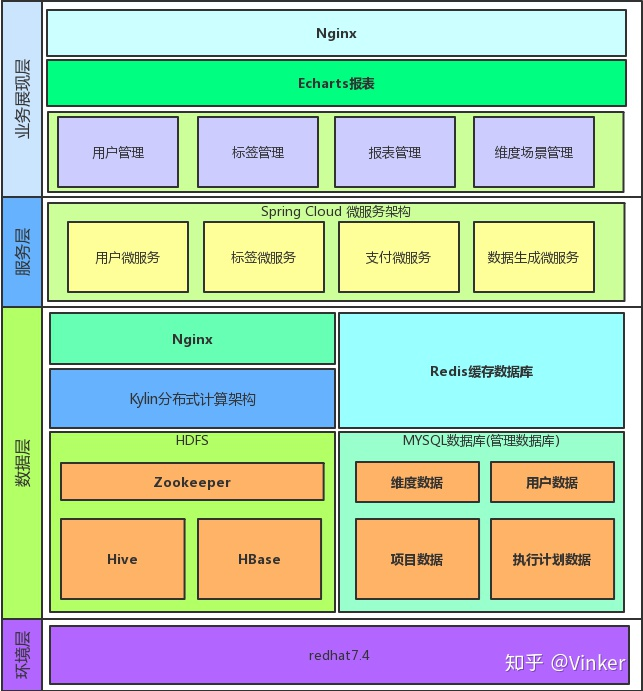


### 1.3平台架构(只谈用法)

#### HDP Core(平台核心)

​	**Hadoop(基础存储计算)**

​			HDFS分布式数文件存储

​			MR批处理

​	**Yarn(基础资源调度)**

​			负责集群资源的统一管理和调度

​			单节点资源管理和使用

​			应用程序管理

​			对任务运行环境的抽象

​			支持运行长应用程序和短应用程序

​		支持docker fpga

​		对比Mesos

​	**Oozie(任务调度编排)**

​		平台调度的基础保障

​		hadop 各种任务的使用与调度

​		对比 Azkaban Airflow

​	**Slider(调度支持 新版已经集成yarn)**

#### Enterpise Data Warehouse(企业数据仓库)

​	**Pig(基础脚本服务)**

​		用类sql语言保证mr执行顺畅

​		pig latin 的执行环境

​	**Hive(数据仓库存储)**

​		基础数据仓库(ods gdm dw app dim)

​		基础ETL的运行实例

​		OLAP的数据存储(kylin)

​		各种数据的hive外表用于查询

​		对比impala

​	**Druid(adhoc方案 实时多维查询和分析)**

​		已处理数十亿事件和TB级数据

​		实时查询分析 高可用、高容错、高性能

​		交互式聚合和快速探究大量数据

​		为OLAP工作流的探索性分析而构建，支持各种过滤、聚合和查询

​		对比 drill es mdrill 等

​	**Tez(简化增强hive)**

​		简化和优化hive执行局于流程

​		缩小hive 执行时间

​	**Sqoop(数据导入导出工具)**

​		定时数据导入

​		定时数据导出

​		对比 datax kettle

#### Data sclence(数据科学)

​	**Spark(内存通用并行计算)**

​		推荐相关

​		数据清洗

​		特征抽取

​		预测相关

​	**flink**
 		对静态数据进行批处理操作

​		对数据流进行流处理操作

​		对结构化数据进行查询操作，将结构化数据抽象成关系表

​		Flink ML，Flink的机器学习库

​		Gelly，Flink的图计算库

​	**Spark sql(结构化数据处理)** 

​	**Spark streaming(spark流式处理)**

​		实时数据计算

​		数据指标监控报警

​	**Zeppelin(界面分析挖掘工具)**

​		基于R和python的单机界面使用工具(分析挖掘)

​		基于spark kafka 的界面操作工具

​		基于预测数据的使用与展现

#### Operational data store(操作KV存储)

​	**Hbase(kv数据存储)**

​		binlog业务数据存储

​		日志数据存储

​		基础数据查询

​	**Phoenix(hbase 类sql查询)**

​		基于hbase的数据查询

​		基于habse数据的表建立

#### Securlty governance(安全治理)

​	**Knox(鉴权工具)**

​		数据的权限鉴权通道

​		平台跟外部的出入口

​	**Ranger(权限管理工具)**

​		架构下各组件的权限管理

​		记录操作日志到solr

​		对比 Sentry

​	**Kerberos(认证)**

​	**Atlas(元数据溯源与数据治理工具)**

​		大数据平台下各种操作的元数据记录

​		数据打标签(对于维度 指标 ETL等)

​		可查询hive storm spark sqoop oozie nifi 元数据，可自定义实现自己的需要查看和维护的工具

​		数据流转流程的图像化展现

​		元数据操作记录与各种信息查询

#### Stream procressing(流式计算)

​	**Storm(实时数据处理分析)暂不用 spark streaming 替代**

​	**Kafka(分布式发布订阅消息系统)**

​		mysql的binlog的消息队列

​		日志的消息队列

​		基于实时分析的消息队列

​		基于其他特定场景的消息队列

​	**MiNiFi(边缘数据处理)**

​		数据产生的源头收集和处理数据

​		通过实现边缘设备智能(edge intelligence)来调整数据流的双向通信

​		可以数据溯源(Data Provenance)

​		可以集中管理和下发Agents

​		java agent

​		c++ agent

​	**Streaming Analytics Manager (流式数据处理界面工具)**

​		拖放可视化设计，开发，部署和管理流式数据分析应用程序

​		进行事件关联，上下文衔接，复杂模式匹配，分析聚合以及创建警报/通知

#### Operations(平台运维工具)

​	**Ambari(大数据平台管理工具)**

​		管理部署各个大数据平台组件(改动 不在维护的除外)

​		平台数据监控收集与展示

​		管理各个组件版本

​		子主题

​		Ambari Metrics(监控平台各类服务及主机的运行情况)

​		Ambari Infra

​		对比 Ganglia、Open-falcon、Prometheus、Zabbix

​	**Zookeeper(基础分布式保证工具)**

​		整体的消息一致性可靠保障

​		协调分布式资源

​	**Solr(搜索应用 操作日志存储)**

​		hadoop操作日志存储查询

​		ranger操作日志存储查询

​		audits数据存储查询

#### Data operation platform(数据操作平台)

​	**NiFi(数据 ETL 数据流处理)**

​		日志清洗 业务数据入库

​		基础数据(mysql binlog业务库 )ETL

​		部分外部数据

​		自定义数据接入方式

​		自定义数据流程处理

​		数据输出出口

​		对比 StreamSets Data Collector

​	**NiFi Registry(NiFi版本管理工具)**

​		NIFI的版本记录回溯

​		NIFI Schema Registry 来统一文件定义(类配置中心)

​		配合SwaggerAPI数据定义

​	**Hue(大数据交互界面平台)**

​		数据查询操作入口

​		调度配置和使用入口

​		数据上传入口

​		ETL操作入口

#### Data visualization(数据可视化工具)

​	**Superset(数据分析界面工具)**

​		挖掘分析的界面展现

​		特定场景下(finebi满足不了的) 图表展现

​	**FineBI(BI界面分析工具)**

​		报表数据可视化

​		部分OLAP分析

​		Fine Index

​		FIne Direct

​		现场数据实时展示

​	**(Cboard)**

​		数据导出邮件配置入口

​		finebi 外的数据展示

​	**Metabase**

​		后续直接用来对接运营产品的数据交互工具

​		支持问题模式,支持对数据进行标记

​		对比 Saiku Tableau Qlikview

​		自主开发

​		Echarts

​		inMap

​		datav

#### OnlineAnalytical processing(OLAP解决方案 adhoc)

​	**Kylin(MOLAP方案)**

​		维度间交叉分析

​		构建过程基于hive集群不需要单独搭建

​		数据存储于hbase集群，主要消耗磁盘

​	**Elasticsearch**

​		横向可扩展，高可用 分片机制

​		单集群,索引缓存在内存中,单节点易造成内存溢出

​		不支持复杂sql,无法实现关联统计分析

​	**Presto(MPP-SQL交互式查询引擎)**

​		多数据源(Hive,Hbase,RDBMS)

​		支持标准SQL 不支持UDF

​		对表的连接以及 group by操作有比较严格的大小限制

​		对集群结点的内存和CPU消耗较大

​	**HAWQ(SQL on Hadoop)**

​		符合ANSI SQL规范并且支持SQL 92、99、2003 OLAP

​		包含关联子查询、窗口函数、汇总与数据库、广泛的标量函数与聚合函数的功能

​		TPC-DS针对具有各种操作要求和复杂性的查询定义了99个模板（例如，点对点、报告、迭代、OLAP、数据挖掘等）

​		HAWQ使用Apache Ambari作为管理和配置的基础

​	**PostgreSQL (单机ORDBMS)**

​		天生就是为扩展而生的，可以在PG中用Python、C、Perl、TCL、PLSQL等来扩展

​		强大 SQL 支持能力和非常丰富的统计函数和统计语法支持

​		hash join、merge join、nestloop join的支持方面做的较好

​	**GreenPlum(MPP架构升级版PostgreSQL)**

​		基于PostgreSQL

​		采用两阶段提交和全局事务管理机制来保证集群上分布式事务的一致性

​		建立在实例级别上的并行计算，可在一次SQL请求中利用到每个节点上的多个CPU CORE的计算能力

​		解决大问题而设计的并行计算技术，而不是大量的小问题的高并发请求

​	**HashData(SQL on Cloud)**

​		托管于云平台，用户不再需要为基础设施投资，不再需要调优运维，仅为您使用的计算资源买单

​		分布式架构，根据负载快速扩充计算能力，实现高性能计算，满足用户交互式查询的需求。

​		云数据仓库,针对云平台订制设计。利用云计算的优势，实现数据仓库的高可用、快速恢复、弹性扩容

​	**ClickHouse**

​		列式存储数据库，数据压缩

​		分布式并行计算，把单机性能压榨到极限

​		可以不依赖hadoop平台

​		关系型、支持SQL

​	**TiDB(没研究 美团用的多)**


#### Graph database(图数据库)

​	**Janus Graph(图数据库引擎)**

​		图的序列化, 图的数据模型和高效的查询

​		依赖hadoop来做图的统计和批量图操作

​		为数据存储,索引和客户端访问实现了粗粒度的模块接口

​		模块架构能和和许多存储,索引,客户端技术集成. 可以简便的扩展新的功能

​	**Dgraph(事务性的分布式图形数据库)**

​		解决企业在数据库增长超过单个服务器时面临的一些问题而构建

​		可扩展的，分布式的，低延迟的图数据库

​		超过 TB 的结构数据里，为用户提供足够低延迟的实时查询

​	**Neo4j(NoSQL图数据库)**

​	**ArangoDB(NoSQL数据库)**

​		原生多模型数据库

​		可以将逻辑功能加入V8的 js framework Foxx™中 并可以完全访问所有功能

​		可扩展性，JOINS, 复杂事务处理


### 1.4、资源申请

​	**基准测试**

​	**资源预估(基于业务存量与增量)**

​	**理解各组件的CPU IO 内存 硬盘 带宽的特性**

​	**硬件知识(RAID 存储加速 存储接口等 )**

​	**资源预判**

​		CPU

​		内存

​		带宽

​				千兆

​				万兆

​		硬盘

​			RAID 0 1 10 5

​			SSD HDD FDD SATA

​			转速

​		数据增量


### 1.5、日常维护

#### **bigdata devops**

​		**服务优先级**

​			高

​			中高

​			中

​			底

​			服务耦合关系图

​		**服务高可用**

​			目前已经高可用的服务和组件

​			需要后面做到高可用的服务和组件

​			不需要高可用的组件和服务


#### **平台规划**

​		**现有集群**

​			硬件拓扑图

​			硬件资源列表

​			服务配置图

​			目前软件使用列表

​			软件拓扑依赖关系图

​			运维平台管理关系图

​		**未来一年集群**

​			新增业务场景和工具的调研

​			资源利用率核查 资源瓶颈判断


#### **服务与资源保障**

​		平台 安装 升级 降级 维护

​		平台监控报警

​		服务监控报警

​		灾难演练

​		测试环境

​	**操作规范**

**权限授权（跳板机）**

**瓶颈判断**

**基于需求的平台二次开发**

**组件版本关注与升级**

**各种疑难杂症修复**

**环境维护(正式 测试)**


### 1.6、技术调研

- 大数据相关
- 机器学习
- IOT相关
- 边缘计算

## 二、数据搜集

### 自有数据

​	**公司内结构化数据**

​			增量

​			全量

​			拉链

​			binlog

​			接口

​			kafka对接

​	**公司内非结构化数据**

​		**小程序**

​			微信小程序

​			头条系小程序

​			支付宝小程序

​		**视频图像**

​			图像帧提取

​			图片压缩转制

​		**excel**

​			格式化规约

​			约定上传时间方式版本

​		**文本**

​			NLP

​			格式化关键信息

​			存储源文件但废弃无用信息


### 第二方数据

​	**日志**

​	**接口**

​	**内部埋点**

​		后端埋点方案

​		无埋点方案

​		url规约系统

​		用户级别

​		版本跟踪

​		页面级别

​		块级别

​		事件级别

​	搜索  露出 曝光 展示 滑动 用户 访问 下载 装机 等统计方式

**运营使用的外部工具**

​	**各种广告平台**

​			广点通

​			达摩盘

​			知乎DSP

​			今日头条系

​			百度系

​			微博营销工具

​			......

​	**各种流量平台**

​	**各种统计分析平台**

**销售使用的外部工具**

​	**商家查询平台**

​			启信宝

​			企查查

​			天眼查

​			赤狐

​	**CRM工具**

**外部数据(非公司IT支撑)**

​		**爬虫平台开发利用推进**

​		**API对接**

​		**WIFI 探针类**

​				**分类**

​					WIFI

​					BLE

​					Zigbee

​					蓝牙

​				**算法**

​					信号强弱

​					围栏

​		**人脸视频类**

​			faceid 设计

​			图片帧

### 第三方数据

​		**第三方埋点**

​				GA

​				百度

​				友盟

​				其他

​		**外部数据**

​				数据报告

​					199IT(100+)

​					艾瑞(100+)

​					IT橘子

​					国家互联网中心

​					恒大研究院

​					亿欧智库

​					易观数据

​					中国通信研究院

​					腾讯数据实验室

​					阿里研究中心

​		**商业合作**

​				数据交换

​				专项购买

​				流量互补

​		**竞品数据**

​			**分析竞品列表**

​				关联品牌

​				关联人物

​				关联商家

​				热点主题

​				讨论度

​				新闻动态频率

​				正负面情绪

​				风险信息  

​                商业环境

​			**爬虫获取商家 商品 评论等业务数据**

​			**从一些公开平台获取统计数据**

​			**新媒体**

​				微信公众号

​				微博

​				知乎

​		**行业数据**

​				大盘数据

​				行业动态数据

​		**统计数据**

​				国家统计局

​				国外统计局

​				专业部门统计数据

​		**数据资讯**

​			大行业

​			本行业

​			其他


## 三、数据价值 

#### **1.数据清洗**

​		日志数据清洗(UDF spark straming )

​		业务数据清洗

​		维度数据抽取

​		数据缺失与修复

​		NLP语义化

​		图片识别等


#### **2.数据仓库**

分层

​		Operational Data Store(ODS) 原始操作数据

​		General Data Mart(GDM)清洗后通用数据

​		Data WareHouse (DW)数据集市

​				用户

​				行为

​				商家

​				商品

​				......

​		Dimension Data(DIM)维度数据

规范

​		权限规范

​		ETL规范

​		调度规范

ETL

元数据(Atlas查看和标记)

​		业务元数据

​		ETL元数据

​		数据元数据

#### **3.统计报表**

​		分类

​		维度

​		指标

​		数据可视化


#### **4.数据报告**

​		抓重点业务或关键路径

​		体系化叙述

​		重点数据解释

​		编写参考 玩转keynote


#### **5.商业智能**

关键指标与转化

​		**博弈分析法(找到博弈方，找到博弈方的冲突与矛盾)**

​				利益方

​				行动

​				信息获取

​				损失

​				均衡点

​				优化

​				策略

​				收益

​		**企业价值评估法(找到利益保持或者增长的关键点或者业务流程量化KPI)**  

​		**行业参考(标准行业的指标体系)**

​		**保证少而精 结果导向 可衡量 一致性**

影响业务决策

​		**商家风控**

​		**用户风控**

影响运营决策

​		**AARRR模型**

​		**RFM模型**

​		**运营增强工具**

​		**用户分层理论**

影响老板决策

​		全局跟踪报表

​		关键节点转化数据跟踪

​		市场大盘的搜集与预估

​		竞争对手信息挖掘

​		效率周期的提醒和关注

​		业务预测与告警

#### **6.业务赋能**

​		数据预警

​		数据预测

​		数据查询

​		对运营支持的数据工具

​		 对业务销售支持的数据工具

​				销售人员的常用工具数据化支撑

​				业务节点的数据跟进

#### **7.数据产品**

**（私域数据）CDP&amp;DMP**
			收集企业私域数据

​			建立私域数据之间相同顾客/用户/受众之间的映射匹配关系 .构建以顾客/用户受众(人)为核心的数据结构(即ID+人的标签，或称ID+人的属 性的数据结构)

​			基于以上数据结构，建立个体画像或人群画像

​			DMP/CDP只针对营销和客户运营的场景，它们可以与企业的渠道管理、备货、物流以及供应链甚至生产环节相联通，并根据需要为这些环节提供数据，但它们并不负责收集和处理这些环节的数据。

**2B产品**

​		行业标准与数据共享

​		垂直行业指数项目

​		针对商家端产品

​				商家快速获取数据

​				商家获取精准数据

​				商家数据增值服务

**2C产品**

​		 结合产品规划

​				用户信息(关系)打通

​				结合产品2C的优惠券 通知 推送等

 		推荐

​		搜索

​		风控

​		舆情

​		用户画像

​		反作弊

#### **8.场景探索**

​		IOT场景

​		AI场景探索

​		数据交换场景

​		规则漏洞-业务场景漏洞-效率优化

#### **9.企业数据化成熟度进化路径**

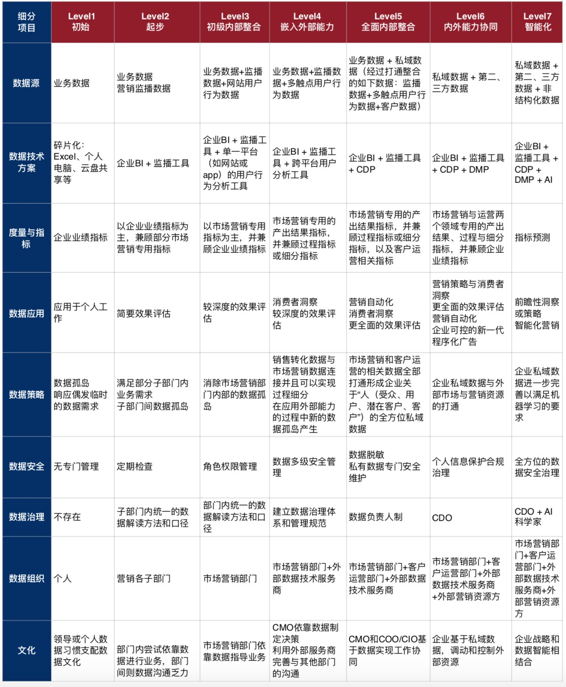


## 四:数据安全

#### **1.企业数据分级**

​	**普通**
​			基础业务数据

​			用户产生的非免敏感数据

​	**敏感**

​			用户信息

​			商家信息

​	**机密**

​			合同

​			推广

​			活动

​			订单

​	**绝密**

​			财务

​			战略

​			融资


#### **2.数据隐私保护**

​	公众数据

​			Personal Identifiable Information(PII级别)

​			用户唯一标识(因公司而异)

####  **3.平台权限控制**

​		数据导出权限控制

​		账号跟踪与密钥更换

​		统一LDAP账号建设

​		数据使用申请

​		大数据产品系 - 账号统一登录平台


#### **4.数据流程规范**

​		需求对接规范

​		数据订正规范

​		提取数据规范

​		业务数据变更修正


## 五:质量保障

#### **1.平台与资源保障**

​			平台监控
​			服务监控
​			调度监控
​			计算监控

#### **2.数据质量**

​	**日志数据质量保障**

​			开发埋点跟踪与工单系统

​			需求流程梳理与制定

​			加入环节测试，统一APP PCWAP 小程序的开发SDK

​	**业务数据质量保障**

​			业务一致性

​			数据主动被动监测与检测系统开发

​			领域统一主键

​			业务数据表备注变 字段 新增 删除 表新增等的跟踪通知

​	**数据仓库与计算逻辑质量保障**

​			抽样检测

​			数据准确性跟踪

​			数据仓库调度监控与计算逻辑review

#### **3.统一口径**

​		专人负责业务领域模型

​		数据仓库主题域宽表建设

​		需求对接明确责任人和需求对接人

#### **4.故障跟进**

​		钉钉报警群的建设与跟进

​		值班制度

## 六、个人软实力 

### 个人素质

#### **1.体系化建设**

##### 	**快速了解一个体系方法论**

###### 			**渠道**

​					专业图书

​					技术官网

​					github

​					processon 里的推荐功能

​				 	技术博客

​					知乎

​					体系报告网站(参考 数据获取-外部数据-数据报告)

​					各种行业平台网站

​					谷歌百度

​					找朋友聊

​					加微信QQ群

###### 			**记录整理**

​					找个工具记录最散漫的疯狂的阅读与吸取

​					最好用表格来划分横向维度和纵向维度

###### 			**消除杂音**

​					刨除过程中一些过时的资料或者概念

​					尽量找原版的设计与理解

###### 			**快速形成自己的理解**

​					聚合

​					分类

​					排序

​					深入

###### 			**系统计划**

###### 			**修正策略**

​					发现方向不对了要懂得立即止损

##### 	**投资视角看公司**

###### 				**商业模式**

​					完整的产品、服务和信息流体系，不完全决定着盈利模式但是衡量盈利模式的基础

​					简单易懂一句话说明白的模式就是好模式

​					在产业上下游关系所处的位置

​					定价权在哪里

​					企业和客户关系的好坏

###### 				**盈利模式**

​						探求企业利润来源、生产过程以及产出，对企业经营要素进行价值识别和管理 关注持续力

###### 				**团队**

​						关注公司的团队架构，工作任务如何进行分工、分组和协调合作 。关注CXO

​								专一性

​								创新性

​								管理者优势

###### 				**用户来源**

​						关注在特定的公司下他们是如何获客的，获客的效果与方法是否可以持续健康的保持优势

###### 				**现金流**

​						公司对于内部价值的挖掘和在商业上的资金变现能力

###### 				**成本结构**

​						成本结构

​						决定因素

​						成本产业优化

​						变现能力

###### 				**路径依赖**

​						公司内部对主营业务的依赖性，对于新业务拓展的阻碍。在快速调整方向时能动性的高低

###### 				**烧钱速度**

###### 				**竞争对手**

​						赛道内竞争对手的强弱与个数，竞争对手的资方背景。竞争对手对红海的竞争性与蓝海的开拓性

###### 				**(赛道)行业特性**

​						垂直行业内的一些特殊关注点和可能发现的价值挖掘点，也是可能构建护城河的点

###### 				**价值流失**

​						价值守护的能力，包括资产数据 用户，针对于流失的方法策略是否有意识和具体的动作

###### 				**护城河**

​						抵御竞争者的保护措施

​									财务效率

​									边际成本

​									回报率

​									品牌效应

###### 				**天花板**

​					公司所在的行业是否已经进入饱和状态，是否供过于求

​							关注行业或者需求拐点

​							关注小行业的大公司

​							关注新旧势力平衡关系

​							关注面对天花板公司采取的策略

#### **2.业务破局**

##### 	**了解业务**

###### 	**老板 高管 经理**

​			**对钱感兴趣的人肯定对数据感兴趣(财务三张表)**

​					资产负债表

​					利润表

​					现金流量表

​			**投其所好**

​					多渠道的了解老板画像

​					试探数据价值的关注度

​			**换位思考**

​					从他们的角度去考虑他们遇到的困难，不解和所做的决定

​					不要被他们的思维固化(在其位谋其政)影响你对于数据价值的思考

​			**全面的体系 重要的分级**

​					全面的体系化建设(基于对行业 业务 数据 的宽泛认知) 不赘述

​					永远要记住摸清主线

​					按照重要程度(看势)做事情的分级

​			**观察对方的底线(长期)**

###### 	**技术 产品 运营**

​			**技术体系初步印象**

​					前端(ios android pc tv) 涉及到埋点日志事情

​					后端(微服务 链路 数据库) 涉及到业务数据入库和日志收集

​			**掌握全局(局部)数据库**

​					先全面后局部的感觉下数据库设计(如果有ER图提供最好)

​					感觉下量级与增速

​			**深入了解产品的规划**

​					找到契合点 不要越界

​					数据价值为主 外层的展现为辅

​					产品方向的数据价值多数来自C端 所以 推荐 广告  用户画像等为主 

​					不同的行业考虑下特性应用(O2OIOT 新零售 AI的落地应用)

​			**拿出诚意才会得到配合**

​					站在开发者角度去尽量减轻他们的负担

​					日志与埋点的配合

​					业务数据入库配合

​					底层运维支持配合

​					技术层面的分享带给别人更多理解相关技术的机会

​			**是否需要数据产品经理**

​					涉及到产品规划和业务赋能的最好有数据产品对接

​					关于数据报表分析的最好让数据分析人员进入对接一线

###### 	**销售 业务 财务**

​			**良好的沟通从兴趣开始**

​			**数据价值来源于解决B端面临问题**

​					是否能提供有价值的数据让业务跑得更快

​					能否提供销售更直接的客户服务数据

​					财务的事情佛系对待

​			**合适的机会跟他们一起开会，反复强调的内容里面就有重点和痛点**

​			**多花时间研究他们的工作流程**

​					流程最能体现价值(优化 提速 转化 效率)

​					接触工作流程中可以更深刻的理解业务

​			**关键指标一定会有所提及(不懂找资料学习再沟通) 绕不过的钱**

​					记录关键指标 自己先琢磨在找懂的人沟通

​					遇到不分享的可以先想办法解决他的一些问题，无论大小，展现诚意。记住自己的目标

##### **分析痛点**

​	**将痛点归类(部门 角色  数据源 数据价值)**

​	**归类后痛点间的关联关系找主线**

​	**能解决的痛点才是痛点**

​	**缩小范围解决头部需求反手解决次类需求**

​	**痛点案例**

​			基础数据指标与总体和各部门的KPI跟踪

​			流量广告投放优化问题

​			潜在用户挖掘与运营转化问题

​			用户深度运营模型问题

​			用户流量扩张和用户粘性问题

​			羊毛党风控问题【成本优化】

​			如何快速成交问题【效率转化】

​			多单率，交叉消费，多场景消费问题

​			竞品商家数据的融合

​			数据和用户流失和丢失问题

​	**专注行动**

​			象限法(重要紧急四象限)

​					优先处理 重要且紧急 紧急不重要的

​					阶段性的处理重要不紧急的(这种事情要记录在本本上)

​			行动前的影响与价值预估

​					可能对其他部门或人造成的工作加重减轻与正负面影响

​					此行动能得到的可能价值(对需求方 相关人 团队 自己)

​			可拆解的任务才能行动

​					行动计划保证在一个可控范围内(人员 时间 资源 )

​					任务的串并行尝试

​					人员维度的安排

​					时间维度的安排

​			行动中的修正与反馈

​					寻找一个反馈对象(最好是需求方)

​					修正来源于对结果的不可控(保证损失最小)

​			拿到结果一定要说话(不要当哑巴 付出得到回报天经地义)

​					打算说给谁听

​					准备好PPT(参见玩转keynote)

​					时间地点

#### **3.数据解读**

##### 	**考虑受众**

​			想要说给谁听是重中之重

​			了解对方的工作特性用类比方式的去阐述数据

##### 	**实事求是 轻易不下结论**

​			全局意识

​			局部业务专研分析思维

​			小心求证，在给出数据前多做检验

##### 	**会看数据**

​			维度-指标-特征-缺失-差值-聚合-分类-排序

​			比率-中数-众数-方差-维度相关性

​			多维度的去思考和验证

​			寻找数据点(点) - 寻找主数据(线) - 串联数据的顺序关系(面)

​	**要有全局意识和局部业务专研分析思维，理解金字塔原理，自上而下表达，自下而上思考，从上提出疑问，从下寻找答案**

#### **4.工具利用**

##### 时间管理工具

​			Omni Focus

​			Tyme2

​			时间四象限 ：重要且紧急、重要不紧急、紧急不重要、不紧急不重要

##### 快速记录工具

​			备忘录

​			Wiki

​			Macdown


##### 扩展思维工具

​			MindNode

​			Processon

##### 学习成长工具

​			优质微信公众号

​			人人都是产品经理

​			知乎

​			读书

#### **5.落地执行**

##### 	**落地能力**

​			站在对方去思考

​			会讲故事让一件事情的参与者多方受益

​			角色设定 一定要在落地的时候事情是给哪个角色制定的，没目标群体的事情落地了也没用
​			计划时间点里程碑要明确

##### 	**执行能力**

​			**时间管理**
​					对于每一步的执行时间要有清醒的认知，到了时间点完不成要想后面的进度和对应方案

​					执行计划的时间点不要做太多的冗余也不要完全不留 短期的控制在10%左右的增量

​					同步进行的事情也要分清楚优先级

​					在一定的考虑内 周末也是用来buffer的

​					要清楚团队的有效工作时间范围，上午？下午？晚上？人不是机器总是要在某个时间段休息的

​			**沟通反馈**

​					要明确细分点的负责人 要巧妙的跟进进度

​			**接受不完美**

​					这个一定要接受，架构不完美可以完善，速度慢可以优化，产品功能完成度超过80%即可

​					接受了不完美不代表不朝着完美的方向努力，快速迭代项目分期是不错的解决方案

​			**抓住重点80%**

​					分清主次，没有任何的产品或者功能或者技术是满足所有人和场景的

​					要清醒的认知什么是对公司有价值的 什么是对团队有价值的


####  **6.清醒复盘**

##### 	复盘前的思考

​				为了解决什么目的，如果没想清楚不需要复盘

​				复盘的人员范围

​				时间控制

##### 	何时复盘

​				不要形式主义，在出现问题后记得一定要复盘

​				当信心缺失

​				当项目受挫

​				当可能骄傲自满


##### 	避坑总结

#### **7.玩转keynote**

##### 	**确定主题与讲述思路**

​			解决痛点模式

​					开篇直接从场景开始带出痛点

​					然后讲述痛点的原因 别人如何解决 我们如何解决

​					具体的方案落地执行与风险点

​			突出主题模式

​			体验报告模式

​			融资招商模式

​			数据报告模式

​			流程讲解模式

​			技术分享模式

##### 	**讲述靠说不靠堆叠**

​			言简意赅

​			归纳总结

##### 	**利用模板来快速制作和辅助思路**

​			参考模板
​					Layouts for Keynote(App Store有售)

​					PC6合集 http://www.pc6.com/mach/macmuban/
​			辅助思路

​					当有些思路阻碍可以看看模板上被人是如何处理和展现的

​					运用模板的特殊元素来装扮自己的文案

##### 	**基础色调选取与排版建议**

​			色调选择

​					多用过度色 原则上整体别超过5个

​					颜色可以用吸管 从浅入深或由深入浅波动选择

​					黑白灰为常用过度配色

​					分清极暖色 极冷色 暖色 冷色 微暖 微冷

​					色彩的对比 平衡 混合  多练习

​			排版建议

​					建议用“细黑”的字体，比如冬青黑体，华文雅黑，微软雅黑light等

​					节奏感：尺寸大小，上下位移，旋转，间距，就是不能让文字之间稳当地排在一起

​					巧用各种图形 可以更形象化的让人理解

​					大纲最好列在每页的面包屑上

​			巧用动画

#### **8.行业关注**

##### 		**多读报告**

​				(参考 数据获取-外部数据-数据报告)

##### 		**专业领域**

​				大数据行业发展与新技术更迭

​				算法paper

​				开发领域新技术

##### 		**业务领域**

​				行业业务特性

​				产品角度

​				运营角度

##### 		**兴趣领域**

​				IOT、汽车物联网、智能家居

​				新零售

​				互联网金融

​				大模型应用、AI+

#### **9.技术能力**

##### 		**系统工程**

​				前端

​				后端

​				数据库

​				系统功能方向：CRM、ERP、CMS、BOPS

​				商家后台

​				......

##### 		**数据分析**

##### 		**算法应用**

​				回归算法

​				神经网络

​				SVM（支持向量机）

​				聚类算法

​						K-Means

​						DBSCAN	

  					......

​				机器学习

​						有监督学习

​								决策树

​								朴素贝叶斯分类器

​								最小二乘法

​								逻辑回归

​								支持向量机（SVM）

​						无监督学习

​								聚类算法

​								主成分分析（PCA）

​								SVD矩阵分解

​								独立成分分析(ICA)

​						增强学习

​				降维算法

​				推荐算法

​						基于物品内容的推荐

​						基于用户相似度的推荐

​				其他

#### **10、产品与运营思维**

##### 		**产品方向**

​				B端(在数据价值里面已经有说)

​				C端(在数据价值里面已经有说)

##### 		**运营方向(垂直人群 +营销场景)**

​				品牌运营

​						**渠道**

​								公众号

​								小程序

​								微信官网

​								地推

​								纸媒

​								地铁

​								KOL合作

​								品牌融合合作

​								品牌跨界 品牌和场景跨界

​						**品牌基本面**

​								讲故事 不讲故事

​								营造感觉 营造氛围

​								视觉VI

​								品牌代言人

​						**媒体策略**

​								大水漫灌

​								精细化投放

 						**传播策略**

​								场景化

​								裂变分享

​								场景化植入

​						**团组操盘**

​						**预算跟进**

​				市场运营

​						市场大盘

​						竞争对手

​						商家

​						行业

​						品牌

​						内部效率

​						策略方案

​						预算申请

​				流量运营

​						推广投放

​						会员体系

​						用户增长

​				用户运营

​						价值 保证基本的活跃和贡献

​									价值的定义和活跃的定义

​									价值参考标准

​									做指标的评分加权都找到重要的价值维度

​									等级划分(案例)

​									等级特权(案例)

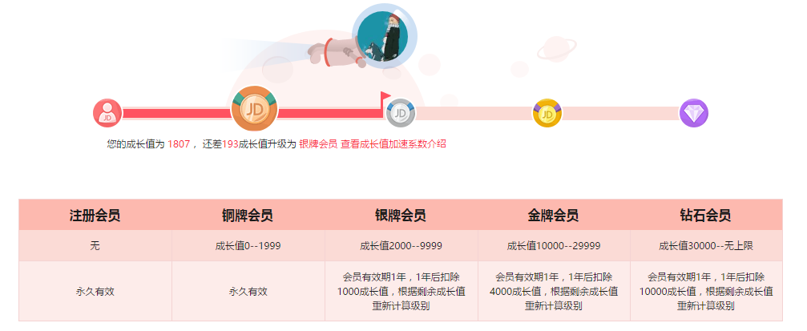

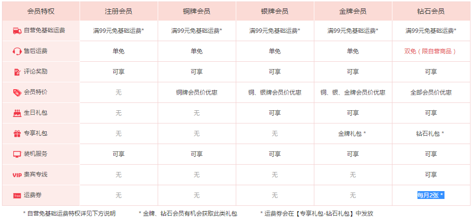

​			

#####   			**数据指标**

​						基本指标(示例)

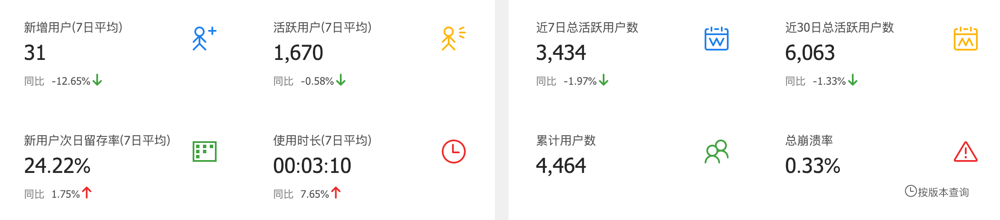

​						注册 登陆 搜索 下单 购物车 等

​						活跃

​								日/周/月 活

​						流失

​						复购

​						付费

​						深度(漏斗)

​						留存

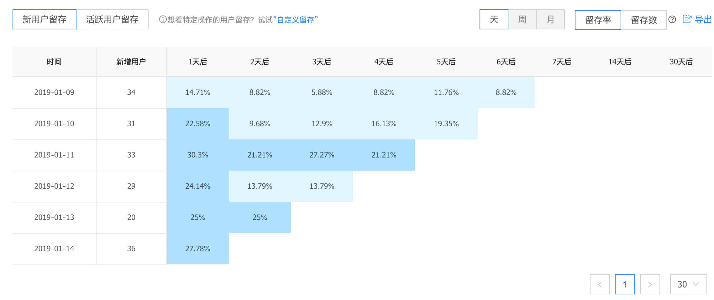

##### 				生命周期

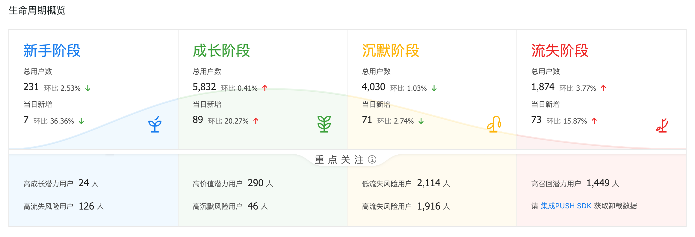

​					运营策略

​						制定目标

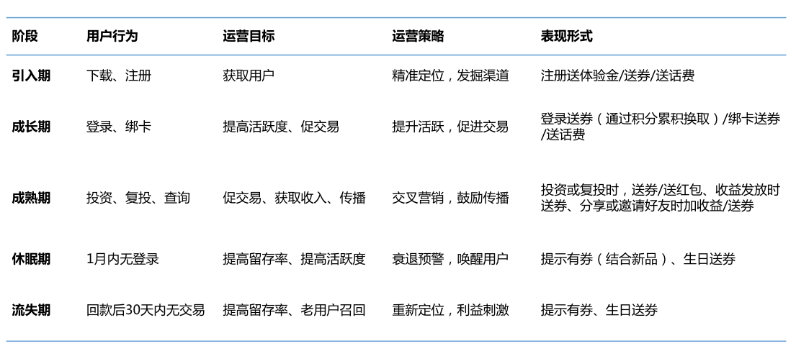

​				策略节奏

​						集中营销

​						精细化分群 针对不同群体做不同的策略

​						策略模型(案例)

​						核心目标及价值营销

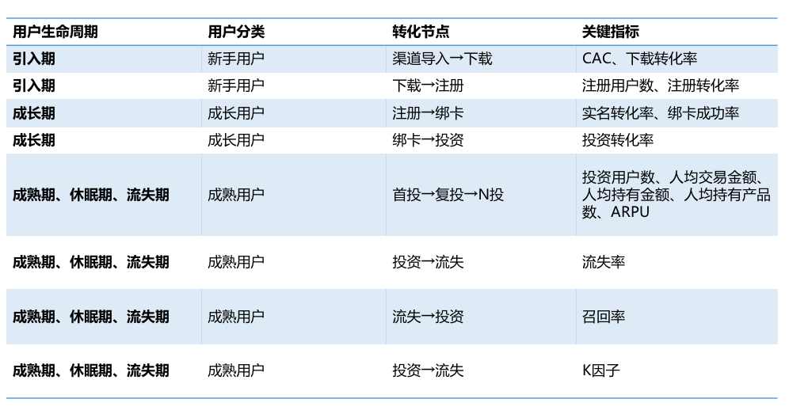

​						**裂变计划**

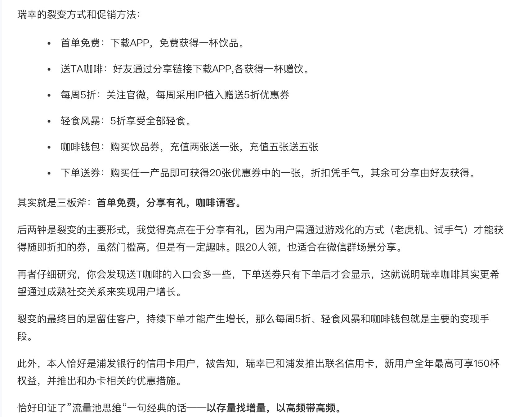

​				

​				效果评估

​				用户分群(案例)

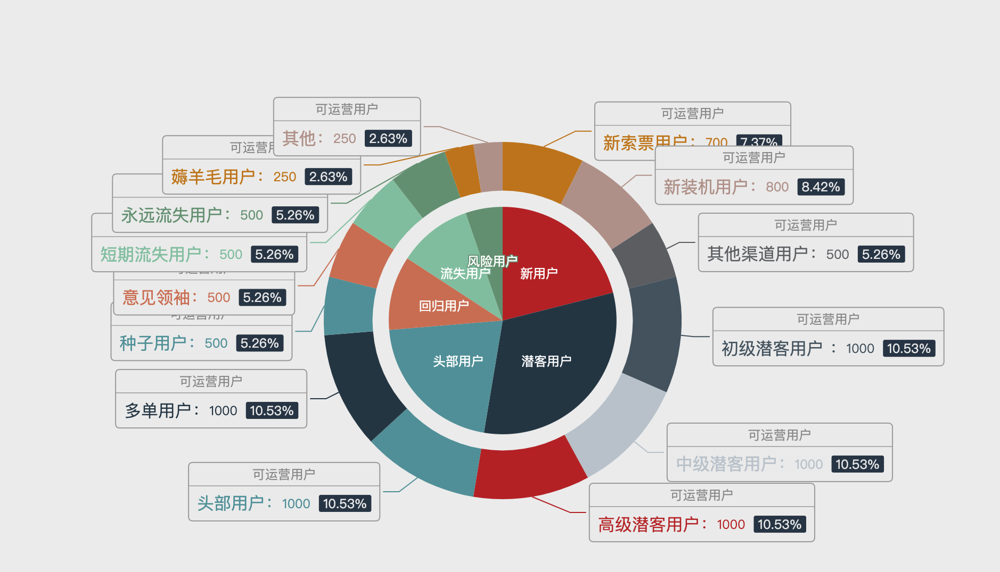

​				**产品运营**

​						内容运营

​						活动运营

​								人性的把握

​								子主题

​						商城运营

​						商业变现

#### **11、团队建设管理能力**

##### 		**1.遇见对的人**

​				寻找综合素质能力高的人 培养副手

​				寻找技术能力强的人 培养技术核心

​				寻找潜力强的人 培养发展核心

​				寻找能主动承担责任有责任心的人 培养团队扛把子

##### 		**2.人尽其才**

​				组团队

​				差异化

​				重培养

##### 		**3.上通下达**

​				不要让自己成为瓶颈

​				将重点的项目让下属有露脸的机会

##### 		**4.评级与晋升**

##### 		**5.拒绝沉溺(不要给鱼)**

​				言传

​						体系化知识输出

​						团队分享会

​				身教

​						方法论的输出

​						完整的示范一次

​						要明确下属他需要做的事而不是事事都亲自动手

​		**6.老司机别翻车**

​						容忍与控制

​						不要触碰底线

​						没有什么是烧烤不能解决的 如果有那就两顿


#### **12、人生开悟之路**

##### 		**1.平衡之道**

​				规划VS变动

​				领导VS下属

​				个人VS团队

​				资源VS价值

​				家庭VS工作

##### 		**2.破除心魔**

​				以结果导向

​						理论上个人感受会是结果导向的障碍

​						结果是个大家相对一致的预期结果

​				接受一家公司代表要融入一种文化

​						是否喜欢是个很重要的分水岭

​						无论什么企业文化都会以结果为导向

​						综合评定自己的容忍度

​				敲碎or划清边界

​						阻碍目标的大多都是边界内自己要做或者推动的

​				多维度的看待事情

​						不要在不同纬度观点下讨论事情 这样容易产生无谓的争执

​						当一种角度理解不了某些人或事的时候那就切换下角度

​						对一个事情或者一个人的评判一定不要单纯的一个角度下结论

​						同样的维度之间切换自如有助于你讨喜

​				信任之路且行且珍惜

​						信任建立在共同的利益之上

​				道德沦陷还是底线失守

​						改变自己，做自己认为恶心的事情是不是就是道德沦陷

​						底线是一个恒久不变的还是一个根据自己的发展阶段 家人 事业 朋友动态调整的


##### 		**3.推荐书籍**

​				技术类(不包含理论与技术框架)

​							《数学之美》

​							《数据仓库工具箱：维度建模的完全指南》

​							《美团机器学习实践》

​							《数据挖掘与数据化运营实战 思路、方法、技巧与应用》

​				业务类

​							《无印良品的改革》

​							《增长黑客》

​							《智联网》

​							《流量池》

​							《浪潮之巅》

​							《京东平台化数据运营》

​							《智能商业》

​				管理与心理学

​							《原则》

​							《乌合之众》

​							《说谎》

​							《策略思维》

​							《卓有成效的管理者》

​							《九型人格》

​							《影响力》

 