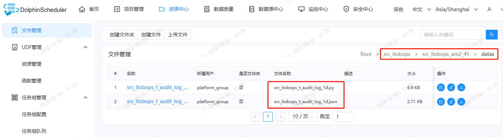
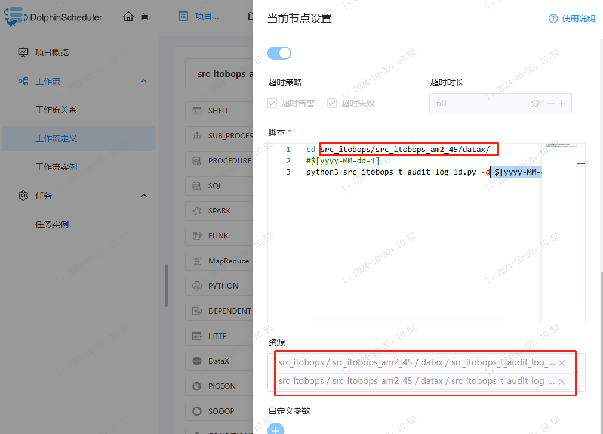

## 一、环境介绍

通过datax将业务数据库oracle、mysql里的数据，抽取到hive库SRC贴源层的临时分区里，再通过Python脚本调起impala sql，将数据加工到SRC层增量分区，以及数仓其他层。

各个环节通过DolphinScheduler调度，定时控制并监控任务状态。


### 1.1 环境与准备

oracle/MySQL + DolphinScheduler + datax +Impala + hive

## 二、步骤说明与脚本样例

### 2.1 datax抽取到SRC_1D表，tmp分区 

调度上准备Python文件和json抽取文件  **(以src_itobops_t_audit_log_1d为例）**



#### 1) python文件

```python
# coding=utf-8
# 引入所需模块
import os
import sys
import time
from impala import dbapi
import datetime
import getopt

# ##############    init  #####################
# 项目目录
WORK_SPACE = os.path.split(os.path.realpath(__file__))[0].split("datawarehouse")[0]

# 脚本名
TABLE_NAME = os.path.split(os.path.realpath(__file__))[1].split(".")[0]

# 准备程序所需参数
def get_date(ago=0, date=None):
    """
        获得指定日期之前或之后ago天数的日期,默认为当天
        :param ago: 为相隔天数,负数为之前、正数为之后
        :param date: 指定的时间,默认为当天
        :rtype: date
    """
    if date is None:
        date = datetime.date.today()
    return date + datetime.timedelta(days=ago)
def format_date(date=None, pattern="%Y%m%d"):
    """
      格式化时间
      :param date:要格式化的时间,默认昨天
      :param pattern: 要转化的格式
      :rtype:str
  """
    if date is None:
        date = get_date(-1)
    return datetime.datetime.strftime(date, pattern)
# 获取当年
DEAL_YEAR = format_date(None, '%Y-%m-%d').split("-")[0]
# 获取当月日期
DEAL_MONTH = format_date(None, '%Y-%m-%d').split("-")[1]
# 获取昨天
DEAL_DATE = format_date(None, '%Y-%m-%d').split("-")[2]
###### 自定义变量
TMP_DT = "tmp"
help_str = "usage: python3 xxx.py -d 2021-09-01 -i|-a"
try:
    opts, args = getopt.getopt(sys.argv[1:], '-hd:-i-inc-a-all:', ['help'])
except getopt.GetoptError:
    print(help_str)
    sys.exit(255)
sync_range = "inc"
dt, year, month, day = "", "", "", ""
for opt, arg in opts:
    if opt in "-a" or opt in "-all":
        sync_range = "all"
    elif opt in "-i" or opt in "-inc":
        sync_range = "inc"
    elif opt in "-d":
        dt = arg
if dt != "":
    dt = datetime.datetime.strptime(dt, '%Y-%m-%d')
    year = format_date(dt, '%Y-%m-%d').split("-")[0]
    # 获取当月日期
    month = format_date(dt, '%Y-%m-%d').split("-")[1]
    # 获取昨天
    day = format_date(dt, '%Y-%m-%d').split("-")[2]
if year:
    DEAL_YEAR = year
if month:
    DEAL_MONTH = month
if day:
    DEAL_DATE = day
# 组合成 xxxx-xx-xx的形式
DEAL_DT = str(DEAL_YEAR) + "-" + str(DEAL_MONTH) + "-" + str(DEAL_DATE)
DEAL_DT_ADD_1D = (datetime.datetime.strptime(DEAL_DT, '%Y-%m-%d')+datetime.timedelta(days=1)).strftime('%Y-%m-%d')
##WHERE_STR 如果同步范围是增量的必须手动填写
if sync_range == "all":
    WHERE_STR = "1=1"
else:
    WHERE_STR = "reqTime >= str_to_date(CONCAT('{DEAL_DT}',' 00:00:00'),'%Y-%m-%d %H:%i:%s') and reqTime < str_to_date(CONCAT('{DEAL_DT_ADD_1D}',' 00:00:00'),'%Y-%m-%d %H:%i:%s')".format(DEAL_DT=DEAL_DT,DEAL_DT_ADD_1D=DEAL_DT_ADD_1D)
if WHERE_STR == "":
    print("WHERE_STR is not null")
    sys.exit(255)

def impala_execute(sql, params=None):
    time.sleep(0.5)
    if params is None:
        params = []
############## impala 集群的环境配置 （根据实际情况调整填写）####################	
    conn = dbapi.connect(host="impala-daemon-ha", port={端口号}, auth_mechanism="{}", user="{账号}", password="{密码}")
    cursor = conn.cursor()
    try:
        print("Impala SQL :" + sql[:10000])
        cursor.execute(sql, params)
        if cursor.has_result_set:
            return cursor.fetchall()
    except Exception as e:
        print("Impala SQL :" + sql[:10000])
        print("Impala Error %s", e)
        exit(255)
    finally:
        cursor.close()
        conn.close()
# ###########################  process_start  ###########################
START = datetime.datetime.now()
print("-------------开始时间-------------:" + str(START))
#print("刷新元数据")
#invalidate_metadata_sql = "INVALIDATE METADATA {table_name} "
#invalidate_metadata_sql = invalidate_metadata_sql.format(table_name=TABLE_NAME)
#impala_execute(invalidate_metadata_sql)

################# SRC层建表语句 #################
create_table_sql="""
		CREATE TABLE IF NOT EXISTS src.src_itobops_t_audit_log_1d
		( xxxxx
		,`audittime` STRING COMMENT '审核时间'
		,`auditor` STRING COMMENT '审核员')
		PARTITIONED BY (dt string)
		COMMENT ''
		ROW FORMAT DELIMITED FIELDS TERMINATED BY '\u0001'
		STORED AS TEXTFILE
		"""
impala_execute(create_table_sql)

################# SRC表删除临时分区 #################
sql = "ALTER TABLE src.{table_name} DROP IF EXISTS PARTITION(dt='{TMP_DT}')"
sql = sql.format(table_name=TABLE_NAME, TMP_DT=TMP_DT)

try:
    print(sql)
    impala_execute(sql)
    print("删除分区成功")
except Exception as e:
    print("删除分区错误", e)
    exit(255)

################# SRC表创建临时分区 #################
sql = "ALTER TABLE src.{table_name} ADD IF NOT EXISTS PARTITION(dt='{TMP_DT}')"
sql = sql.format(table_name=TABLE_NAME, TMP_DT=TMP_DT)

impala_execute(sql)

################# 调起json文件，开始抽数。 这里可以定制自定义变量 #################
val = os.system("""
python3 /opt/soft/addax/bin/addax.py src_itobops_t_audit_log_1d.json -p "-Ddt={TMP_DT} -Dwherestr=\\"{WHERE_STR}\\""
""".format(TABLE_NAME=TABLE_NAME, TMP_DT=TMP_DT, WHERE_STR=WHERE_STR))

if val != 0:
    print("datax同步失败")
    exit(255)

################# SRC表刷新临时分区 #################
sql = "refresh src.{TABLE_NAME} partition(dt='{TMP_DT}')"
sql = sql.format(TABLE_NAME=TABLE_NAME, TMP_DT=TMP_DT)
impala_execute(sql)
# ########################### 加解密，数据由tmp分区，写到增量分区里  ###########################
insert_sql="""
	INSERT OVERWRITE TABLE src.src_itobops_t_audit_log_1d partition(dt='{DEAL_DT}')
	SELECT
	 XXXX
	`audittime`,
	`auditor`
	FROM src.src_itobops_t_audit_log_1d
	WHERE dt='tmp'
	"""
insert_sql=insert_sql.format(DEAL_DT=DEAL_DT)
try:
    print(insert_sql)
    impala_execute(insert_sql)
    print("加解密后插入分区成功")
except Exception as e:
    print("加解密后插入分区失败", e)
    exit(255)

# ###########################  process_end  ###########################
END = datetime.datetime.now()
print("-------------结束时间-------------:" + str(END))
print("-------------共耗时-------------...." + str(END - START))
```

#### 2) json文件

```json
{
    "job": {
        "content": [
            {
                "reader": {
                    "name": "mysqlreader",
                    "parameter": {
                        "column": ["XXXX","`audittime`","`auditor`"],
                        "connection": [
                            {
                                "jdbcUrl": ["jdbc:mysql://{MySQL数据库连接}?useUnicode=true&characterEncoding=utf8&useSSL=false&tinyInt1isBit=false"],
                                "table": ["{MySQL表名}"],
                                "driver": "com.mysql.jdbc.Driver"
                            }
                        ],
                        "password": "{MySQL数据库密码}",
                        "username": "{MySQL数据库账号}",
                        "splitPk": "",
                        "where": "${wherestr}"
                    }
                },
                "writer": {
                    "name": "hdfswriter",
                    "parameter": {
                        "column": [{"name": "XXXX", "type": "STRING"}, {"name": "audittime", "type": "STRING"}, {"name": "auditor", "type": "STRING"}],
                        "defaultFS": "hdfs://hdfs-namenode:8020",
                        "fieldDelimiter": "\u0001",
                        "fileName": "src_itobops_t_audit_log_1d",
                        "fileType": "text",
                        "path": "/user/hive/warehouse/src.db/src_itobops_t_audit_log_1d/dt=${dt}",
                        "writeMode": "nonConflict"
                    }
                }
            }
        ],
        "setting": {
            "speed": {
                "channel": "6"
            }
        }
    }
}
```

#### 3) DolphinSchedule配置

在调度上配置执行sql 运行任务实例即可。




## 三、其他

