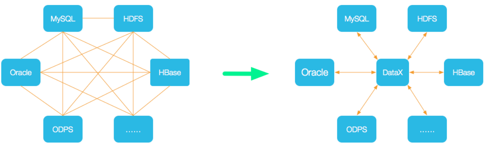
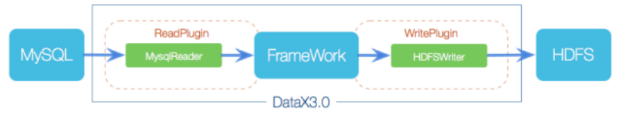
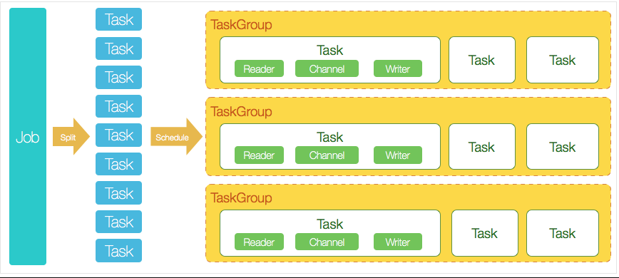

## 1.DataX简介

### 1-1.项目地址

项目地址：https://github.com/alibaba/DataX

官方文档：https://github.com/alibaba/DataX/blob/master/introduction.md

### 1-2.DataX概述

 DataX 是阿里云 DataWorks数据集成 的开源版本，在阿里巴巴集团内被广泛使用的离线数据同步工具/平台。DataX 实现了包括 MySQL、Oracle、OceanBase、SqlServer、Postgre、HDFS、Hive、ADS、HBase、TableStore(OTS)、MaxCompute(ODPS)、Hologres、DRDS, databend 等各种异构数据源之间高效的数据同步功能

 DataX本身作为数据同步框架，将不同数据源的同步抽象为从源头数据源读取数据的Reader插件，以及向目标端写入数据的Writer插件，理论上DataX框架可以支持任意数据源类型的数据同步工作。同时DataX插件体系作为一套生态系统, 每接入一套新数据源该新加入的数据源即可实现和现有的数据源互通

### 1-3.DataX支持的数据源

DataX目前已经有了比较全面的插件体系，主流的RDBMS数据库、NOSQL、大数据计算系统都已经接入

| 类型               | 数据源                          | Reader(读) | Writer(写) | 文档    |
| ------------------ | ------------------------------- | ---------- | ---------- | ------- |
| RDBMS 关系型数据库 | MySQL                           | √          | √          | 读 、写 |
|                    | Oracle                          | √          | √          | 读 、写 |
|                    | OceanBase                       | √          | √          | 读 、写 |
|                    | SQLServer                       | √          | √          | 读 、写 |
|                    | PostgreSQL                      | √          | √          | 读 、写 |
|                    | DRDS                            | √          | √          | 读 、写 |
|                    | Kingbase                        | √          | √          | 读 、写 |
|                    | 通用RDBMS(支持所有关系型数据库) | √          | √          | 读 、写 |
| 阿里云数仓数据存储 | ODPS                            | √          | √          | 读 、写 |
|                    | ADB                             |            | √          | 写      |
|                    | ADS                             |            | √          | 写      |
|                    | OSS                             | √          | √          | 读 、写 |
|                    | OCS                             |            | √          | 写      |
|                    | Hologres                        |            | √          | 写      |
|                    | AnalyticDB For PostgreSQL       |            | √          | 写      |
| 阿里云中间件       | datahub                         | √          | √          | 读 、写 |
|                    | SLS                             | √          | √          | 读 、写 |
| 阿里云图数据库     | GDB                             | √          | √          | 读 、写 |
| NoSQL数据存储      | OTS                             | √          | √          | 读 、写 |
|                    | Hbase0.94                       | √          | √          | 读 、写 |
|                    | Hbase1.1                        | √          | √          | 读 、写 |
|                    | Phoenix4.x                      | √          | √          | 读 、写 |
|                    | Phoenix5.x                      | √          | √          | 读 、写 |
|                    | MongoDB                         | √          | √          | 读 、写 |
|                    | Cassandra                       | √          | √          | 读 、写 |
| 数仓数据存储       | StarRocks                       | √          | √          | 读 、写 |
|                    | ApacheDoris                     |            | √          | 写      |
|                    | ClickHouse                      |            | √          | 写      |
|                    | Databend                        |            | √          | 写      |
|                    | Hive                            | √          | √          | 读 、写 |
|                    | kudu                            |            | √          | 写      |
| 无结构化数据存储   | TxtFile                         | √          | √          | 读 、写 |
|                    | FTP                             | √          | √          | 读 、写 |
|                    | HDFS                            | √          | √          | 读 、写 |
|                    | Elasticsearch                   |            | √          | 写      |
| 时间序列数据库     | OpenTSDB                        | √          |            | 读      |
|                    | TSDB                            | √          | √          | 读 、写 |
|                    | TDengine                        | √          | √          | 读 、写 |

### 1-4.DataX特点

- 可靠的数据质量监控
- 丰富的数据转换功能
- 精准的速度控制
- 强劲的同步性能
- 健壮的容错机制
- 极简的使用体验

## 2.DataX原理

### 2-1.DataX设计理念

1.异构数据源同步问题，就是不同框架之间同步数据时，相同的数据在不同框架中具有不同的数据结构。

2.DataX的设计理念：

DataX将复杂的网状的同步链路变成了星型数据链路，DataX作为中间传输载体负责连接数据各种数据源。
当需要接入一个新的数据源的时候，只需要将此数据源对接到DataX，便能跟已有的数据源做到无缝数据同步。




### 2-2.DataX框架设计

DataX本身作为离线数据同步框架，采用Framework+plugin架构构建。将数据源读取和写入抽象成为Reader/Writer插件，纳入到整个同步框架中



- Reader 

  数据采集模块，负责采集数据源的数据，将数据发送给Framework

- Writer  

  数据写入模块，负责不断从Framework取数据，并将数据写出到目的端。

- Framework

  主题框架，用于连接Reader和Writer，作为两者的数据传输通道，并处理缓冲、流控、并发、数据转换等核心技术问题

  **Framework的几大功能**

- 缓冲 

  Reader 和 Writer 可能会有读写速度不一致的情况，所以中间需要一个组件作为缓冲

- 流控 

  控制数据传输的速度，DataX 可以随意根据需求调整数据传输速度

- 并发      并发的同步或写入数据

- 数据转换

     既然是异构，那么说明读 Reader 的数据源与 写 Writer 的数据源 数据结构可能不同,数据结构不同的话，需要做数据转换操作，转换也在 Framework 中完成

### 2-3.DataX运行流程

DataX支持单机多线程模式完成同步作业，下面用一个DataX作业生命周期的时序图，用以说明DataX的运行流程、核心概念以及每个概念的关系



#### 核心模块介绍：

1. DataX完成单个数据同步的作业，我们称之为Job，DataX接受到一个Job之后，将启动一个进程来完成整个作业同步过程。DataX Job模块是单个作业的中枢管理节点，承担了数据清理、子任务切分(将单一作业计算转化为多个子Task)、TaskGroup管理等功能。
2. DataXJob启动后，会根据不同的源端切分策略，将Job切分成多个小的Task(子任务)，以便于并发执行。Task便是DataX作业的最小单元，每一个Task都会负责一部分数据的同步工作。
3. 切分多个Task之后，DataX Job会调用Scheduler模块，根据配置的并发数据量，将拆分成的Task重新组合，组装成TaskGroup(任务组)。每一个TaskGroup负责以一定的并发运行完毕分配好的所有Task，默认单个任务组的并发数量为5。
4. 每一个Task都由TaskGroup负责启动，Task启动后，会固定启动Reader—>Channel—>Writer的线程来完成任务同步工作。
5. DataX作业运行起来之后， Job监控并等待多个TaskGroup模块任务完成，等待所有TaskGroup任务完成后Job成功退出。否则，异常退出，进程退出值非0

### 2-4.DataX调度策略

举例来说，用户提交了一个DataX作业，并且配置了20个并发，目的是将一个100张分表的mysql数据同步到odps里面。 DataX的调度决策思路是：

1. DataXJob根据分库分表切分成了100个Task。
2. 根据20个并发，DataX计算共需要分配4个TaskGroup。
3. 4个TaskGroup平分切分好的100个Task，每一个TaskGroup负责以5个并发共计运行25个Task。

## 3.DataX安装部署

```shell
# 下载安装包
[ljt@centos100 ~]$ cd /opt/software/
[ljt@centos100 software]$ wget https://datax-opensource.oss-cn-hangzhou.aliyuncs.com/202210/datax.tar.gz
# 解压安装包
[ljt@centos100 software]$ tar -xf datax.tar.gz -C /opt/module
[ljt@centos100 software]$ cd /opt/module/datax/
# DataX自检任务
[ljt@centos100 datax]$ python bin/datax.py job/job.json
2023-02-15 19:01:48.489 [job-0] INFO  JobContainer -
任务启动时刻                    : 2023-02-15 19:01:38
任务结束时刻                    : 2023-02-15 19:01:48
任务总计耗时                    :                 10s
任务平均流量                    :          253.91KB/s
记录写入速度                    :          10000rec/s
读出记录总数                    :              100000
读写失败总数                    :                   0
# 成功执行自检任务
```

