# Docker

Docker是一个开源的应用容器引擎，它允许开发者打包他们的应用以及应用的依赖包到一个可移植的容器中，然后发布到任何流行的Linux机器或Windows服务器上。容器是完全使用**沙箱机制**(程序受控的环境)，相互之间不会有任何接口（类似iPhone的app）而且更轻量级。

Docker 的实现依赖于 Linux 内核的三大核心技术：

- Namespace：实现容器的隔离性，包括 PID（进程隔离）、NET（网络隔离）、MNT（文件系统隔离）等 6 种命名空间，使容器内进程认为自己运行在独立系统中
- Cgroups：控制容器的资源配额，如 CPU 使用率、内存上限、IO 带宽等，防止单个容器耗尽宿主机资源
- UnionFS：实现镜像的分层存储，Docker 支持多种 UnionFS 实现（aufs、overlay2 等），其中 overlay2 因性能优势成为主流选择
  

## 一、简介

### 1.1 核心概念

- **镜像（Image）**

  Docker镜像类似于虚拟机镜像，可以将它理解为一个只读的模板。

  镜像是创建Docker容器的基础，包含运行应用所需的代码、运行时、库、环境变量和配置文件。

  镜像自身是只读的。它采用分层存储结构（UnionFS），每一层都是只读的，新增内容会作为新层叠加。

  镜像通常是通过一个Dockerfile定义的，Dockerfile包含了构建镜像所需的指令。

  - 增量更新：修改镜像时仅需更新变化的层，减少网络传输量
  - 层共享：不同镜像可共享相同基础层，节省存储空间
  - 不可变性：镜像一旦构建完成就无法修改，保证环境一致性

- **容器（Container）**

  Docker容器类似于一个轻量级的沙箱，Docker利用容器来运行和隔离应用。

  容器是从镜像创建的应用运行实例。

  可以将其启动、开始、停止、删除，而这些容器都是彼此相互隔离的、互不可见的。

  可以把容器看做是一个简易版的Linux系统环境以及运行在其中的应用程序打包而成的盒子。

- **仓库（Repository）**

  Docker仓库类似于代码仓库，它是Docker集中存放镜像文件的场所。

  有时候会看到有资料将Docker仓库和仓库注册服务器（Registry）混为一谈，并不严格区分。

  实际上，仓库注册服务器是存放仓库的地方，其上往往存放着多个仓库。

  每个仓库集中存放某一类镜像，往往包括多个镜像文件，通过不同的标签（tag）来进行区分。

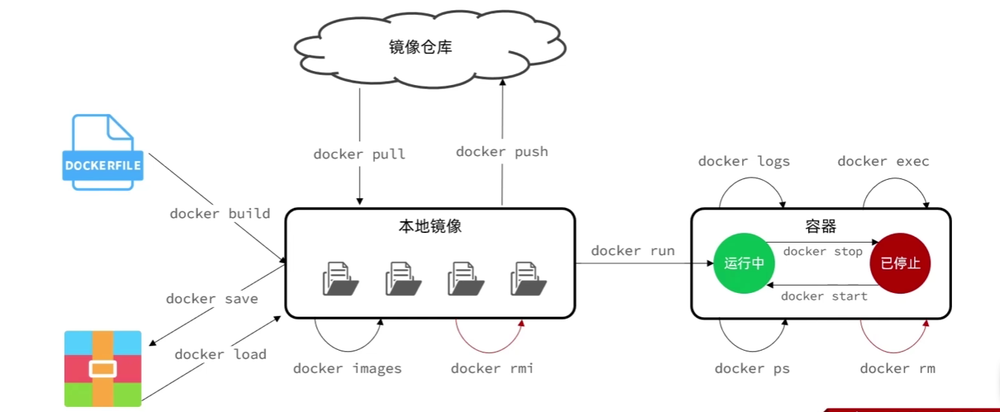

### 1.2 特点：

- **可移植性**：Docker容器可以在任何支持Docker的操作系统上运行，应用部署和迁移变得非常简单。
- **隔离性**：**容器之间是相互隔离**的，一个容器的崩溃不会影响其他容器。
- **轻量级**：容器不需要像虚拟机那样启动一个完整的操作系统，因此它们可以快速启动，并且占用更少的系统资源。
- **安全性**：容器运行在自己的隔离环境中，并且可以限制对系统资源的访问，从而提供了额外的安全层。

### 1.3 优缺点：

```
【优点】
● 快速部署和扩展：  容器可以在秒内启动，这对于需要快速扩展服务的应用场景非常有用。
● 持续集成和持续部署（CI/CD）：  Docker可以简化从开发到生产环境的部署流程。
● 微服务架构： Docker容器非常适合微服务架构，因为它允许将应用分解为多个独立的服务。

【缺点】
● 复杂性：虽然单个容器很简单，但在生产环境中管理大量容器可能会变得复杂。
```

### 1.4 Docker的工作流程：

1. **编写Dockerfile**：定义应用的依赖、环境变量、配置等。
2. **构建镜像**：通过Dockerfile构建应用镜像。
3. **运行容器**：从镜像启动一个或多个容器实例。
4. **管理容器**：启动、停止、监控和删除容器。
5. **共享镜像**：将构建好的镜像推送到Docker仓库，以便在其他机器上使用

### 1.5 官方文档： 

https://docs.docker.com/reference/

### 1.6 Docker工作原理：


## 二、安装和使用

### 环境准备和说明：

**(2025-09-17安装有效)**

**VMware Workstation 12 Pro**:  12.5.7 

**系统版本**：CentOS-7-x86_64-DVD-1908.iso

**shell工具**：FinalShell 4.5.12

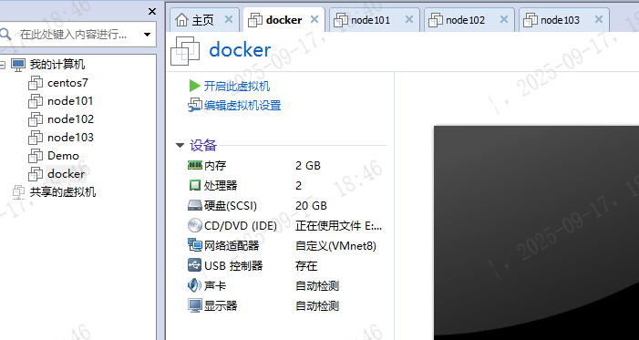

### 1.卸载旧版Docker

```shell
yum remove docker \
    docker-client \
    docker-client-latest \
    docker-common \
    docker-latest \
    docker-latest-logrotate \
    docker-logrotate \
    docker-engine \
    docker-selinux
```

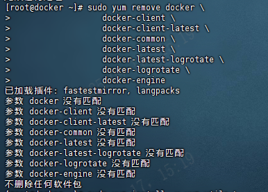

### 2.安装必要依赖包

```shell
sudo yum install -y yum-utils \
    device-mapper-persistent-data \
    lvm2
```

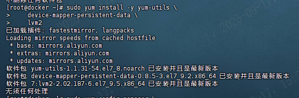

### 3.配置Docker的yum库

Docker的yum源是一个**软件仓库**，它允许用户通过yum包管理器在基于Red Hat的Linux发行版（如CentOS、Fedora）上轻松地**安装、更新和卸载Docker及其相关组件**。Yum（Yellowdog Updater, Modified）是一个用于RPM-based Linux系统的自动化更新和软件包安装的工具。

```shell
###备份原有的repo文件(可选，有备无患)
sudo mv /etc/yum.repos.d/CentOS-Base.repo /etc/yum.repos.d/CentOS-Base.repo.backup

###下载阿里云的repo配置文件
sudo curl -o /etc/yum.repos.d/CentOS-Base.repo http://mirrors.aliyun.com/repo/Centos-7.repo
###刷新YUM元数据缓存
sudo yum clean all
sudo yum makecache

###使用阿里云源安装yum-utils
sudo yum --disablerepo=\* --enablerepo=aliyun install -y yum-utils
###配置Docker的yum源
sudo yum-config-manager --add-repo https://mirrors.aliyun.com/docker-ce/linux/centos/docker-ce.repo
sudo sed -i 's+download.docker.com+mirrors.aliyun.com/docker-ce+' /etc/yum.repos.d/docker-ce.repo
###更新yum,建立缓存
sudo yum makecache fast
```

### 4.安装Docker

```shell
##安装命令
yum install -y docker-ce docker-ce-cli containerd.io docker-buildx-plugin docker-compose-plugin
```

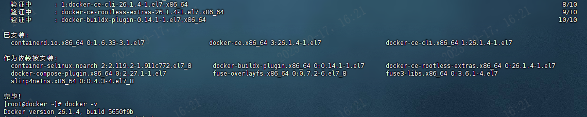

```shell
#查看Docker版本
docker -v
# 启动Docker
systemctl start docker
#列出运行在本地Docker主机上的所有镜像
docker images
# 停止Docker
systemctl stop docker
# 重启
systemctl restart docker
# 设置开机自启
systemctl enable docker
# 执行docker ps命令，如果不报错，说明安装启动成功
docker ps
```

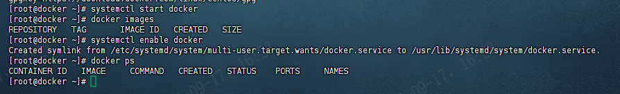

### 5.配置镜像加速

镜像地址可能会变更，如果失效可以百度找最新的docker镜像。

```shell
# 创建目录
mkdir -p /etc/docker

# 复制内容，注意把其中的镜像加速地址改成你自己的
tee /etc/docker/daemon.json <<-'EOF'
{
    "registry-mirrors": [
    "https://registry.docker-cn.com",
    "http://hub-mirror.c.163.com",
    "https://docker.mirrors.ustc.edu.cn",
    "https://dockerhub.azk8s.cn",
    "https://mirror.ccs.tencentyun.com",
    "https://registry.cn-hangzhou.aliyuncs.com",
    "https://docker.mirrors.ustc.edu.cn",
    "https://docker.1panel.live",
    "https://atomhub.openatom.cn/",
    "https://hub.uuuadc.top",
    "https://docker.anyhub.us.kg",
    "https://dockerhub.jobcher.com",
    "https://dockerhub.icu",
    "https://docker.ckyl.me",
    "https://docker.awsl9527.cn"
    ]
}
EOF
# 重新加载配置
systemctl daemon-reload
# 重启Docker
systemctl restart docker
```

### 6.Docker简单命令

官网文档： https://docs.docker.com/reference/cli/docker/


```shell
#docker 版本信息
docker version
#docker 系统信息
docker info
#docker 命令解读(不输入command展示所有命令)
docker [command] --help 
```

### 7.运行应用


#### 7.1 镜像

##### 7.1.1 检索镜像docker search

**直接去官网搜索下载(推荐):**    https://hub.docker.com/

在 docker 中搜索镜像主要使用 Search 子命令，默认只搜索 Docker Hub 官方[镜像仓库](https://cloud.tencent.com/product/tcr?from_column=20065&from=20065)中的镜像。

非外网环境不能访问，需要科学上网。

格式 : `docker search [所搜索的镜像名称] [选项]`

```shell
-f :过滤
	# 搜索被收藏超过 300 个的并且关键词包括 Python 的镜像
	docker search -f stars=300 python
	# 搜索官方提供的带有 Redis 关键字的镜像
	docker search -f is-official=true redis
	NAME        DESCRIPTION              STARS            OFFICIAL            AUTOMATED
	redis      Redis is an open source key-value store that…   8792                [OK]
–format string：格式化输出内容
-s :列出搜藏不小于指定值的镜像
--automated : 只列出 automated build 类型的镜像
--limit : 限制输出结果
--no-trunc: 不截断输出结果
```

##### 7.1.2 拉取镜像 docker pull

- **语法: docker pull image[:tag]**

```shell
#格式：docker pull [镜像仓库URL]/[命名空间名称]/[仓库名称]:[镜像版本号]
 示例: docker pull docker.io/library/busybox:latest
#拉取镜像
docker pull mysql
#拉取指定版本镜像
docker pull mysql:5.7
```

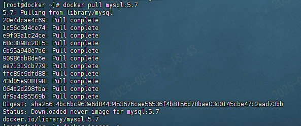

##### 7.1.3 查看镜像docker images

- **语法: docker images [option]**

```shell
-a,all:    展示所有镜像 (包括临时镜像文件)
-q,quite:  只展示镜像ID
–digests=trur | false：列出镜像的数字摘要值，默认为否；
-f，–filter=[]：过滤列出的镜像，如dangling=true只显示没有被使用的镜像；也可以指定带有特殊标注的镜像等；
–format=”TEMPLATE”：控制输出格式，如.ID代表ID信息，.Repository代表仓库信息等；
–no-trunc=true | false：对输出结果中太长的部分是否进行截断，如ID信息，默认为是；
```


| REPOSITORY | TAG                                         | IMAGE ID | CREATED            | SIZE           |
| :--------- | :------------------------------------------ | :------- | :----------------- | :------------- |
| 仓库名称   | 版本号（又称镜像标签）(latest:表示最新版本) | 镜像ID   | 镜像创建时间到现在 | 镜像文件的体积 |

 **` docker inspect` 命令获取镜像的详细信息**

```
使用docker inspect 命令获取镜像的详细信息，包括 PID、作者、架构等等。
基本格式：docker inspect [镜像ID] / [镜像名称：版本号]
```

##### 7.1.4 镜像删除docker rmi

- **语法: docker rmi [option] image:tag**

```shell
#注意要是完整标签: 
docker rmi nginx:latest
#推荐使用其唯一镜像ID 删除:  
docker rmi 3f8a4339aadd

#option说明,-f:全部删除
#$(docker images -aq) 即取得所有镜像ID集合
docker rmi -f $(docker images -aq)
```

##### 7.1.5 查看镜像构建历史docker history

格式 : `docker history [镜像名字:镜像版本号] / [镜像ID]`

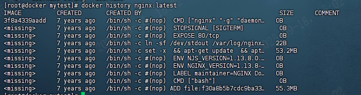

##### 7.1.6 清理镜像docker image prune

使用一段时间之后，docker 会产生很多临时镜像文件，以及一些没有被使用的镜像， 我们可以通过 docker image prune 命令来进行清理。

- **格式：docker image prune [选项]**

```shell
docker image prune命令选项
-a：清理所有没有当前使用的镜像，不仅是临时镜像。
-f： 强制删除。等同于rmi删除。
-filter filter：只清除符合给定过滤器的镜像。
```

##### 7.1.7 推送镜像docker push

- **格式 : `docker push [镜像仓库URL]/[命名空间名称]/[仓库名称]:[版本号]`**

push将本地镜像推送到网上的个人的私有仓库中，例如阿里云的私有仓库。

推送镜像，push一次只能推送一个镜像。

##### 7.1.8  为镜像添加docker tag

为了方便后续工作中使用特定的镜像，还可以使用 docker tag 命令来为本地的镜像添加标签、修改镜像名称和版本号。

**格式 : `docker tag [原镜像仓库url]/[原镜像命名空间]/[原镜像仓库名称]:[版本号]  [新镜像仓库url]/[新镜像命名空间]/[新镜像仓库名称]:[版本号]`**

```shell
#docker tag 旧标签 新标签
docker tag [原镜像仓库url]/[原镜像命名空间]/[原镜像仓库名称]:[版本号] \
					[新镜像仓库url]/[新镜像命名空间]/[新镜像仓库名称]:[版本号]  
#docker tag ubuntu:latest myubuntu:latest
```

修改tag后，源镜像还会存在，ID则为同一个，**在删除镜像时若指定的是ID则会删除所有匹配到ID的镜像**，若指定的是`镜像名称：版本`则仅删除指定名称的单个镜像。

#### 7.2 容器

##### 7.2.1 运行容器docker run

- **语法:docker run [option] image[:tag]** [command] [arg...] 如果本地没有镜像会自动去仓库拉取。

```shell
--name: 为容器指定一个名称；
-d: 后台运行容器，并返回容器ID，也即启动守护式容器；
    非后台运行会阻塞控制台
    常见坑：当后台运行容器时，若容器没有提供服务，则会自动停止
-i,-t,-it：以交互模式运行容器;为容器重新分配一个伪输入终端;二者通常同时使用;
           交互方式运行,进入容器内部查看内容
           exit:停止容器并从退回主机
           ctrl + p + q:不停止容器退出
	#创建并进入容器
    #docker run -it --name 容器名称 镜像名称:标签 /bin/bash
-e : 在容器内设置一个环境变量。
--link：链接到另一个容器。
-h：指定容器内的主机名。
-p: 端口映射，-p标志用于指定端口映射，它允许你将容器内的端口映射到镜像端口,即
    运行Docker的机器上的端口。这是为了让外部网络能够访问在Docker容器内运行的服务
    端口映射可以提高安全性，因为可以只公开必要的端口，而非公开容器内的所有端口。
    映射有以下格式
      -p ip:主机端口:容器端口 
      -p 主机端口:容器端口(常用)
      -p 容器端口
      容器端口
-v: 映射存储卷，可以映射文件及文件夹。表示目录映射关系（前者是宿主机目录，后者是映射到宿主机上的目录），可以使用多个 -v 做多个目录或文件映射。注意：最好做目录映射，在宿主机上做修改，然后共享到容器上；映射后在宿主机文件内的修改都会映射到容器内的文件中。
	# docker run -d -v 宿主机文件路径:容器内文件路径 nginx:1.19.2
-w: 指定命令执行时，所在的路径
例如:
docker run -d --name nignx -p 80:80 nginx
后台运行最新版本nginx ,容器名字定义为nginx,镜像,容器端口都是80
```

- 不写tag默认最新版本,command和arg为默认配置一般不写

- ctrl + c 终止运行

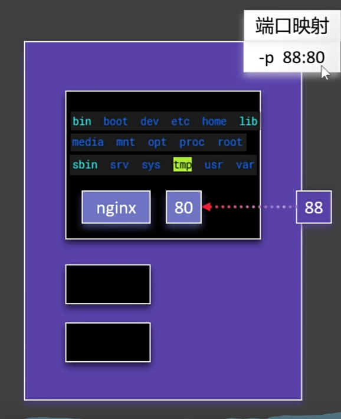

**运行结果：**

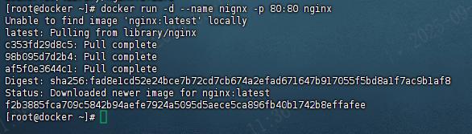

**页面访问：**

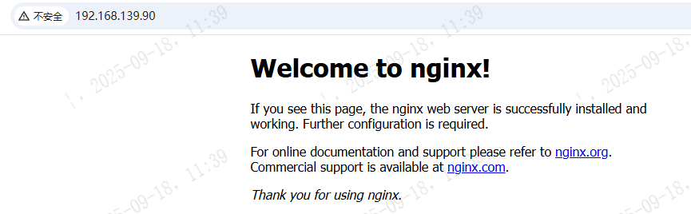

##### 7.2.2 查看运行容器docker ps

- **语法:docker ps [option] container**

```shell
docker ps 
-d:  查看正在运行容器
-a:  查看所有容器(包括已经停止的)
-n=?:展示最近运行的?个容器
-q:  只显示id
-f：查看停止的容器         示例：docker ps -f status=exited
```

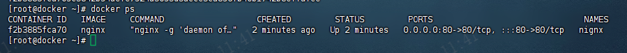

- 【说明】

  | CONTAINER ID | IMAGE  | COMMAND      | CREATED  | STATUS             | PORTS    | NAMES            |
  | ------------ | ------ | ------------ | -------- | ------------------ | -------- | ---------------- |
  | 容器id       | 镜像名 | 容器默认命令 | 创建时间 | 启动状态(up即成功) | 占用端口 | 应用容器名(随机) |

- 容器的操作(container)只能是**容器名或容器ID**(非镜像名),若可以唯一识别,可以只使用ID前几位数字

##### 7.2.3 停止容器docker stop

- **语法: docker stop [option] container [container]**

```shell
-t, --time int：这个选项指定在发送 SIGTERM 信号后等待容器停止的秒数。
容器中的应用程序可以捕获SIGTERM信号并执行清理操作，如保存状态、关闭连接、释放资源等再退出
如果在指定的时间内容器没有停止，那么 Docker 将发送 SIGKILL 信号来强制停止容器。
默认情况下，docker stop 会等待 10 秒。

#container自己停止或20秒后强制停止,不使用-t默认10秒
docker stop -t 20 container

[container] 
同时操作多个容器 docker stop $(docker ps)
```

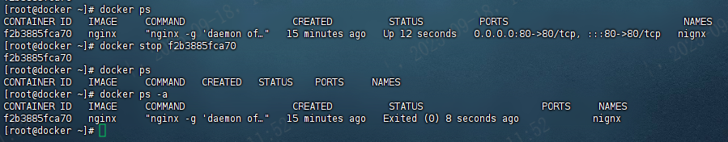

##### 7.2.4 强停容器docker kill

- **语法: docker stop [option] container**
- 直接发送SIGKILL信号到容器的主进程，这会立即终止容器，不给容器中的进程任何清理和退出的机会。适用于容器无响应或者需要快速停止容器。

##### 7.2.5 启动容器docker start

- 语法:**语法: docker restart container [container]**
- 启动停止的容器,若已经启动或者已经删除则无效

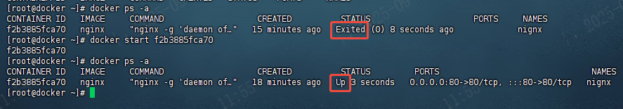

##### 7.2.6 重启容器docker restart

- **语法: docker restart container [container]**
- 关闭的则启动,启动的则重启

##### 7.2.7 查看容器状态docker stats

- **语法: docker stats container** 
- 展示容器占用的cpu内存情况

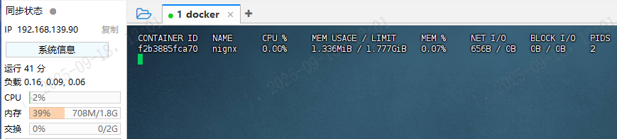

Docker容器主要有以下7个状态：

- created：已创建，还未运行的容器
- running：正在运行中的容器
- restarting：容器正在重启中
- removing：容器正在迁移中
- paused：已暂停状态的容器
- exited：停止状态的容器
- dead：死亡，主要是操作系统出现异常或者断电关机等有可能引发dead状态，不是很常见。

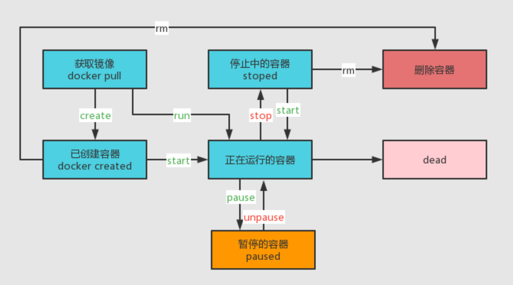

暂停和停止状态的区别

- docker pause 命令挂起指定容器中的所有进程
- docker stop 容器内主进程会在指定时间内被杀死，默认为10s后。

##### 7.2.8 查看容器日志docker logs

- **语法：docker logs [option] container**

```shell
     --details        Show extra details provided to logs
  -f, --follow        跟踪日志输出。类似tail -f命令。
      --since string   显示某个开始时间的所有日志。 (e.g. "2013-01-02T13:23:37Z") or relative (e.g. "42m" for 42 minutes)
  -n, --tail string    仅列出最新N条容器日志。 (default "all")
  -t, --timestamps     显示时间戳。
      --until string   Show logs before a timestamp (e.g. "2013-01-02T13:23:37Z") or relative (e.g. "42m" for 42 minutes)

-tf:展示日志
--tail number:以字符串的形式展示日志,number展示日志条数
```

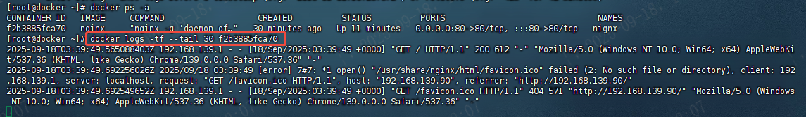

##### 7.2.9 查看容器进程信息docker top

- **语法:docker top container**

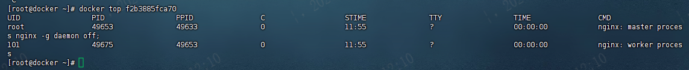

##### 7.2.10 删除容器docker rm 

- **语法:docker rm [option] container [container]**
- 不能删除运行中的容器,除非option选用**-f**
- 同理,删除所有镜像: docker rmi -f $(docker ps -aq)

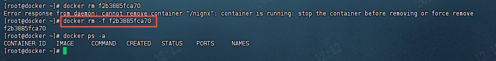

##### 7.2.11 查看容器详细信息docker inspect

该命令能够查看该容器详细信息

**格式：docker [image] inspect 镜像标签**

```shell
#示例1： docker [image] inspect ubuntu:18.04
[root@docker mytest]# docker inspect 2a9262bdbbb9
[
    {
        "Id": "2a9262bdbbb91da0f7e6e4ad15dae9b5baff287079373eb1995692f2470a5fb4",
        "Created": "2025-09-18T05:38:52.543983118Z",
        "Path": "nginx",
        "Image": "sha256:3f8a4339aadda5897b744682f5f774dc69991a81af8d715d37a616bb4c99edf5",
        "ResolvConfPath": "/var/lib/docker/containers/2a9262bdbbb91da0f7e6e4ad15dae9b5baff287079373eb1995692f2470a5fb4/resolv.conf",
        "HostnamePath": "/var/lib/docker/containers/2a9262bdbbb91da0f7e6e4ad15dae9b5baff287079373eb1995692f2470a5fb4/hostname",
        "HostsPath": "/var/lib/docker/containers/2a9262bdbbb91da0f7e6e4ad15dae9b5baff287079373eb1995692f2470a5fb4/hosts",
        "LogPath": "/var/lib/docker/containers/2a9262bdbbb91da0f7e6e4ad15dae9b5baff287079373eb1995692f2470a5fb4/2a9262bdbbb91da0f7e6e4ad15dae9b5baff287079373eb1995692f2470a5fb4-json.log",
        "Name": "/nignx",
        "RestartCount": 0,
...(省略部分)...
```

同样支持 -f 选项过滤指定信息。

```shell
[root@docker]# docker inspect -f '{{.Id}}' b1a13dfe7105
b1a13dfe71056d8c02fb90e52a503bbedc60301f62e9c49604fa86c2258fd310
```

#### 7.3 容器配置

##### 7.3.1 进入容器docker exec/attach

- **语法:docker exec -it container bashShell** (官方推荐使用)
- 格式 : `docker exec [参数] [容器名或ID] [命令]`

继attach 之后，exec 是官方推出的有一个新的进入容器的命令，这也是**目前推荐使用的进入容器的方式**。这个命令相当于在容器中执行一个命令。

```shell
Options:
  -d, --detach               Detached mode: run command in the background
      --detach-keys string   Override the key sequence for detaching a container
  -e, --env list             Set environment variables
      --env-file list        Read in a file of environment variables
  -i, --interactive          Keep STDIN open even if not attached
      --privileged           Give extended privileges to the command
  -t, --tty                  Allocate a pseudo-TTY
  -u, --user string          Username or UID (format: "<name|uid>[:<group|gid>]")
  -w, --workdir string       Working directory inside the container
#前置工作,启动并改名:docker run -d --name nginx -p 80:80 nginx
#命令以与控制台(/bin/bash)交互(-it)的形式进入容器nginx(已经取容器名为nginx)
docker exec -it nginx /bin/bash
或者
docker exec -it nginx bash

#exec进入容器并开启新终端并操作,更常用
#注意,无法通过vi编辑器操作容器中的文件,容器只存在一些运行必备的资源
```

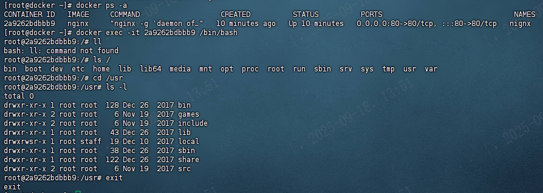

- **语法:docker attach container**  进入容器正在执行的终端

通过管道，连接容器内PID=1的进程，容器至少有一个进程运行前台。

attach 是最早 docker 官方推出的进入容器的命令了，不过使用该命令有一个问题。当多个窗口同时使用该命令进入该容器时，所有的窗口都会同步显示。如果有一个窗口阻塞了，那么其他窗口也无法再进行操作，当所有窗口退出时，容器结束。

```shell
Usage:  docker attach [OPTIONS] CONTAINER
Attach local standard input, output, and error streams to a running container

Aliases:
  docker container attach, docker attach

Options:
      --detach-keys string   Override the key sequence for detaching a container
      --no-stdin             Do not attach STDIN
      --sig-proxy            Proxy all received signals to the process (default true)
```

##### 7.3.2 退出容器

- `exit` : 容器停止退出
- `Ctrl+P+Q` : 容器不停止退出

##### 7.3.3 宿主机和容器复制文件docker cp

复制命令类似于 Linux 系统中的 scp 命令，是将宿主主机上的内容上传到容器中，也可能是将容器中的文件下载到宿主主机中。

**1) 从容器内复制文件到宿主主机**

**格式：`docker cp [容器ID:容器内文件路径] 宿主主机路径`**


**2) 从宿主机复制文件到容器**

**格式 : `docker cp 宿主主机路径 [容器ID：容器内文件路径]`**

```shell
[root@Stupidkid ~]# docker cp ./export_nginx.tar d78575358e04:/home
[root@Stupidkid ~]# docker exec d78575358e04 ls /home
export_nginx.tar
```

#### 7.4 容器目录挂载  -v

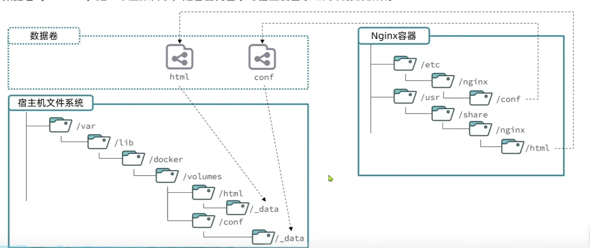

我们可以在创建容器的时候，将宿主机的目录与容器内的目录进行映射，这样我们就可以**通过修改宿主机某个目录的文件从而去影响容器**，而且这个操作是双向绑定的，也就是说**容器内的操作也会影响到宿主机**，实现备份功能。

**格式:  docker run -di -v  宿主机目录:容器目录  镜像名** 

但是容器被删除的时候，宿主机的内容并不会被删除。如果多个容器挂载同一个目录，其中一个容器被删除，其他容器的内容也不会受到影响。

```shell
容器与宿主机之间的数据卷属于引用的关系，数据卷是从外界挂载到容器内部中的，所以可以脱离容器的生命周期而独立存在，正是由于数据卷的生命周期并不等同于容器的生命周期，在容器退出或者删除以后，数据卷仍然不会受到影响，数据卷的生命周期会一直持续到没有容器使用它为止。

创建容器添加 -v 参数，格式为宿主机目录:容器目录，例如：
docker run -d -v /mydata/docker_centos/data:/usr/local/data --name centos7-01 centos:7
# 多目录挂载
docker run -d -v /宿主机目录:/容器目录 -v /宿主机目录2:/容器目录2 镜像名

#查看帮助信息
docker volum --help
#创建数据卷
docker volume create
#查看所有数据卷
docker volume ls
#删除指定数据卷
docker volume rm
#查看某个数据卷的详情
docker volume inspect
#清除数据卷
docker volume prune
```

 **目录挂载操作可能会出现权限不足的提示。**这是因为 CentOS7 中的安全模块 SELinux 把权限禁掉了，在 docker run 时通过 `--privileged=true` 给该容器加权限来解决挂载的目录没有权限的问题。

##### 7.4.1 匿名挂载

匿名挂载只需要写容器目录即可，容器外对应的目录会在 `/var/lib/docker/volume` 中生成。

```shell
# 匿名挂载  -v 容器内路径	
docker run -di -v /usr/local/data --name centos7-02 centos:7
# 查看 volume 数据卷信息
docker volume ls
```

##### 7.4.2 具名挂载（常用）

具名挂载就是给数据卷起了个名字，容器外对应的目录会在 `/var/lib/docker/volume` 中生成。

```shell
# 具名挂载  -v 卷名：容器内路径	
docker run -di -v docker_centos_data:/usr/local/data --name centos7-03 centos:7
# 查看 volume 数据卷信息
docker volume ls
```

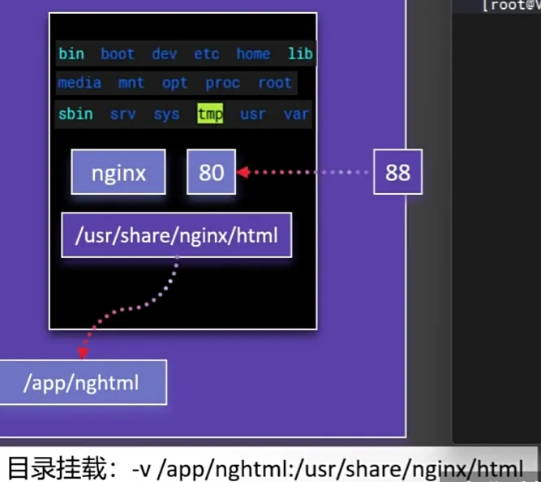

##### 7.4.3 指定目录挂载

这种方式的挂载不会在 `/var/lib/docker/volume` 目录生成内容。

```shell
#  -v /宿主机路径：容器内路径  #指定路径挂载
docker run -di -v /mydata/docker_centos/data:/usr/local/data --name centos7-01 centos:7
# 多目录挂载
docker run -di -v /宿主机目录:/容器目录 -v /宿主机目录2:/容器目录2 镜像名
```

##### 7.4.4 查看目录挂载关系docker volume inspect

通过 `docker volume inspect 数据卷名称` 可以查看该数据卷对应宿主机的目录地址。

通过 `docker inspect 容器ID或名称` ，在返回的 JSON 节点中找到 `Mounts`，可以查看详细的数据挂载信息。

```shell
[root@localhost ~]# docker volume inspect docker_centos_data
[
    {
        "CreatedAt": "2020-08-13T20:19:51+08:00",
        "Driver": "local",
        "Labels": null,
        "Mountpoint": "/var/lib/docker/volumes/docker_centos_data/_data",
        "Name": "docker_centos_data",
        "Options": null,
        "Scope": "local"
    }
]
```

##### 7.4.5 只读ro 只写rw

```shell
# 只读。只能通过修改宿主机内容实现对容器的数据管理。
docker run -it -v /宿主机目录:/容器目录:ro 镜像名
# 读写，默认。宿主机和容器可以双向操作数据。
docker run -it -v /宿主机目录:/容器目录:rw 镜像名
```

##### 7.4.6  volumes-from（继承）

```shell
# 容器 centos7-01 指定目录挂载
docker run -di -v /mydata/docker_centos/data:/usr/local/data --name centos7-01 centos:7
# 容器 centos7-04 和 centos7-05 相当于继承 centos7-01 容器的挂载目录
docker run -di --volumes-from centos7-01:ro --name centos7-04 centos:7
docker run -di --volumes-from centos7-01:rw --name centos7-05 centos:7
```

#### 7.5 保存镜像

##### 7.5.1 镜像提交docker commit

- **基于已有容器创建，语法:docker commit [option]  CONTAINER  [repository[:tag]]**

```shell
#将容器修改好的配置信息打包上传到主机
docker commit container

#option
-a:指定作者
-c:改变的列表
-m:打包信息
-p:打包期间暂停运行

#repository[:tag]
指定镜像名[和版本号]
```

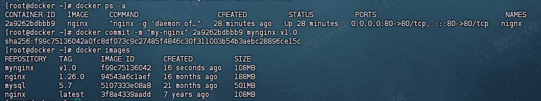

##### 7.5.2 镜像保存和加载 docker save/load

- **语法:docker save [option] image[:tag]**

save能将**镜像**完整的保存下来，包括镜像ID和构建历史。一样可用输出重定向或-o选项保存至tar包中，并且save支持将多个镜像保存至一个tar包中。

```shell
Usage:  docker save [OPTIONS] IMAGE [IMAGE...]
Save one or more images to a tar archive (streamed to STDOUT by default)
Aliases:
  docker image save, docker save
Options:
  -o, --output string   将镜像保存为tar包(名字随便取)
#格式
docker save [镜像名或ID ...] > [压缩包名称]
docker save -o [压缩包名称] [镜像名称或ID ...]
#示例 
docker save -o mynginx.tar mynginx:vers1.0
```

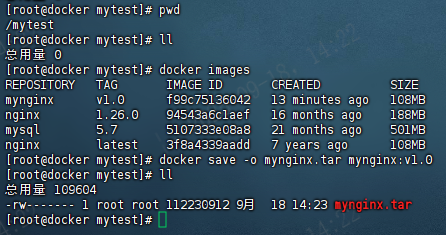

- **语法:docker load [option]** 

load是将**save保存的镜像文件**载入为镜像。save保存时若使用镜像ID保存镜像，导入时则没有镜像名称，load在导入时也不能自定义镜像名称，可以在导入后使用docker tag命令修改。

```
-i:指定压缩包路径,自动读取,根据压缩包产生镜像
-q:抑制负载输出
docker load -i mynginx.tar
```

展示当前已经保存的压缩包和镜像,将镜像删除,然后从压缩包中加载回镜像

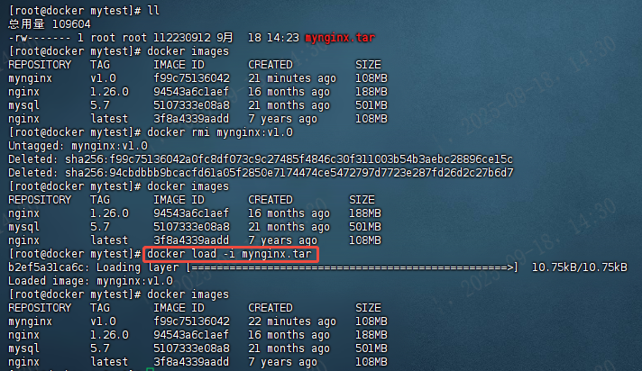

##### 7.5.3 镜像导入导出export、import

某些时候，需要将容器或镜像保存成文件从一个系统迁移到另外一个系统，此时可以使用 Docker 的导入和导出功能，这也是Docker 自身提供的一个重要特性。

导出的文件是一个tar包，可以通过压缩命令进行压缩，然后进行传输。

**export**   将**容器**导出到标准输出，可以使用输出重定向或-o选项至文件中。

-  **格式：docker export [容器名或ID] > [文件名称]**

```shell
#示例：将nginx容器导出
docker export nginx > export_nginx.tar
```

**import**  将**export导出**的文件导入为镜像，可以自定义导入的镜像名称和版本号。

import虽然可以导入“save保存的文件”， 但是导入后无法运行。

**格式：`docker import [文件名称] [自定义镜像名称]:[版本号]`**

#### 7.6 分享镜像

科学上网，登录官网:    https://hub.docker.com/

##### 7.6.1 登录私有镜像仓库

- **命令格式：docker login [选项] [镜像仓库URL]**

```
docker login --username=你的阿里云用户名 registry.cn-zhangsan.aliyuncs.com/stupid_kid/stupid_kid
```

### 三、制作镜像Dockerfile

- 镜像就是包含了应用程序，程序运行的系统函数库，运行配置等文件的文件包。构建镜像的过程其实就是把上述文件打包的过程。

https://docs.docker.com/reference/dockerfile/

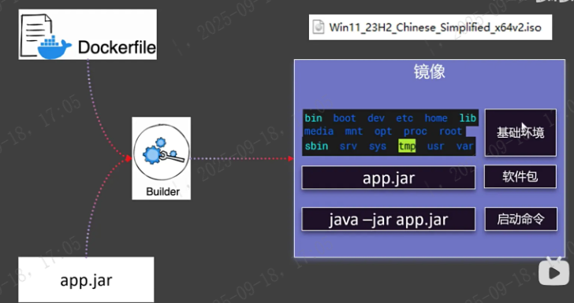

常用的 DockerFile 指令如下：

```shell
FROM				# from:基础镜像，一切从这里开始构建
MAINTAINER			# maintainer:镜像是谁写的， 姓名+邮箱
RUN					# run:镜像构建的时候需要运行的命令
ADD					# add:步骤，tomcat镜像，这个tomcat压缩包！添加内容 添加同目录
WORKDIR				# workdir:镜像的工作目录
VOLUME				# volume:挂载的目录
EXPOSE				# expose:保留端口配置
CMD					# cmd:指定这个容器启动的时候要运行的命令，只有最后一个会生效，可被替代
ENTRYPOINT			# entrypoint:指定这个容器启动的时候要运行的命令，可以追加命令
ONBUILD				# onbuild:当构建一个被继承DockerFile这个时候就会运行onbuild的指令，触发指令
COPY				# copy:类似ADD，将我们文件拷贝到镜像中
ENV					# env:构建的时候设置环境变量！
```

