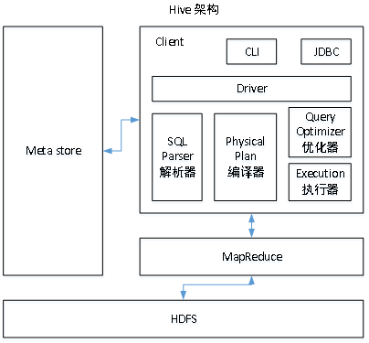

### 数据倾斜总结

**1．用户接口：Client**

CLI（command-line interface）、JDBC/ODBC(jdbc访问hive)、WEBUI（浏览器访问hive）

**2．元数据：Metastore**

元数据包括：表名、表所属的数据库（默认是default）、表的拥有者、列/分区字段、表的类型（是否是外部表）、表的数据所在目录等；

默认存储在自带的derby数据库中，推荐使用MySQL存储Metastore

**3．Hadoop**

使用HDFS进行存储，使用MapReduce进行计算。

**4．驱动器：Driver**

（1）解析器（SQL Parser）：将SQL字符串转换成抽象语法树AST，这一步一般都用第三方工具库完成，比如antlr；对AST进行语法分析，比如表是否存在、字段是否存在、SQL语义是否有误。

（2）编译器（Physical Plan）：将AST编译生成逻辑执行计划。

（3）优化器（Query Optimizer）：对逻辑执行计划进行优化。

（4）执行器（Execution）：把逻辑执行计划转换成可以运行的物理计划。对于Hive来说，就是MR/Spark。

