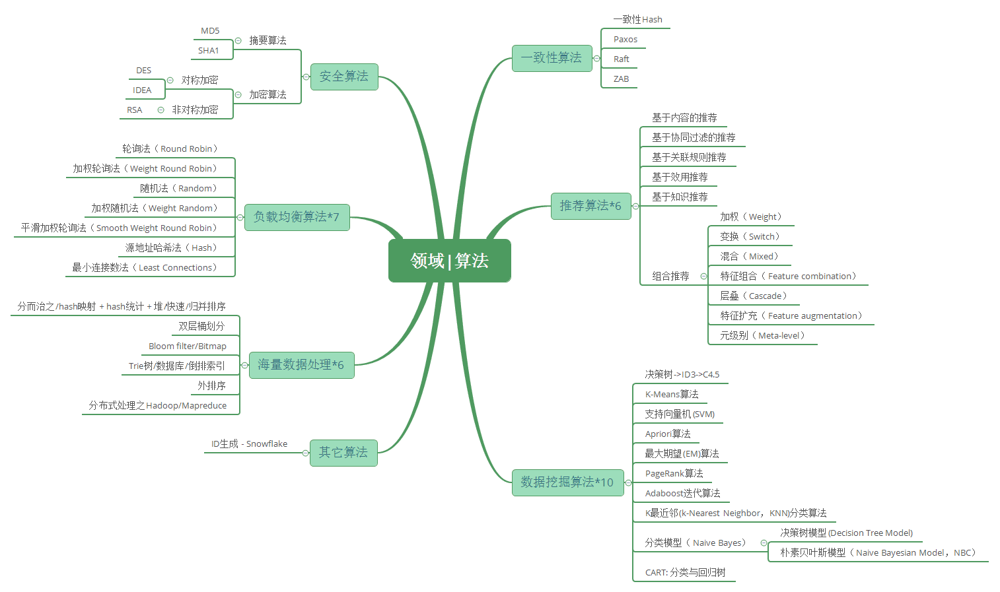
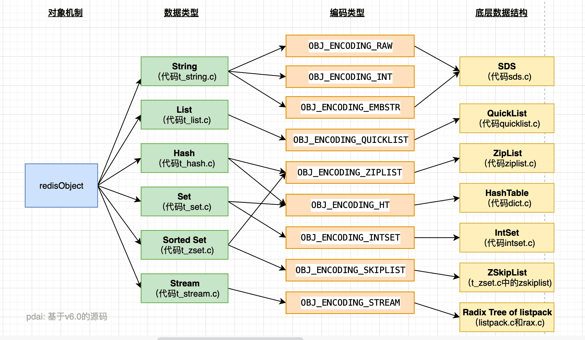

```
身边不缺乏有恒心、有毅力的朋友，及时很用心努力地学习，技术水平始终有些瓶颈。
面对心仪的岗位始终可望而不可得，总觉得自己比互联网大厂员工差距甚大，总觉得投入产出不成比。努力而没有收获，难免会陷入自我怀疑，最终灰心泄气，躺平摆烂或者转行。
最本质的原因是，心中没有清晰的知识体系框架，只见树木不见森林。
众所周知，平地起高楼除了挖很深的地基，还要有十分合理清晰的架构图纸，后面按部就班地添砖加瓦即可，水滴终能石穿。
本章主要梳理JAVA后端常用的技能，梳理成框架，以便后期查漏补缺。
```

## 全栈知识体系结构


### 一、Java基础知识

#### 1、面向对象与Java基础


##### Java 基础 - 面向对象


##### Java 基础 - 知识点


##### Java 基础 - 泛型机制详解

- Java泛型这个特性是从JDK 1.5才开始加入的，因此为了兼容之前的版本，Java泛型的实现采取了“伪泛型”的策略，即Java在语法上支持泛型，但是在编译阶段会进行所谓的“类型擦除”（Type Erasure），将所有的泛型表示（尖括号中的内容）都替换为具体的类型（其对应的原生态类型），就像完全没有泛型一样。

##### Java 基础 - 注解机制详解

- 注解是JDK1.5版本开始引入的一个特性，用于对代码进行说明，可以对包、类、接口、字段、方法参数、局部变量等进行注解。它是框架学习和设计者必须掌握的基础。

##### Java 基础 - 异常机制详解

- Java异常是Java提供的一种识别及响应错误的一致性机制，java异常机制可以使程序中异常处理代码和正常业务代码分离，保证程序代码更加优雅，并提高程序健壮性。

##### Java 基础 - 反射机制详解

- JAVA反射机制是在运行状态中，对于任意一个类，都能够知道这个类的所有属性和方法；对于任意一个对象，都能够调用它的任意一个方法和属性；这种动态获取的信息以及动态调用对象的方法的功能称为java语言的反射机制。Java反射机制在框架设计中极为广泛，需要深入理解。

#### 2.集合框架


**介绍**

容器，就是可以容纳其他Java对象的对象。*Java Collections Framework(JCF)*为Java开发者提供了通用的容器，其始于JDK 1.2，优点是:

- 降低编程难度
- 提高程序性能
- 提高API间的互操作性
- 降低学习难度
- 降低设计和实现相关API的难度
- 增加程序的重用性

Java容器里只能放对象，对于基本类型(int, long, float, double等)，需要将其包装成对象类型后(Integer, Long, Float, Double等)才能放到容器里。很多时候拆包装和解包装能够自动完成。这虽然会导致额外的性能和空间开销，但简化了设计和编程。

**Collection**集合

> 容器主要包括 Collection 和 Map 两种，Collection 存储着对象的集合，而 Map 存储着键值对(两个对象)的映射表。


##### Set集合

**TreeSet**

基于红黑树实现，支持有序性操作，例如根据一个范围查找元素的操作。但是查找效率不如 HashSet，HashSet 查找的时间复杂度为 O(1)，TreeSet 则为 O(logN)。

**HashSet**

基于哈希表实现，支持快速查找，但不支持有序性操作。并且失去了元素的插入顺序信息，也就是说使用 Iterator 遍历 HashSet 得到的结果是不确定的。

**LinkedHashSet**

具有 HashSet 的查找效率，且内部使用双向链表维护元素的插入顺序。


##### **List集合**

**ArrayList**

基于动态数组实现，支持随机访问。

**Vector**

和 ArrayList 类似，但它是线程安全的。

**LinkedList**

基于双向链表实现，只能顺序访问，但是可以快速地在链表中间插入和删除元素。不仅如此，LinkedList 还可以用作栈、队列和双向队列。

[Collection - ArrayList 源码解析]()

[Collection - LinkedList源码解析]()


##### Queue队列

**LinkedList**

可以用它来实现双向队列。

**PriorityQueue**

基于堆结构实现，可以用它来实现优先队列。

[Collection - Stack & Queue 源码解析]()

[Collection - PriorityQueue源码解析]()


##### **Map集合**

**TreeMap**

基于红黑树实现。

**HashMap**

基于哈希表实现。

**HashTable**

和 HashMap 类似，但它是线程安全的，这意味着同一时刻多个线程可以同时写入 HashTable 并且不会导致数据不一致。它是遗留类，不应该去使用它。现在可以使用 ConcurrentHashMap 来支持线程安全，并且 ConcurrentHashMap 的效率会更高，因为 ConcurrentHashMap 引入了分段锁。

**LinkedHashMap**

使用双向链表来维护元素的顺序，顺序为插入顺序或者最近最少使用(LRU)顺序。

- [Map - HashSet & HashMap 源码解析]()
- [Map - LinkedHashSet&Map源码解析]()
- [Map - TreeSet & TreeMap 源码解析]()
- [Map - WeakHashMap源码解析]()


#### 3.Java并发框架


##### Java 并发 - 理论基础

- 多线程的出现是要解决什么问题的?
- 线程不安全是指什么? 举例说明
- 并发出现线程不安全的本质什么? 可见性，原子性和有序性。
- Java是怎么解决并发问题的? 3个关键字，JMM和8个Happens-Before
- 线程安全是不是非真即假? 不是
- 线程安全有哪些实现思路?
- 如何理解并发和并行的区别?

##### Java 并发 - 线程基础

- 线程有哪几种状态? 分别说明从一种状态到另一种状态转变有哪些方式?
- 通常线程有哪几种使用方式?
- 基础线程机制有哪些?
- 线程的中断方式有哪些?
- 线程的互斥同步方式有哪些? 如何比较和选择?
- 线程之间有哪些协作方式?

**关键字: synchronized详解**

- Synchronized可以作用在哪里? 分别通过对象锁和类锁进行举例。
- Synchronized本质上是通过什么保证线程安全的? 分三个方面回答：加锁和释放锁的原理，可重入原理，保证可见性原理。
- Synchronized由什么样的缺陷? Java Lock是怎么弥补这些缺陷的。
- Synchronized和Lock的对比，和选择?
- Synchronized在使用时有何注意事项?
- Synchronized修饰的方法在抛出异常时,会释放锁吗?
- 多个线程等待同一个Synchronized锁的时候，JVM如何选择下一个获取锁的线程?
- Synchronized使得同时只有一个线程可以执行，性能比较差，有什么提升的方法?
- 我想更加灵活地控制锁的释放和获取(现在释放锁和获取锁的时机都被规定死了)，怎么办?
- 什么是锁的升级和降级? 什么是JVM里的偏斜锁、轻量级锁、重量级锁?
- 不同的JDK中对Synchronized有何优化?

**关键字: volatile详解**

- volatile关键字的作用是什么?
- volatile能保证原子性吗?
- 之前32位机器上共享的long和double变量的为什么要用volatile? 现在64位机器上是否也要设置呢?
- i++为什么不能保证原子性?
- volatile是如何实现可见性的? 内存屏障。
- volatile是如何实现有序性的? happens-before等
- 说下volatile的应用场景?

**关键字: final详解**

- 所有的final修饰的字段都是编译期常量吗?

- 如何理解private所修饰的方法是隐式的final?

- 说说final类型的类如何拓展? 比如String是final类型，我们想写个MyString复用所有String中方法，同时增加一个新的toMyString()的方法，应该如何做?

- final方法可以被重载吗? 可以

- 父类的final方法能不能够被子类重写? 不可以

- 说说final域重排序规则?

- 说说final的原理?

- 使用 final 的限制条件和局限性?

  

##### J.U.C框架

- JUC框架包含几个部分?
- 每个部分有哪些核心的类?
- 最最核心的类有哪些?

**JUC原子类: CAS, Unsafe和原子类详解**

- 线程安全的实现方法有哪些?
- 什么是CAS?
- CAS使用示例，结合AtomicInteger给出示例?
- CAS会有哪些问题?
- 针对这这些问题，Java提供了哪几个解决的?
- AtomicInteger底层实现? CAS+volatile
- 请阐述你对Unsafe类的理解?
- 说说你对Java原子类的理解? 包含13个，4组分类，说说作用和使用场景。
- AtomicStampedReference是什么?
- AtomicStampedReference是怎么解决ABA的? 内部使用Pair来存储元素值及其版本号
- java中还有哪些类可以解决ABA的问题? AtomicMarkableReference

**JUC锁:**

- **JUC锁: LockSupport详解**
  - 为什么LockSupport也是核心基础类? AQS框架借助于两个类：Unsafe(提供CAS操作)和LockSupport(提供park/unpark操作)
  - 写出分别通过wait/notify和LockSupport的park/unpark实现同步?
  - LockSupport.park()会释放锁资源吗? 那么Condition.await()呢?
  - Thread.sleep()、Object.wait()、Condition.await()、LockSupport.park()的区别? 重点
  - 如果在wait()之前执行了notify()会怎样?
  - 如果在park()之前执行了unpark()会怎样?
- **JUC锁: 锁核心类AQS详解**
  - 什么是AQS? 为什么它是核心?
  - AQS的核心思想是什么? 它是怎么实现的? 底层数据结构等
  - AQS有哪些核心的方法?
  - AQS定义什么样的资源获取方式? AQS定义了两种资源获取方式：`独占`(只有一个线程能访问执行，又根据是否按队列的顺序分为`公平锁`和`非公平锁`，如`ReentrantLock`) 和`共享`(多个线程可同时访问执行，如`Semaphore`、`CountDownLatch`、 `CyclicBarrier` )。`ReentrantReadWriteLock`可以看成是组合式，允许多个线程同时对某一资源进行读。
  - AQS底层使用了什么样的设计模式? 模板
  - AQS的应用示例?
- **JUC锁: ReentrantLock详解**
  - 什么是可重入，什么是可重入锁? 它用来解决什么问题?
  - ReentrantLock的核心是AQS，那么它怎么来实现的，继承吗? 说说其类内部结构关系。
  - ReentrantLock是如何实现公平锁的?
  - ReentrantLock是如何实现非公平锁的?
  - ReentrantLock默认实现的是公平还是非公平锁?
  - 使用ReentrantLock实现公平和非公平锁的示例?
  - ReentrantLock和Synchronized的对比?
- **JUC锁: ReentrantReadWriteLock详解**
  - 为了有了ReentrantLock还需要ReentrantReadWriteLock?
  - ReentrantReadWriteLock底层实现原理?
  - ReentrantReadWriteLock底层读写状态如何设计的? 高16位为读锁，低16位为写锁
  - 读锁和写锁的最大数量是多少?
  - 本地线程计数器ThreadLocalHoldCounter是用来做什么的?
  - 缓存计数器HoldCounter是用来做什么的?
  - 写锁的获取与释放是怎么实现的?
  - 读锁的获取与释放是怎么实现的?
  - RentrantReadWriteLock为什么不支持锁升级?
  - 什么是锁的升降级? RentrantReadWriteLock为什么不支持锁升级?

**JUC集合:** 

- **JUC集合: ConcurrentHashMap详解**

  - 为什么HashTable慢? 它的并发度是什么? 那么ConcurrentHashMap并发度是什么?
  - ConcurrentHashMap在JDK1.7和JDK1.8中实现有什么差别? JDK1.8解決了JDK1.7中什么问题
  - ConcurrentHashMap JDK1.7实现的原理是什么? 分段锁机制
  - ConcurrentHashMap JDK1.8实现的原理是什么? 数组+链表+红黑树，CAS
  - ConcurrentHashMap JDK1.7中Segment数(concurrencyLevel)默认值是多少? 为何一旦初始化就不可再扩容?
  - ConcurrentHashMap JDK1.7说说其put的机制?
  - ConcurrentHashMap JDK1.7是如何扩容的? rehash(注：segment 数组不能扩容，扩容是 segment 数组某个位置内部的数组 HashEntry<K,V>[] 进行扩容)
  - ConcurrentHashMap JDK1.8是如何扩容的? tryPresize
  - ConcurrentHashMap JDK1.8链表转红黑树的时机是什么? 临界值为什么是8?
  - ConcurrentHashMap JDK1.8是如何进行数据迁移的? transfer

-  **JUC集合: CopyOnWriteArrayList详解**

  - 请先说说非并发集合中Fail-fast机制?
  - 再为什么说ArrayList查询快而增删慢?
  - 对比ArrayList说说CopyOnWriteArrayList的增删改查实现原理? COW基于拷贝
  - 再说下弱一致性的迭代器原理是怎么样的? `COWIterator<E>`
  - CopyOnWriteArrayList为什么并发安全且性能比Vector好?
  - CopyOnWriteArrayList有何缺陷，说说其应用场景?

- **JUC集合: ConcurrentLinkedQueue详解**

  - 要想用线程安全的队列有哪些选择? Vector，`Collections.synchronizedList( List<T> list)`, ConcurrentLinkedQueue等
  - ConcurrentLinkedQueue实现的数据结构?
  - ConcurrentLinkedQueue底层原理? 全程无锁(CAS)
  - ConcurrentLinkedQueue的核心方法有哪些? offer()，poll()，peek()，isEmpty()等队列常用方法
  - 说说ConcurrentLinkedQueue的HOPS(延迟更新的策略)的设计?
  - ConcurrentLinkedQueue适合什么样的使用场景?

- **JUC集合: BlockingQueue详解**

  - 什么是BlockingDeque?

  - BlockingQueue大家族有哪些? ArrayBlockingQueue, DelayQueue, LinkedBlockingQueue, SynchronousQueue...

  - BlockingQueue适合用在什么样的场景?

  - BlockingQueue常用的方法?

  - BlockingQueue插入方法有哪些? 这些方法(`add(o)`,`offer(o)`,`put(o)`,`offer(o, timeout, timeunit)`)的区别是什么?

  - BlockingDeque 与BlockingQueue有何关系，请对比下它们的方法?

  - BlockingDeque适合用在什么样的场景?

  - BlockingDeque大家族有哪些?

  - BlockingDeque 与BlockingQueue实现例子?

    

**JUC线程池**

- **JUC线程池: FutureTask详解**

  - FutureTask用来解决什么问题的? 为什么会出现?
  - FutureTask类结构关系怎么样的?
  - FutureTask的线程安全是由什么保证的?
  - FutureTask结果返回机制?
  - FutureTask内部运行状态的转变?
  - FutureTask通常会怎么用? 举例说明。

- **JUC线程池: ThreadPoolExecutor详解**

  - 为什么要有线程池?
  - Java是实现和管理线程池有哪些方式? 请简单举例如何使用。
  - 为什么很多公司不允许使用Executors去创建线程池? 那么推荐怎么使用呢?
  - ThreadPoolExecutor有哪些核心的配置参数? 请简要说明
  - ThreadPoolExecutor可以创建哪是哪三种线程池呢?
  - 当队列满了并且worker的数量达到maxSize的时候，会怎么样?
  - 说说ThreadPoolExecutor有哪些RejectedExecutionHandler策略? 默认是什么策略?
  - 简要说下线程池的任务执行机制? execute –> addWorker –>runworker (getTask)
  - 线程池中任务是如何提交的?
  - 线程池中任务是如何关闭的?
  - 在配置线程池的时候需要考虑哪些配置因素?
  - 如何监控线程池的状态?

- **JUC线程池: ScheduledThreadPool详解**

  - ScheduledThreadPoolExecutor要解决什么样的问题?
  - ScheduledThreadPoolExecutor相比ThreadPoolExecutor有哪些特性?
  - ScheduledThreadPoolExecutor有什么样的数据结构，核心内部类和抽象类?
  - ScheduledThreadPoolExecutor有哪两个关闭策略? 区别是什么?
  - ScheduledThreadPoolExecutor中scheduleAtFixedRate 和 scheduleWithFixedDelay区别是什么?
  - 为什么ThreadPoolExecutor 的调整策略却不适用于 ScheduledThreadPoolExecutor?
  - Executors 提供了几种方法来构造 ScheduledThreadPoolExecutor?

- **JUC线程池: Fork/Join框架详解**

  - Fork/Join主要用来解决什么样的问题?

  - Fork/Join框架是在哪个JDK版本中引入的?

  - Fork/Join框架主要包含哪三个模块? 模块之间的关系是怎么样的?

  - ForkJoinPool类继承关系?

  - ForkJoinTask抽象类继承关系? 在实际运用中，我们一般都会继承 RecursiveTask 、RecursiveAction 或 CountedCompleter 来实现我们的业务需求，而不会直接继承 ForkJoinTask 类。

  - 整个Fork/Join 框架的执行流程/运行机制是怎么样的?

  - 具体阐述Fork/Join的分治思想和work-stealing 实现方式?

  - 有哪些JDK源码中使用了Fork/Join思想?

  - 如何使用Executors工具类创建ForkJoinPool?

  - 写一个例子: 用ForkJoin方式实现1+2+3+...+100000?

  - Fork/Join在使用时有哪些注意事项? 结合JDK中的斐波那契数列实例具体说明。

    

**JUC工具类**

- **JUC工具类: CountDownLatch详解**
  - 什么是CountDownLatch?
  - CountDownLatch底层实现原理?
  - CountDownLatch一次可以唤醒几个任务? 多个
  - CountDownLatch有哪些主要方法? await(),countDown()
  - CountDownLatch适用于什么场景?
  - 写道题：实现一个容器，提供两个方法，add，size 写两个线程，线程1添加10个元素到容器中，线程2实现监控元素的个数，当个数到5个时，线程2给出提示并结束? 使用CountDownLatch 代替wait notify 好处。
- **JUC工具类: CyclicBarrier详解**
  - 什么是CyclicBarrier?
  - CyclicBarrier底层实现原理?
  - CountDownLatch和CyclicBarrier对比?
  - CyclicBarrier的核心函数有哪些?
  - CyclicBarrier适用于什么场景?
- **JUC工具类: Semaphore详解**
  - 什么是Semaphore?
  - Semaphore内部原理?
  - Semaphore常用方法有哪些? 如何实现线程同步和互斥的?
  - Semaphore适合用在什么场景?
  - 单独使用Semaphore是不会使用到AQS的条件队列?
  - Semaphore中申请令牌(acquire)、释放令牌(release)的实现?
  - Semaphore初始化有10个令牌，11个线程同时各调用1次acquire方法，会发生什么?
  - Semaphore初始化有10个令牌，一个线程重复调用11次acquire方法，会发生什么?
  - Semaphore初始化有1个令牌，1个线程调用一次acquire方法，然后调用两次release方法，之后另外一个线程调用acquire(2)方法，此线程能够获取到足够的令牌并继续运行吗?
  - Semaphore初始化有2个令牌，一个线程调用1次release方法，然后一次性获取3个令牌，会获取到吗?
- **JUC工具类: Phaser详解**
  - Phaser主要用来解决什么问题?
  - Phaser与CyclicBarrier和CountDownLatch的区别是什么?
  - 如果用CountDownLatch来实现Phaser的功能应该怎么实现?
  - Phaser运行机制是什么样的?
  - 给一个Phaser使用的示例?
- **JUC工具类: Exchanger详解**
  - Exchanger主要解决什么问题?
  - 对比SynchronousQueue，为什么说Exchanger可被视为 SynchronousQueue 的双向形式?
  - Exchanger在不同的JDK版本中实现有什么差别?
  - Exchanger实现机制?
  - Exchanger已经有了slot单节点，为什么会加入arena node数组? 什么时候会用到数组?
  - arena可以确保不同的slot在arena中是不会相冲突的，那么是怎么保证的呢?
  - 什么是伪共享，Exchanger中如何体现的?
  - Exchanger实现举例
- **Java 并发 - ThreadLocal详解**
  - 什么是ThreadLocal? 用来解决什么问题的?
  - 说说你对ThreadLocal的理解
  - ThreadLocal是如何实现线程隔离的?
  - 为什么ThreadLocal会造成内存泄露? 如何解决
  - 还有哪些使用ThreadLocal的应用场景?

####  4.IO框架


##### Java IO/NIO/AIO

- **Java IO - 分类(传输，操作)**

  - 本文主要从`传输方式`和`数据操作`两个方面分析Java IO的分类

- **Java IO - 设计模式(装饰者模式)**

  - Java I/O 使用了装饰者模式来实现

- **Java IO - 源码: InputStream**

  - 本文主要从JDK源码角度分析InputStream

- **Java IO - 源码: OutputStream**

  - 本文主要从JDK源码角度分析 OutputStream

- **Java IO - 常见类使用**

  - 本文主要介绍Java IO常见类的使用，包括：磁盘操作，字节操作，字符操作，对象操作和网络操作

    

##### IO 模型 - Unix IO 模型

- 本文主要简要介绍 Unix I/O 5种模型，并对5大模型比较，并重点为后续章节解释IO多路复用做铺垫

- **Java IO - BIO 详解**
  - BIO就是: blocking IO。最容易理解、最容易实现的IO工作方式，应用程序向操作系统请求网络IO操作，这时应用程序会一直等待；另一方面，操作系统收到请求后，也会等待，直到网络上有数据传到监听端口；操作系统在收集数据后，会把数据发送给应用程序；最后应用程序受到数据，并解除等待状态
- **Java NIO - 基础详解**
  - 新的输入/输出 (NIO) 库是在 JDK 1.4 中引入的，弥补了原来的 I/O 的不足，提供了高速的、面向块的 I/O
- **Java NIO - IO多路复用详解**
  - 本文主要对IO多路复用，Ractor模型以及Java NIO对其的支持
- **Java AIO - 异步IO详解**
  - 本文主要对异步IO和Java中对AIO的支持详解。@pdai

#####  IO框架

- [Java NIO - 零拷贝实现]()

  这里转一篇Java NIO 零拷贝的实现文章，在此之前建议先理解什么是Linux中零拷贝，可以先看这篇文章。

  本文从源码着手分析了 Java NIO 对零拷贝的实现，主要包括基于内存映射（mmap）方式的 MappedByteBuffer 以及基于 sendfile 方式的 FileChannel。

  最后在篇末简单的阐述了一下 Netty 中的零拷贝机制，以及 RocketMQ 和 Kafka 两种消息队列在零拷贝实现方式上的区别。

- [Java N(A)IO - 框架: Netty]()

  Netty是一个高性能、异步事件驱动的NIO框架，提供了对TCP、UDP和文件传输的支持。

  作为当前最流行的NIO框架，Netty在互联网领域、大数据分布式计算领域、游戏行业、通信行业等获得了广泛的应用，一些业界著名的开源组件也基于Netty构建，比如RPC框架、zookeeper等

#### 5. JVM相关


#####  **JVM相关类加载**

- **JVM基础 - 类字节码详解**
  - 源代码通过编译器编译为字节码，再通过类加载子系统进行加载到JVM中运行
- **JVM基础 - Java 类加载机制**
  - 这篇文章将带你深入理解Java 类加载机制

#####  **JVM内存结构**：     

本文主要对JVM 内存结构进行讲解，注意不要和Java内存模型混淆

##### **JMM基础**

- JVM基础 - Java 内存模型引入
  - 很多人都无法区分Java内存模型和JVM内存结构，以及Java内存模型与物理内存之间的关系。本文从堆栈角度引入JMM，然后介绍JMM和物理内存之间的关系, 为后面`JMM详解`, `JVM 内存结构详解`, `Java 对象模型详解`等铺垫。
- JVM基础 - Java 内存模型详解
  - 本文主要转载自 Info 上[深入理解Java内存模型在新窗口打开](https://www.infoq.cn/article/java_memory_model/), 作者程晓明。这篇文章对JMM讲的很清楚了，大致分三部分：重排序与顺序一致性；三个同步原语（lock，volatile，final）的内存语义，重排序规则及在处理器中的实现；java 内存模型的设计，及其与处理器内存模型和顺序一致性内存模型的关系

##### JVM相关GC

**GC - Java 垃圾回收基础知识**

- 垃圾收集主要是针对堆和方法区进行；程序计数器、虚拟机栈和本地方法栈这三个区域属于线程私有的，只存在于线程的生命周期内，线程结束之后也会消失，因此不需要对这三个区域进行垃圾回收。

**GC - Java 垃圾回收器之G1详解**

- G1垃圾回收器是在Java7 update 4之后引入的一个新的垃圾回收器。同优秀的CMS垃圾回收器一样，G1也是关注最小时延的垃圾回收器，也同样适合大尺寸堆内存的垃圾收集，官方在ZGC还没有出现时也推荐使用G1来代替选择CMS。G1最大的特点是引入分区的思路，弱化了分代的概念，合理利用垃圾收集各个周期的资源，解决了其他收集器甚至CMS的众多缺陷。

**GC - Java 垃圾回收器之ZGC详解**

- ZGC（The Z Garbage Collector）是JDK 11中推出的一款低延迟垃圾回收器, 是JDK 11+ 最为重要的更新之一，适用于**大内存低延迟**服务的内存管理和回收。在梳理相关知识点时，发现美团技术团队分享的文章[新一代垃圾回收器ZGC的探索与实践在新窗口打开](https://tech.meituan.com/2020/08/06/new-zgc-practice-in-meituan.html)比较完善（包含G1收集器停顿时间瓶颈，原理，优化等）, 这里分享给你，帮你构建ZGC相关的知识体系

**GC - Java 垃圾回收器之CMS GC问题分析与解决**

- 本文整理自[美团技术团队在新窗口打开](https://tech.meituan.com/2020/11/12/java-9-cms-gc.html), 这篇文章将可以帮助你构建CMS GC相关问题解决的知识体系，分享给你

##### **JVM相关 排错调优**


- **调试排错 - JVM 调优参数**

  - 本文对JVM涉及的常见的调优参数和垃圾回收参数进行阐述

- **调试排错 - Java 内存分析之堆内存和MetaSpace内存**

  - 本文以两个简单的例子(`堆内存溢出`和`MetaSpace (元数据) 内存溢出`）解释Java 内存溢出的分析过程

- **调试排错 - Java 内存分析之堆外内存**

  - Java 堆外内存分析相对来说是复杂的，美团技术团队的[Spring Boot引起的“堆外内存泄漏”排查及经验总结在新窗口打开](https://tech.meituan.com/2019/01/03/spring-boot-native-memory-leak.html)可以为很多Native Code内存泄漏/占用提供方向性指引。

- **调试排错 - Java 线程分析之线程Dump分析**

  - Thread Dump是非常有用的诊断Java应用问题的工具。

- **调试排错 - Java 问题排查之Linux命令**

  - Java 在线问题排查之通过linux常用命令排查。

- **调试排错 - Java 问题排查之工具单**

  - Java 在线问题排查之通过java调试/排查工具进行问题定位。

- **调试排错 - Java 问题排查之JVM可视化工具**

  - 本文主要梳理常见的JVM可视化的分析工具，主要包括JConsole, Visual VM, Vusial GC, JProfile 和 MAT等。

- **调试排错 - Java 问题排查之应用在线调试Arthas**

  - 本文主要介绍Alibaba开源的Java诊断工具，开源到现在已经1.7万个点赞了，深受开发者喜爱。具体解决在线问题，比如：
  - 这个类从哪个 jar 包加载的? 为什么会报各种类相关的 Exception?
  - 我改的代码为什么没有执行到? 难道是我没 commit? 分支搞错了?
  - 遇到问题无法在线上 debug，难道只能通过加日志再重新发布吗?
  - 线上遇到某个用户的数据处理有问题，但线上同样无法 debug，线下无法重现！
  - 是否有一个全局视角来查看系统的运行状况?
  - 有什么办法可以监控到JVM的实时运行状态?

- **调试排错 - Java 问题排查之使用IDEA本地调试和远程调试**

  - Debug用来追踪代码的运行流程，通常在程序运行过程中出现异常，启用Debug模式可以分析定位异常发生的位置，以及在运行过程中参数的变化；并且在实际的排错过程中，还会用到Remote Debug。IDEA 相比 Eclipse/STS效率更高，本文主要介绍基于IDEA的Debug和Remote Debug的技巧。

- **调试排错 - Java动态调试技术原理**

  - 本文转载自 美团技术团队胡健的[Java 动态调试技术原理及实践在新窗口打开](https://tech.meituan.com/2019/11/07/java-dynamic-debugging-technology.html), 通过学习java agent方式进行动态调试了解目前很多大厂开源的一些基于此的调试工具。

    

### 二、数据结构与算法


```
避免孤立的学习知识点，要关联学习。比如实际应用当中，我们经常使用的是`查找`和`排序`操作，这在我们的各种管理系统、数据库系统、操作系统等当中，十分常用，我们通过这个线索将知识点串联起来
```

#### 数据结构基础

**数组**的下标寻址十分迅速，但计算机的内存是有限的，故数组的长度也是有限的，实际应用当中的数据往往十分庞大；而且无序数组的查找最坏情况需要遍历整个数组；后来人们提出了二分查找，二分查找要求数组的构造一定有序，二分法查找解决了普通数组查找复杂度过高的问题。任何一种数组无法解决的问题就是插入、删除操作比较复杂，因此，在一个增删查改比较频繁的数据结构中，数组不会被优先考虑

**普通链表**由于它的结构特点被证明根本不适合进行查找

**哈希表**是数组和链表的折中，同时它的设计依赖散列函数的设计，数组不能无限长、链表也不适合查找，所以也不适合大规模的查找

**二叉查找树**因为可能退化成链表，同样不适合进行查找

**AVL树**是为了解决可能退化成链表问题，但是AVL树的旋转过程非常麻烦，因此插入和删除很慢，也就是构建AVL树比较麻烦

**红黑树**是平衡二叉树和AVL树的折中，因此是比较合适的。集合类中的Map、关联数组具有较高的查询效率，它们的底层实现就是红黑树。

**多路查找**树 是大规模数据存储中，实现索引查询这样一个实际背景下，树节点存储的元素数量是有限的(如果元素数量非常多的话，查找就退化成节点内部的线性查找了)，这样导致二叉查找树结构由于树的深度过大而造成磁盘I/O读写过于频繁，进而导致查询效率低下。

**B树**与自平衡二叉查找树不同，B树适用于读写相对大的数据块的存储系统，例如磁盘。它的应用是文件系统及部分非关系型数据库索引。

**B+树**在B树基础上，为叶子结点增加链表指针(B树+叶子有序链表)，所有关键字都在叶子结点 中出现，非叶子结点作为叶子结点的索引；B+树总是到叶子结点才命中。通常用于关系型数据库(如Mysql)和操作系统的文件系统中。

**B*树**是B+树的变体，在B+树的非根和非叶子结点再增加指向兄弟的指针, 在B+树基础上，为非叶子结点也增加链表指针，将结点的最低利用率从1/2提高到2/3。

**R树**是用来做空间数据存储的树状数据结构。例如给地理位置，矩形和多边形这类多维数据建立索引。

**Trie树**是自然语言处理中最常用的数据结构，很多字符串处理任务都会用到。Trie树本身是一种有限状态自动机，还有很多变体。什么模式匹配、正则表达式，都与这有关。

#### 排序算法详解


##### 冒泡排序(Bubble Sort)

- 它是一种较简单的排序算法。它会遍历若干次要排序的数列，每次遍历时，它都会从前往后依次的比较相邻两个数的大小；如果前者比后者大，则交换它们的位置。这样，一次遍历之后，最大的元素就在数列的末尾！ 采用相同的方法再次遍历时，第二大的元素就被排列在最大元素之前。重复此操作，直到整个数列都有序为止

##### 快速排序(Quick Sort)

- 它的基本思想是: 选择一个基准数，通过一趟排序将要排序的数据分割成独立的两部分；其中一部分的所有数据都比另外一部分的所有数据都要小。然后，再按此方法对这两部分数据分别进行快速排序，整个排序过程可以递归进行，以此达到整个数据变成有序序列。

##### 插入排序(Insertion Sort)

- 直接插入排序(Straight Insertion Sort)的基本思想是: 把n个待排序的元素看成为一个有序表和一个无序表。开始时有序表中只包含1个元素，无序表中包含有n-1个元素，排序过程中每次从无序表中取出第一个元素，将它插入到有序表中的适当位置，使之成为新的有序表，重复n-1次可完成排序过程。

##### Shell排序(Shell Sort)

​		希尔排序实质上是一种分组插入方法。它的基本思想是: 对于n个待排序的数列，取一个小于n的整数gap(gap被称为步长)将待排序元素分成若干个组子序列，所有距离为gap的倍数的记录放在同一个组中；然后，对各组内的元素进行直接插入排序。 这一趟排序完成之后，每一个组的元素都是有序的。然后减小gap的值，并重复执行上述的分组和排序。重复这样的操作，当gap=1时，整个数列就是有序的。

##### 选择排序(Selection sort)

- 它的基本思想是: 首先在未排序的数列中找到最小(or最大)元素，然后将其存放到数列的起始位置；接着，再从剩余未排序的元素中继续寻找最小(or最大)元素，然后放到已排序序列的末尾。以此类推，直到所有元素均排序完毕。

##### 堆排序(Heap Sort)

- 堆排序是指利用堆这种数据结构所设计的一种排序算法。堆是一个近似完全二叉树的结构，并同时满足堆积的性质：即子结点的键值或索引总是小于（或者大于）它的父节点。

##### 归并排序(Merge Sort)

- 将两个的有序数列合并成一个有序数列，我们称之为"归并"。归并排序(Merge Sort)就是利用归并思想对数列进行排序。

##### 桶排序(Bucket Sort)

- 桶排序(Bucket Sort)的原理很简单，将数组分到有限数量的桶子里。每个桶子再个别排序（有可能再使用别的排序算法或是以递归方式继续使用桶排序进行排序）

##### 基数排序(Radix Sort)

- 它的基本思想是: 将整数按位数切割成不同的数字，然后按每个位数分别比较。具体做法是: 将所有待比较数值统一为同样的数位长度，数位较短的数前面补零。然后，从最低位开始，依次进行一次排序。这样从最低位排序一直到最高位排序完成以后, 数列就变成一个有序序列

####  算法思想详解

#####  分治算法

- 分治算法的基本思想是将一个规模为N的问题分解为K个规模较小的子问题，这些子问题相互独立且与原问题性质相同。求出子问题的解，就可得到原问题的解

##### 动态规划算法

- 动态规划算法通常用于求解具有某种最优性质的问题。在这类问题中，可能会有许多可行解。每一个解都对应于一个值，我们希望找到具有最优值的解。动态规划算法与分治法类似，其基本思想也是将待求解问题分解成若干个子问题，先求解子问题，然后从这些子问题的解得到原问题的解

##### 贪心算法

- 本文主要介绍算法中贪心算法的思想: 保证每次操作都是局部最优的，并且最后得到的结果是全局最优的

##### 二分法

- 本文主要介绍算法思想中分治算法重要的二分法，比如二分查找；二分查找也称折半查找（Binary Search），它是一种效率较高的查找方法。但是，折半查找要求线性表必须采用顺序存储结构，而且表中元素按关键字有序排列。

##### 搜索算法

- 本文主要介绍算法中搜索算法的思想，主要包含BFS，DFS

##### 回溯算法

- Backtracking(回溯)属于 DFS, 本文主要介绍算法中Backtracking算法的思想。回溯算法实际上一个类似枚举的搜索尝试过程，主要是在搜索尝试过程中寻找问题的解，当发现已不满足求解条件时，就“回溯”返回，尝试别的路径。回溯法是一种选优搜索法，按选优条件向前搜索，以达到目标。但当探索到某一步时，发现原先选择并不优或达不到目标，就退回一步重新选择，这种走不通就退回再走的技术为回溯法

#### 领域算法详解



##### **安全算法**

[摘要算法]()

- 消息摘要算法的主要特征是加密过程不需要密钥，并且经过加密的数据无法被解密，目前可以解密逆向的只有CRC32算法，只有输入相同的明文数据经过相同的消息摘要算法才能得到相同的密文。消息摘要算法不存在密钥的管理与分发问题，适合于分布式网络上使用。

[加密算法]()

- 数据加密的基本过程就是对原来为明文的文件或数据按某种算法进行处理，使其成为不可读的一段代码为“密文”，使其只能在输入相应的密钥之后才能显示出原容，通过这样的途径来达到保护数据不被非法人窃取、阅读的目的。 该过程的逆过程为解密，即将该编码信息转化为其原来数据的过程

[国密算法]()

- 国密即国家密码局认定的国产密码算法。主要有SM1，SM2，SM3，SM4，SM7, SM9。

##### **字符串匹配算法**

[朴素的字符串匹配算法（Naive String Matching Algorithm)]()

- 朴素的字符串匹配算法又称为**暴力匹配算法**（Brute Force Algorithm），最为简单的字符串匹配算法

[Knuth-Morris-Pratt 字符串匹配算法（即 KMP 算法）]()

- Knuth-Morris-Pratt算法（简称KMP）是最常用的字符串匹配算法之一

[Boyer-Moore 字符串匹配算法]()

- 各种文本编辑器的"查找"功能（Ctrl+F），大多采用Boyer-Moore算法，效率非常高

[字符串匹配 - 文本预处理：后缀树（Suffix Tree）]()

- 上述字符串匹配算法(朴素的字符串匹配算法, KMP 算法, Boyer-Moore算法)均是通过对**模式（Pattern）字符串进行预处理**的方式来加快搜索速度。对 Pattern 进行预处理的最优复杂度为 O(m)，其中 m 为 Pattern 字符串的长度。那么，有没有对文本（Text）进行预处理的算法呢？本文即将介绍一种**对 Text 进行预处理**的字符串匹配算法：后缀树（Suffix Tree）

##### **大数据处理**

[分治/hash/排序]()

- 就是先映射，而后统计，最后排序:
- `分而治之/hash映射`: 针对数据太大，内存受限，只能是: 把大文件化成(取模映射)小文件，即16字方针: 大而化小，各个击破，缩小规模，逐个解决
- `hash_map统计`: 当大文件转化了小文件，那么我们便可以采用常规的hash_map(ip，value)来进行频率统计。
- `堆/快速排序`: 统计完了之后，便进行排序(可采取堆排序)，得到次数最多的IP。

[Bitmap & Bloom Filter]()

- 布隆过滤器有着广泛的应用，对于大量数据的“存不存在”的问题在空间上有明显优势，但是在判断存不存在是有一定的错误率(false positive)，也就是说，有可能把不属于这个集合的元素误认为属于这个集合(False Positive)，但不会把属于这个集合的元素误认为不属于这个集合(False Negative)

[双层桶划分]()

- 其实本质上还是分而治之的思想，重在“分”的技巧上！`适用范围`: 第k大，中位数，不重复或重复的数字；`基本原理及要点`: 因为元素范围很大，不能利用直接寻址表，所以通过多次划分，逐步确定范围，然后最后在一个可以接受的范围内进行。

[Trie树/数据库/倒排索引]()

- `适用范围`: 数据量大，重复多，但是数据种类小可以放入内存；`基本原理及要点`: 实现方式，节点孩子的表示方式；`扩展`: 压缩实现

[外排序]()

- `适用范围`: 大数据的排序，去重；`基本原理及要点`: 外排序的归并方法，置换选择败者树原理，最优归并树

[Map & Reduce]()

- MapReduce是一种计算模型，简单的说就是将大批量的工作(数据)分解(MAP)执行，然后再将结果合并成最终结果(REDUCE)。这样做的好处是可以在任务被分解后，可以通过大量机器进行并行计算，减少整个操作的时间。但如果你要我再通俗点介绍，那么，说白了，Mapreduce的原理就是一个归并排序

##### **分布式算法**

[一致性Hash算法]()

- 一致性Hash算法是个经典算法，Hash环的引入是为解决`单调性(Monotonicity)`的问题；虚拟节点的引入是为了解决`平衡性(Balance)`问题

[Paxos算法]()

- Paxos算法是Lamport宗师提出的一种基于消息传递的分布式一致性算法，使其获得2013年图灵奖。自Paxos问世以来就持续垄断了分布式一致性算法，Paxos这个名词几乎等同于分布式一致性, 很多分布式一致性算法都由Paxos演变而来

[Raft算法]()

- Paxos是出了名的难懂，而Raft正是为了探索一种更易于理解的一致性算法而产生的。它的首要设计目的就是易于理解，所以在选主的冲突处理等方式上它都选择了非常简单明了的解决方案

[ZAB算法]()

- ZAB 协议全称：Zookeeper Atomic Broadcast（Zookeeper 原子广播协议）, 它应该是所有一致性协议中生产环境中应用最多的了。为什么呢？因为他是为 Zookeeper 设计的分布式一致性协议！

[Snowflake算法]()

- Snowflake，雪花算法是由Twitter开源的分布式ID生成算法，以划分命名空间的方式将 64-bit位分割成多个部分，每个部分代表不同的含义。这种就是将64位划分为不同的段，每段代表不同的涵义，基本就是时间戳、机器ID和序列数。为什么如此重要？因为它提供了一种ID生成及生成的思路，当然这种方案就是需要考虑时钟回拨的问题以及做一些 buffer的缓冲设计提高性能。

##### **其它算法汇总**

- 负载均衡算法汇总
  - 本文主要介绍常用的负载均衡算法和Nginx中支持的负载均衡算法：轮询法(Round Robin)，加权轮询法(Weight Round Robin)，平滑加权轮询法(Smooth Weight Round Robin)，随机法(Random)，加权随机法(Weight Random)，源地址哈希法(Hash)，最小连接数法(Least Connections)
- 推荐算法汇总
  - 本文主要对推荐算法整体知识点做汇总，做到总体的理解；深入理解需要再看专业的材料
- 数据挖掘10大算法汇总
  - 国际权威的学术组织the IEEE International Conference on Data Mining (ICDM) 2006年12月评选出了数据挖掘领域的十大经典算法: C4.5, k-Means, SVM, Apriori, EM, PageRank, AdaBoost, kNN, Naive Bayes, and CART

### 三、数据库理论与实践


#### 数据库基础与理论


#### SQL语言基础和进阶


#### SQL DB - MySQL数据库


#### NoSQL DB - Redis详解





#### NoSQL DB - MongoDB详解


### 四、开发与常用基础


### 五、架构与系统设计


