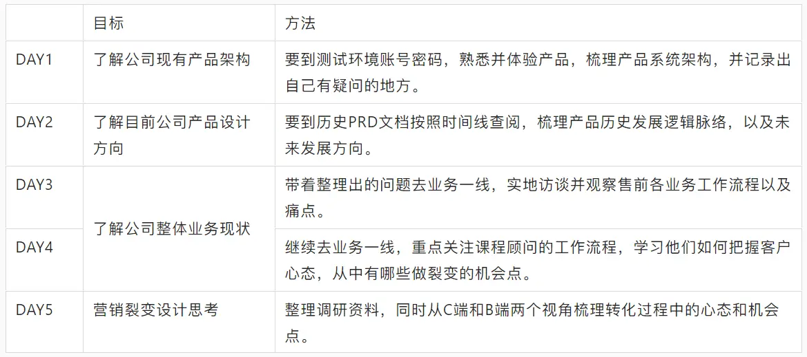
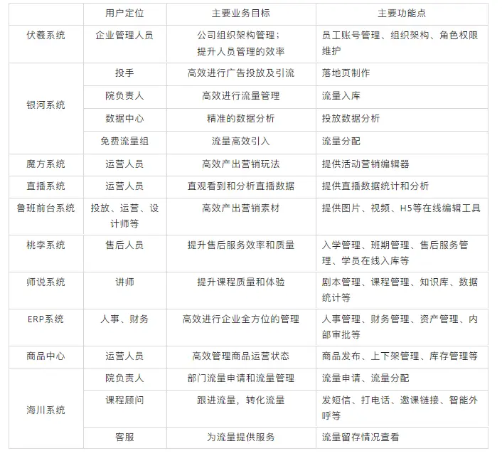
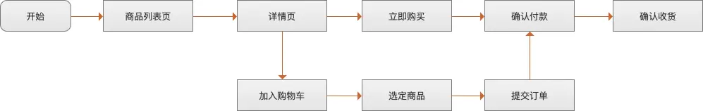
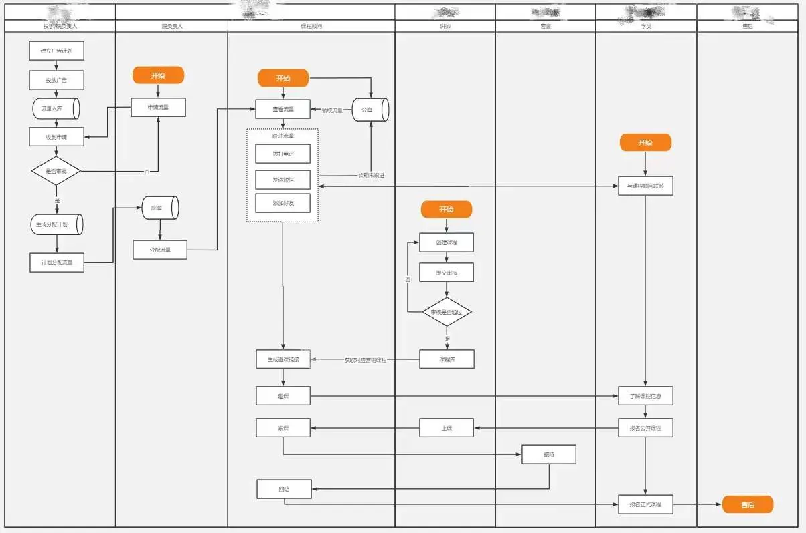
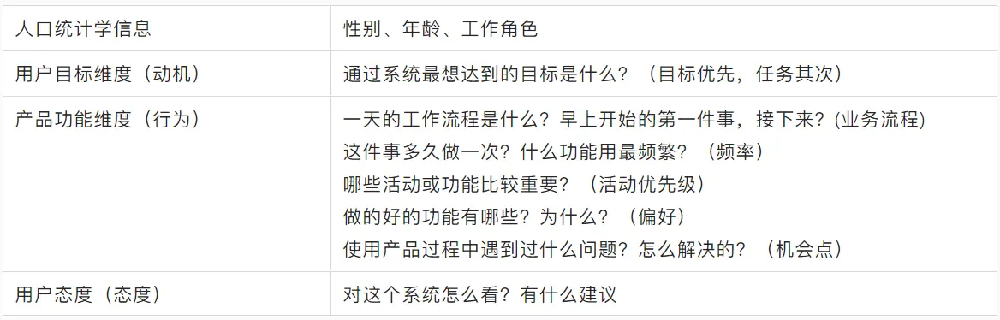

### 一、本职工作

梳理交接到手里的工作和内容，沟通熟悉。

#### 1.1. 梳理公司现有的产品信息

##### **1.1.1 熟悉产品框架**

系统中的每块功能都有其独特的场景意义，代表业务对其依赖的轻重缓急。熟悉产品框架要了解它的发展历程，包括但不限于：

**立项背景：**

立项背景帮助了解产品诞生的起因，需要解决的问题，产品发展的目标以及所要服务的业务角色。基于这些大前提，在短期之内可按照原来固有的路径进行发展迭代，可避免与相关配合人员因项目立意及产品结构差异过大等问题造成不必要的分歧。

**拆分产品：**

拆分产品，包括功能架构，用户使用流程及数据流向等。这一步是对产品框架的全局了解，基于现有平台能力。短期可依赖过往经验或行业通用解决方案，为后续的产品迭代做基础性的规划。

梳理完整个产品的骨架，接下来要根据不同的“骨骼”位置，丰富血肉。

##### **1.1.2 梳理文档**

交接文档需要明确几部分信息：产品开发团队、各系统地址（包括测试环境）、各文档地址、跨多团队的对接流程、所支撑业务部门及相关对接人等。

##### **1.1.3 熟悉数据**和业务指标

表信息包括字段含义及血缘关系。可以优先掌握与当前产品相关的数据，进一步了解平台的数据服务能力。也方便在日常分析过程挖掘潜在需求。其次可以向下溯源，依据仓库提供表的使用频率以及血缘关系逐步构建数据全貌，反哺产品上的数据遗漏点。

**指标体系是业务流程的量化**，从不同维度梳理业务，把指标有机的组织起来，便于统一管理和解读。比如：同样是新增用户，有人定义是某日新激活的用户为新用户；有人则定义为某日激活且有关键行为的用户为新用户。如果双方沟通开始就没有明确那即浪费时间更容易出错。

##### **1.1.4 查看“代码逻辑”**

查看代码逻辑并非在git上熟悉所有代码，而是对照产品功能及流程向开发同学熟悉功能间的流转细节（伪代码），这一步是对功能文档及测试文档的补充。如果需求文档缺失严重，这部就极为重要。

一可以“拉近”与开发同学的关系，二可以掌握逻辑细节，三还能熟悉基本的开发框架避免很多无法落地的想法。很多小伙伴抱怨和开发同学之间的“矛盾”，比如话语权低，难沟通，甚至还有改需求的情况。大概率的原因是开发同学觉得“你不懂”。如果能快速的让对方感受到你的专业，相信后续推进工作就容易的多。

#### 1.2.了解公司产品架构和功能设计

##### **1.2.1 为什么要调研清楚业务目标呢？**

因为业务目标是整体业务发展的大方向，大到新项目，小到一个功能优化点，对标的都是业务目标。以教育行业为例。“双减政策”前，公司的业务发展会更激进一点，业务上的主要目标可能是获客。“双减”之后，业务上的主要目标就是怎么提高教师人效，降低成本了。

清楚了目标后，保证了产品经理的身位不会落后于业务。更进一步讲，甚至可以在了解一段时间业务后，根据业务现在的痛点和目标，提出能够赋能业务的产品功能或想法，走在业务的前面。

##### **1.2.2 如何调研清楚业务目标？**

一般情况下，一个健康的业务在某一个阶段的目标是确定的。因此，去询问业务负责人或产品负责人即可。如果目标还不明确。建议根据调研的行业惯例、公司情况和相关负责人共创业务目标。

要到测试环境账号密码之后，梳理公司系统的定位、目标功能、作用和边界、系统与系统之间应该怎样配合，信息是如何流通的，为什么要这么做，对应的业务有哪些。

## 二、公司主营业务

#### 2.1.梳理业务逻辑流程

通过以上动作了解了业务背景后，接下来就是了解业务逻辑。对于业务的了解，主要解决三个方面的问题，即，人、事、环境。

##### 2.1.1. 人（公司组织架构，部门职能关系等）

快速熟知组织架构和对接人即是快速了解业务的一种途径。

同时也能与业务联动高效推广数据产品的服务能力。首先需要先了解公司内部每个角色大体工作内容及重点负责人，包括产品、运营、渠道、测试、营销、商业化等。

梳理各角色对数据依赖的侧重点，针对性的进行功能设计及指标制定。可以从现有产品中导出近3个月的访问记录，根据所在部门来进行相关角色的划分。

面对一个新业务时，对于产品经理来说，业务是陌生且复杂的。那么就要梳理好会关注产品的各方，也就是涉众。涉众就是**影响产品，或受产品影响的任何人、团体或组织。**

如何找到涉众呢？可以从三个角度去找。

1. **公司角度**，我们面对的用户是哪些？有哪些外部的合作伙伴？这里需要求助内部人员，是否有相关的用户调研文档可以参考，弄清楚公司角度涉众的期望。
2. **系统角度**，主要关注，谁使用、谁查看、谁维护。
3. **流程角度**，主要搞清楚业务的主流程是什么？在主流程中都有谁参与进来。

通过不同角度找到业务的涉众后，接下来要了解每个涉众对系统或功能的期望是什么。这需要我们梳理好业务后，组织会议，和各个方面拉齐对业务诉求和方向的认知。

##### 2.1.2. 事（商业模式、业务流程、功能框架等）

**了解商业模式**首先要建立行业的认知，可通过PEST方法分别从政治、经济、社会以及技术环境进行综合分析。了解公司当前所处在什么样的产业生命周期内，行业有哪些竞争对手，各自发展水平如何。通过对行业的了解为业务发展提供可参考的方向。

对于事，也就是业务的梳理，从粗到细大致可以分为三层，七个要素。

三层是大框架、做细节和画页面。七个要素分属于三个层级。分别是搭框架的梳理功能框架和非功能框架。做细节的业务流程、业务操作和信息结构。画页面的交互和信息设计。

在刚刚接触新业务时，我们为了能够更快速地上手，业务逻辑无需全部都了解清楚后再着手做需求。很多逻辑短时间内无法摸清，并且有些逻辑需要实际做的时候才能够有更深的理解。

因此，在初期只需要梳理好**功能框架**和**业务流程**即可。后面做需求的时候遇到一个问题解决一个问题，你会发现，当你梳理了一段时间后，系统内的逻辑基本上都清楚了。

那么，如何梳理业务呢？首先借用**用例**梳理出产品有什么大的功能。

从目标层、实现层到步骤层，将业务梳理出来。其次，用**流程图梳理业务**，先画出主流程，然后加入分支流程和异常流程，如果涉及到其他业务方的交互，加入**泳道图**进行梳理。

梳理完业务后，不能保证自己梳理的是对的，是全的。还有比较重要一步是，给懂业务的人反讲自己的梳理。最好把业务、产品、研发都拉上。最后根据参与返讲人员的意见修正自己的梳理。

##### 2.1.3. 环境

每个公司，甚至同一公司的不同组的合作模式都不一样。因此，需要对自己所处的环境有清晰的了解。有的时候不是对人和事不够了解，而是对所处环境的规则不了解，导致推进需求遇到阻力。对环境的了解，可以从以下几方面入手。

1. **需求的发起** 有些团队是业务发起，产品承接。有些团队是产品和业务共创。有些团队要求产品根据业务现状发现产品功能痛点，发起需求。不同的需求发起方式，决定了产品经理的工作方法和状态。因此，需要弄清需求是如何发起的。
2. **需求产出的节奏。**有些团队需求产出节奏比较制度化。会有一个产品的产出、开发、上线的整体流程。有些比较随意。
3. **合作方式。**产研之间如何合作，产品和业务之间如何合作。是否有相关的制度去保障各方之间的合作顺畅开展。这也是在前期比较重要一点。

#### 2.2.构建业务框架

##### 2.2.1. 用户路径

用户使用流程为骨，每个流程都在解决用户切实的需求，流程与流程之间构建了app整体的服务能力，我们以电商购物为例，从打开app到完成一次消费需要经过以下步骤：

梳理骨架可以按点->线->面的方式进行流程搭建。

点：整理关键功能

线：链接关键功能间的关系

面：管理流程与流程之间的交互。

##### 2.2.2.后台业务流程交互

页面上所有的商品信息都需要依赖业务后台进行支撑，通过后台可以获取到数据产品中所依赖的部分分析维度。若想让数据产品直接作用于业务，那么对接业务后台将会是一个重要输出方向。

## 三、业务调研

基于之前推导出的业务流程，实际去业务现场实际调查业务现状，看看业务是否实际跟着产品预先设想的步骤操作，这样会印象更加深刻，也更能够提升调研效率。

#### **3.1.明确调研人员角色**

- 部门负责人
- 项目经理及前后端开发
- 数据人员（数据分析师、数据仓库开发）
- 销售
- 等等.....

#### **3.2.明确调研目的及输出**

- 了解不同角色用户的日常工作的业务流程，以及业务流程所对应的系统流程。（修正输出业务流程图）
- 挖掘用户在进行日常工作行为中的问题和痛点，提取出对应的用户需求。（观察法和访谈法）

#### 3.3.调研方法

#### 3.4.事后梳理总结