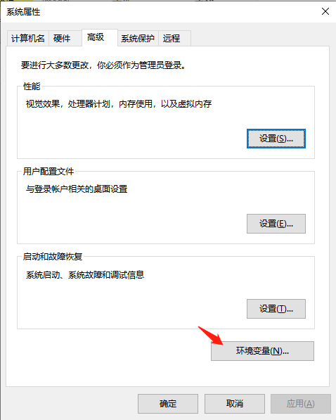

### 一、安装python

#### 1) 下载

这里直接去[python官网](https://www.python.org/)就可以了，网址是：[https://www.python.org](https://www.python.org/)

根据个人电脑系统选择对应版本，下载安装包备用。位置如下图：


操作： 点击1“Downloads”  ->  选择操作系统  -> 选择2稳定版中对应安装包（现在系统一般64位）

第1、2行“Windows embeddable package (32-bit) ”是解压即可用的zip包

第4、5行“Windows installer(64-bit) ”是.exe格式安装包


#### 2）安装

以exe包为例说明：

**步骤一：**


**步骤二**


**步骤三**


安装在D盘的python39文件夹里了。之后点击安装`Install` 基本上没有问题。

注意的地方就是，自定义的目录位置不要太深，不要有汉字。建议如图中直接安装在某个盘符下的python目录中。


#### 3）配置环境变量

**操作：**右键点击“此电脑”  ->  选择”属性“   ->  选择左侧”高级系统设置“   -> 选择”环境变量“

步骤1


步骤2



步骤3


在该目录下后追加：`D:\Python39\Scripts\;D:\Python39\`  

注意，因为前面有一些配置了，可能需要加一个” ；“。windows10如果是分行添加那种，不需要考虑


#### 4）验证

操作： windows键 + R  ->  输入cmd -> 调出黑窗后，输入python 

进入命令行显示python版本号，即为安装成功。


### 二、安装anaconda

#### 1) 下载

推荐使用[清华大学开源软件镜像站](https://mirrors.tuna.tsinghua.edu.cn/anaconda/archive/)下载
网址：https://mirrors.tuna.tsinghua.edu.cn/anaconda/archive/


我下载的是Anaconda3-2021.05-Windows-x86_64.exe


#### 2）安装

步骤：


点击NEXT。


选择 I agree


点击NEXT


选择安装目录，点击next


勾选第二项，为anaconda添加系统python环境，点击install

后面点击next，点击完成就行。


#### 3）配置环境变量

注意： 配置步骤跟配置python变量流程一样。

在配置anaconda环境变量时，需把path中的python相关内容删除，替换为anaconda相关的目录。如下：


内容如下：

```
D:\Anaconda3\;D:\Anaconda3\Library\bin;D:\Anaconda3\Scripts\
```


**4）验证**

操作： windows键 + R  ->  输入cmd -> 调出黑窗后，输入anaconda --version 

进入命令行显示版本号，即为安装成功。


### 三、anaconda简易使用

[Anaconda](https://link.jianshu.com?t=https://www.continuum.io/why-anaconda)是一个用于科学计算的Python发行版，支持 Linux, Mac, Windows系统，提供了包管理与环境管理的功能，可以很方便地解决多版本python并存、切换以及各种第三方包安装问题。Anaconda利用工具/命令`conda`来进行package和environment的管理，并且已经包含了Python和相关的配套工具。

这里先解释下conda、anaconda这些概念的差别。`conda`可以理解为一个工具，也是一个可执行命令，其核心功能是**包管理**与**环境管理**。包管理与pip的使用类似，环境管理则允许用户方便地安装不同版本的python并可以快速切换。Anaconda则是一个打包的集合，里面预装好了conda、某个版本的python、众多packages、科学计算工具等等，所以也称为Python的一种发行版。其实还有Miniconda，顾名思义，它只包含最基本的内容——python与conda，以及相关的必须依赖项，对于空间要求严格的用户，Miniconda是一种选择。

**conda将几乎所有的工具、第三方包都当做package对待，甚至包括python和conda自身**！因此，conda打破了包管理与环境管理的约束，能非常方便地安装各种版本python、各种package并方便地切换。

#### 1）管理虚拟环境

**activate** 能将我们引入anaconda设定的虚拟环境中, 如果你后面什么参数都不加那么会进入anaconda自带的base环境,

#### 2）创建自己的虚拟环境

创建一个名称为learn的虚拟环境并指定python版本为3

```
conda create -n learn python=3
```

#### 3）切换环境

```
activate learn # for Windows
source activate learn # for Linux & Mac
```

如果忘记了名称我们可以先去查看所有的环境

```
conda env list
```

#### 4）安装第三方包

```
conda install requests 
#或者
pip install requests

#已有更新
conda update requests
```

#### 5）卸载第三方包

```
conda remove requests
#或者
pip uninstall requests
```

#### 6）查看环境安装了哪些库

```
#要查看当前环境中所有安装了的包可以用
conda list 
```

#### 7）导入导出环境

导出当前环境的包信息

```
conda env export > environment.yaml
```

创建一个相同的虚拟环境时

```
conda env create -f environment.yaml
```


### 四、安装pycharm

#### 1）下载

官网地址： https://www.jetbrains.com/pycharm/download/#section=windows

直接下载专业版（Professional）


#### 2）安装

双击exe安装包，选择安装目录，一路 Next，直至安装完成。这里不详细展开。


#### 3）永久破解

步骤一：

在host文件下添加“0.0.0.0 [account.jetbrains.com](http://account.jetbrains.com/)” 。

**hosts文件位置：C:\Windows\System32\drivers\etc**

【推荐工具】 使用 ”switchHost “ 工具管理本地IP域名映射关系表


步骤二：

安装破解插件 JetbrainsCrack-2.6.10-release-enc.jar

链接：https://pan.baidu.com/s/1YLC0uBkqloMT1XyJc-2Q_A 密码：2la6

1、放置插件


2、修改文件


修改内容如下


```
-javaagent:C:\Program Files\JetBrains\PyCharm 2018.1.2\JetbrainsCrack-2.8-release-enc.jar
```

3) 重启pycharm，择 Activate code(激活码激活)，输入

```
ThisCrackLicenseId-{
"licenseId":"11011",
"licenseeName":"SteveTao",
"assigneeName":"SteveTao",
"assigneeEmail":"2246920335@qq.com",
"licenseRestriction":"",
"checkConcurrentUse":false,
"products":[
{"code":"II","paidUpTo":"2099-12-31"},
{"code":"DM","paidUpTo":"2099-12-31"},
{"code":"AC","paidUpTo":"2099-12-31"},
{"code":"RS0","paidUpTo":"2099-12-31"},
{"code":"WS","paidUpTo":"2099-12-31"},
{"code":"DPN","paidUpTo":"2099-12-31"},
{"code":"RC","paidUpTo":"2099-12-31"},
{"code":"PS","paidUpTo":"2099-12-31"},
{"code":"DC","paidUpTo":"2099-12-31"},
{"code":"RM","paidUpTo":"2099-12-31"},
{"code":"CL","paidUpTo":"2099-12-31"},
{"code":"PC","paidUpTo":"2099-12-31"}
],
"hash":"2911276/0",
"gracePeriodDays":7,
"autoProlongated":false}
```

步骤三：

打开软件验证


### 五、pycharm中配置Anaconda和已有python

点击”File“ -> "settings" -> "project interpreter"


在配置中”ADD“对应的python环境目录，或者anaconda创建的环境目录。


### 六、问题QA记录

