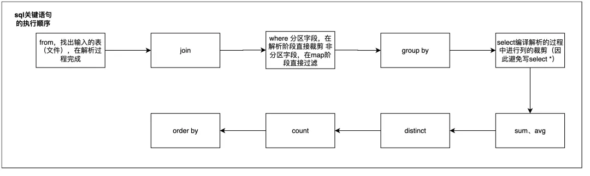

## 一、**SQL运行慢的常见原因**

### 1.**资源紧张，任务优先级比较低**

通过大数据管理平台界面，可以查看集群当前资源情况。

任务多，时间点密集、拥堵；单任务占用资源过大；等都有可能导致sql变慢。

### 2.**参数设置不合理**

| 配置参数                                      | 参数说明                                                     |
| --------------------------------------------- | ------------------------------------------------------------ |
| mapreduce.map.memory.mb                       | 一个MapTask可使用的资源上限（单位:MB），默认为1024。如果MapTask实际使用的资源量超过该值，则会被强制杀死。 |
| mapreduce.reduce.memory.mb                    | 一个ReduceTask可使用的资源上限（单位:MB），默认为1024。如果ReduceTask实际使用的资源量超过该值，则会被强制杀死。 |
| mapreduce.map.cpu.vcores                      | 每个MapTask可使用的最多cpu core数目，默认值: 1               |
| mapreduce.reduce.cpu.vcores                   | 每个ReduceTask可使用的最多cpu core数目，默认值: 1            |
| mapreduce.reduce.shuffle.parallelcopies       | 每个Reduce去Map中取数据的并行数。默认值是5  (指的是同时向多少个map拉取数据) |
| mapreduce.reduce.shuffle.merge.percent        | Buffer中的数据达到多少比例开始写入磁盘。默认值0.66 (达到比例开始溢写到磁盘) |
| mapreduce.reduce.shuffle.input.buffer.percent | Buffer大小占Reduce可用内存的比例。默认值0.7 (Reduce存放数据的量) |
| mapreduce.reduce.input.buffer.percent         | 指定多少比例的内存用来存放Buffer中的数据，默认值是0.0 (溢写时内存中还放多少比例的数据,其他全部溢写) |

| 配置参数                                 | 参数说明                                        |
| ---------------------------------------- | ----------------------------------------------- |
| yarn.scheduler.minimum-allocation-mb     | 给应用程序Container分配的最小内存，默认值：1024 |
| yarn.scheduler.maximum-allocation-mb     | 给应用程序Container分配的最大内存，默认值：8192 |
| yarn.scheduler.minimum-allocation-vcores | 每个Container申请的最小CPU核数，默认值：1       |
| yarn.scheduler.maximum-allocation-vcores | 每个Container申请的最大CPU核数，默认值：32      |
| yarn.nodemanager.resource.memory-mb      | 给Containers分配的最大物理内存，默认值：8192    |

### **3.SQL语句不当**

SQL关键语句执行顺序：



其中from、select在解析过程进行，where分区字段在解析阶段直接裁剪，非分区字段在map阶段过滤。

因此在写SQL语句时，避免写select *，充分利用where限制分区，添加条件限制数据量等。

当表数据量很大时，可以考虑先将where条件写进子查询内，再和其他表进行join。

### **4.数据倾斜**

数据倾斜是SQL优化中常见的情况，是指在MapReduce模型中大量value值集中在少部分reducer中处理的情况，由于少部分reducer处理的数据量过大，从而延长了整个任务执行的时间。

出现数据倾斜的原因一般有以下几种：

1、join中关联出现**热点key**（相关reducer耗时较长）；

2、join关联字段中**空值过多**（处理空值的reducer耗时超过平均值）；

3、group by中出现**热点key**，某些键值数据量过多（比如在shop_id+order_id表中计算各商户的订单量，热门商户就可能是热点key）；

4、join中count distinct中特殊值过多；

可以用odps中的mapjoin hint语法、手动切分热点、设置skewjoin参数(set odps.sql.skewjoin=true;)等来对数据倾斜进行处理。

### 5.**数据计算量大**

当数据量非常大时，需要更多的计算资源来并行处理数据。

如果没有适当调整资源分配（如增加实例数、使用更高级别的实例类型），任务可能会因为资源不足而运行缓慢甚至失败。

此时可以看下是否能一开始就对数据进行一些裁剪。比较经典的场景是根据业务理解添加适当的where条件、提前group by去重等来限制数据量，比如流量表限制log来源等，可以有效减少数据读取量。

集市服务层ads应用表中，当cube的维度很多时，各个维度的枚举值组合起来，进行count(distinct)计算时耗费会比较高。

此时可以先从业务上进行优化，比如裁剪一些用不到的维度组合。

如果裁剪之后还是跑的很慢，且groupby与distinct字段值都均匀时，可以考虑用group by代替count distinct。


## 二、SQL优化案例

### **1、大表join小表：用Mapjoin Hint处理**

通过显式指定Mapjoin Hint提示，添加（/*+ MAPJOIN(小表1,小表2,小表3) */）语句来提升SQL运行效率。

开启Mapjoin后，在map阶段将小表的数据加载在内存中，在处理大表的每一行记录时，直接使用本地的小表数据进行join操作，大大提高了join的效率。 （HIVE高版本做了优化，这一项不需要人工处理了）

```sql
select ds
,count(ditsinct user_id) as nums
from
(
SELECT /*+ MAPJOIN(c) */
         b.ds
          ,b.user_id
      FROM table_b b
       INNER JOIN table_c c
       ON b.district_id = c.district_id
)
group by ds
;
```

MapJoin优化适用于左连接、右连接、内连接，不可用于全连接，应用在左连接时，大表必须为左表；应用在右连接时，大表必须为右表。

### **2、用双重group by代替count(distinct)**

当数据量大且count distinct对象key的分布比较均匀时，可以用双重group by代替count distinct。

```sql
select ds,count(distinct item_id) as item_cnt
from item_table
group by ds;

---改写后

select ds,count(item_id) as item_cnt
from
    (select ds,item_id
    from item_table
    group by ds,item_id
    )
group by ds;
```

### **3、临时表较大，进行拆分**

当表里有复杂临时表耗时较长时，可以根据业务特性或者需要将临时表进行拆分，将大段资源消耗拆分成多段，避免因为资源等待而耗时。

### **4、合理采用UDF函数**

用户自定义函数（UDF，User Defined Function）可以帮助我们实现特定的数据处理能力，有一些适当的UDF函数可以显著帮助我们节省运行时长。

但当UDF函数涉及大量循环或者没有充分利用其并行处理能力时，可能会使SQL任务整体运行时长增加或者资源消耗增大。


